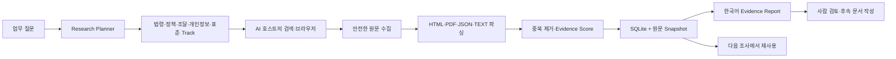

<div align="center">

# Public Sector Research Agent

### 검색 결과가 아니라, 검토 가능한 근거를 남기는 공공분야 리서치 Skill

법령·정책·조달·개인정보·표준의 **공식 원문을 우선 조사**하고,<br>
인용 구간·수집시점·원문 해시·신뢰도 설명을 사용자 PC에 함께 보존합니다.

[](https://github.com/Kminer2053/public-sector-research-mcp/actions/workflows/ci.yml)
[](LICENSE)

[](https://agentskills.io/)


[](https://github.com/Kminer2053/public-sector-research-mcp/stargazers)

[5분 시작](#5분-시작) ·
[업무 활용 예시](#이런-업무에-사용하세요) ·
[작동 방식](#어떻게-작동하나요) ·
[데이터와 안전](#내-자료는-어디에-저장되나요) ·
[로드맵](#현재-범위와-로드맵)

</div>

> [!IMPORTANT]
> 현재 `main`은 **MCP 서버가 아니라 범용 Agent Skill과 로컬 CLI**입니다.
> 로그인·공개 서버 없이 Codex, Claude Code 또는 일반 CLI에서 먼저 사용할 수 있습니다.
> MCP adapter와 공개 서비스는 검증된 Core를 바탕으로 별도 제품 브랜치에서 개발합니다.

## 30초 요약

공공분야 조사는 “그럴듯한 답”보다 **누가, 언제, 어느 문서의 어느 구간에서 그렇게 말했는지**가 중요합니다.

Public Sector Research Agent는 AI가 찾은 자료를 그대로 요약하지 않습니다.

1. 업무 질문을 법령·정책·조달·개인정보·표준 등 조사 쟁점으로 나눕니다.
2. 공식기관 원문을 우선 탐색하도록 검색계획을 만듭니다.
3. HTML·PDF·JSON·텍스트 원문과 메타데이터를 로컬에 저장합니다.
4. 답변에 사용할 Passage를 출처 위치와 연결합니다.
5. 근거의 권위성·직접성·최신성 등을 구성요소별로 설명합니다.
6. 확인하지 못한 항목과 수집 실패를 숨기지 않고 `PARTIAL`로 남깁니다.
7. 다음 조사에서는 저장된 근거를 먼저 검색해 불필요한 재수집을 줄입니다.

```text
AI가 웹에서 공식 출처를 찾습니다
                  ↓
Skill이 원문을 수집·구조화합니다
                  ↓
근거 구간과 한계를 사람이 검토합니다
                  ↓
보고서·규정·체크리스트 작성에 재사용합니다
```

## 이런 분께 특히 유용합니다

| 사용자 | 자주 겪는 업무 | 얻는 결과 |
|---|---|---|
| 정책·기획 담당자 | 정책동향, 정부계획, 기관 적용방안 조사 | 공식자료 중심의 검토 가능한 정책 브리프 |
| 법무·감사·개인정보 담당자 | 현행 법령, 적용대상, 의무·권고 구분 | 조항·가이드 원문과 연결된 Evidence Report |
| 조달·계약 담당자 | AI·SaaS 구매조건, 데이터 권리, 업체 종속 검토 | 쟁점별 근거와 미확인 위험 목록 |
| 디지털·AI 담당자 | AI 운영원칙, 보안·개인정보 기준 수립 | 국내외 공식 기준을 비교한 근거 묶음 |
| 연구·평가 담당자 | 공공사례, 경영평가, 성과지표 조사 | 출처 등급과 인용 위치가 남는 조사자료 |
| 보고서 작성자 | 여러 출처를 다시 찾고 인용하는 반복작업 | 재검색 가능한 로컬 Evidence Memory |

## 기존 웹 검색과 무엇이 다른가요?

| 일반적인 AI 웹 검색 | Public Sector Research Agent |
|---|---|
| 검색 결과를 읽고 바로 요약 | 조사계획을 먼저 만들고 공식 원문을 우선 확보 |
| 링크 단위 출처 표시 | 문서 안의 **Passage 단위** 인용과 locator 저장 |
| 신뢰도를 하나의 느낌으로 판단 | 권위성·1차자료·직접성·최신성 등 점수 구성을 설명 |
| 실패한 자료는 결과에서 사라지기 쉬움 | 실패 원인·재시도 가능성·조사 공백을 명시 |
| 다음 질문에서 처음부터 다시 검색 | 기존 snapshot과 Evidence Memory를 우선 재사용 |
| 서비스 서버에 조사자료를 맡길 수 있음 | 원문과 SQLite DB를 기본적으로 사용자 PC에 저장 |
| 사실과 해석이 섞일 수 있음 | `FACT`·`INFERENCE`·`RECOMMENDATION` 구분 원칙 적용 |

> **Evidence First, Opinion Later.**<br>
> 의견을 빨리 만드는 것보다, 나중에 다시 확인할 수 있는 근거를 먼저 남깁니다.

## 이런 업무에 사용하세요

### 공공기관 AI 구매원칙

```text
공공기관이 생성형 AI 서비스를 구매할 때
데이터 권리, 학습 재사용, 기록 반환, 개인정보,
업체 종속 방지 조건을 공식자료 중심으로 조사해줘.
```

예상 조사 track:

- 현행 법령·규정
- 공공 조달·계약 기준
- 개인정보와 데이터 처리
- 데이터 반환·삭제·학습 재사용 조건
- 국제 공공부문 AI 구매 가이드
- 업체 종속과 상호운용성

### 규정·컴플라이언스 검토

```text
이 지침이 현재 시행 중인지, 적용대상은 누구인지,
법적 의무와 권고사항을 구분하고 근거 조항을 표시해줘.
```

### 정책·사례 벤치마킹

```text
국내외 공공기관의 AI 활용원칙을 비교하되
보도기사보다 정부·기관 원문을 우선하고,
우리 기관에 바로 적용하기 어려운 조건도 표시해줘.
```

### 기존 조사 재사용

```text
이 프로젝트에서 이전에 조사한 개인정보·데이터 권리 근거를 먼저 찾고,
재사용 가능한 자료와 최신성 재확인이 필요한 자료를 나눠줘.
```

## 무엇이 만들어지나요?

조사 프로젝트 안에 다음 자료가 함께 남습니다.

```text
<project>/.psr/
├─ project.json                 # 프로젝트 정보
├─ research.db                 # Source·Passage·Citation Evidence Index
├─ profiles/                   # 조사 유형별 Research Profile
├─ runs/<run-id>/
│  ├─ plan.json                # 쟁점·검색어·완료조건
│  ├─ result.json              # 처리 결과와 실패·공백
│  └─ report.md                # 사람이 검토하는 Evidence Report
├─ sources/<source-id>/documents/<document-id>/snapshots/<snapshot-id>/
│  ├─ original.*               # 수집한 원문
│  ├─ extracted.md             # 추출한 본문
│  └─ metadata.json            # URL·수집시점·hash·content type
└─ reports/<run-id>.md
```

보고서에는 다음이 표시됩니다.

- 조사 기준일과 관할
- 출처 등급과 공식 1차자료 여부
- 직접 인용할 수 있는 원문 Passage
- page·HTML block·JSON Pointer 등 원문 위치
- SHA-256 원문 무결성 정보
- Evidence Score 구성요소와 설명
- 발행일 미확인, 수집 실패, 근거 부족 등 조사 공백
- 재사용한 기존 snapshot과 새로 수집한 자료

## 어떻게 작동하나요?



역할은 명확히 나뉩니다.

- **AI 호스트**: 웹 검색, 브라우저 탐색, 공식 출처 후보 발견
- **Public Sector Research Skill**: 조사계획, 출처 선택 원칙, 검토 절차
- **로컬 `psr` Core**: 수집, 파싱, 저장, 점수화, 보고서 생성
- **사용자**: 적용범위·현행성·상충 근거·최종 판단 검토

## 핵심 기능

| 기능 | 현재 제공 내용 |
|---|---|
| Research Planner | 질문을 조사 track·근거 유형·검색어·완료조건으로 분해 |
| Government Profile | 법령·정책·조달·개인정보·국제표준 공식자료 우선 |
| Bounded Collection | HTTP(S), 공개주소, robots.txt, timeout, bytes, port 경계 |
| Document Parsing | HTML·JSON·TEXT, 선택형 PDF Passage 추출 |
| Evidence Index | Source·Document·Snapshot·Passage·Citation을 SQLite로 저장 |
| Explainable Score | Authority·Primary·Relevance·Snapshot·Specificity·Freshness·Independence |
| Deduplication | URL 정규화, 문서 SHA-256, Passage text 중복 제거 |
| Partial Success | 일부 실패 시 성공 근거 보존, 실패와 공백 별도 표시 |
| Project Memory | 저장된 Passage 검색, 최근 snapshot 기본 7일 재사용 |
| Reporting | 한국어 Markdown·JSON 결과, 원문 locator와 hash 포함 |
| Portability | Codex metadata, Claude Code marketplace, 일반 Agent Skills 구조 |

## 5분 시작

### 1. Skill 설치

<details open>
<summary><strong>Codex</strong></summary>

```bash
python3 ~/.codex/skills/.system/skill-installer/scripts/install-skill-from-github.py \
  --repo Kminer2053/public-sector-research-mcp \
  --path skills/public-sector-research
```

설치 후 새 Codex 작업에서 다음처럼 요청합니다.

```text
$public-sector-research를 사용해서
공공기관 생성형 AI 구매 시 데이터 권리와
업체 종속 방지 원칙을 조사해줘.
```

</details>

<details>
<summary><strong>Claude Code</strong></summary>

Claude Code에서 marketplace를 등록하고 Skill을 설치합니다.

```text
/plugin marketplace add Kminer2053/public-sector-research-mcp
/plugin install public-sector-research@public-sector-research-agent
```

설치 후 자연어로 요청합니다.

```text
Use the public-sector-research skill.
공공기관 AI 구매 시 개인정보와 조달 기준을
공식 원문 중심으로 조사해줘.
```

</details>

<details>
<summary><strong>공통 설치 또는 다른 Agent 호스트</strong></summary>

```bash
git clone https://github.com/Kminer2053/public-sector-research-mcp.git
cd public-sector-research-mcp
python3 scripts/install_skill.py --target all
```

특정 경로에 설치하려면 다음을 사용합니다.

```bash
python3 scripts/install_skill.py \
  --destination /path/to/agent/skills/public-sector-research
```

Agent Skills를 지원하는 다른 호스트에서는
`skills/public-sector-research/` 폴더를 해당 호스트의 Skill 검색 경로에 복사합니다.

</details>

### 2. 로컬 프로젝트 초기화

Skill은 대화 중 필요한 명령을 실행할 수 있습니다. 직접 CLI로 확인하려면:

```bash
python3 skills/public-sector-research/scripts/psr.py \
  project init ./example-project \
  --name "공공기관 AI 구매원칙"
```

### 3. 조사계획 만들기

```bash
python3 skills/public-sector-research/scripts/psr.py \
  --project ./example-project \
  research plan \
  "공공기관 생성형 AI 구매 시 데이터 권리와 업체 종속 방지 원칙을 조사하라"
```

출력된 `run_id`, 조사 track, 추천 검색어를 검토합니다.

### 4. 공식 출처 수집·보고서 생성

AI 호스트가 찾은 공식 URL을 `sources.jsonl`에 기록합니다.

```json
{"track_id":"law-regulation","url":"https://official.example/law","title":"공식 법령","publisher":"공식기관","source_tier":"OFFICIAL_PRIMARY","published_at":"2026-01-01"}
{"track_id":"privacy","url":"https://official.example/privacy.pdf","title":"개인정보 안내서","publisher":"공식기관","source_tier":"OFFICIAL_PRIMARY","published_at":"2025-08-07"}
```

```bash
python3 skills/public-sector-research/scripts/psr.py \
  --project ./example-project \
  research run <run-id> \
  --sources-file sources.jsonl
```

완료 후 `.psr/runs/<run-id>/report.md`를 검토합니다.

## Evidence Score는 어떻게 보나요?

종합점수 하나만 믿지 않도록 구성요소와 설명을 함께 저장합니다.

| 구성요소 | 가중치 | 검토 질문 |
|---|---:|---|
| Authority | 25% | 발행기관과 출처 등급이 충분히 공신력 있는가? |
| Primary source | 15% | 기사나 블로그가 아닌 원문인가? |
| Direct relevance | 20% | Passage가 조사 질문을 직접 지지하는가? |
| Original snapshot | 15% | 원문 bytes와 SHA-256을 확보했는가? |
| Specificity | 10% | page·block·pointer 등 위치를 다시 찾을 수 있는가? |
| Freshness | 10% | 기준일에 비추어 최신성이 충분한가? |
| Independence | 5% | 다른 근거를 단순 재인용한 자료는 아닌가? |

> [!NOTE]
> 점수는 진실 판정이 아니라 **검토 순서를 돕는 설명 가능한 지표**입니다.
> 발행일이 없거나 provenance를 완전히 확인하지 못한 경우 그 한계도 함께 표시합니다.

## 내 자료는 어디에 저장되나요?

기본 동작은 **local-first**입니다.

- 조사 원문은 프로젝트의 `.psr/sources/`에 저장됩니다.
- 구조화된 근거는 `.psr/research.db`에 저장됩니다.
- 별도 중앙 서버로 조사자료를 업로드하지 않습니다.
- 동일 출처의 최근 snapshot은 기본 7일 동안 재사용합니다.
- 네트워크가 없어도 기존 Passage 검색과 보고서 재생성이 가능합니다.

수집 안전 경계:

- HTTP(S) 공개주소만 허용
- localhost·사설망·link-local·reserved 주소 차단
- redirect 이후 주소도 다시 검증
- 기본 포트 80·443만 허용
- robots.txt의 명시적 차단 준수
- 수집 bytes·timeout·재시도·동시성 제한
- 로그인·CAPTCHA·paywall·접근제한 우회 금지

> [!CAUTION]
> 이 도구는 자동 법률판단, 감사판정, 조달 적격판정 또는 기관의 최종 결재를 대신하지 않습니다.
> 공식 원문 확보 여부, 시행일, 관할, 적용대상과 AI의 후속 해석은 담당자가 최종 검토해야 합니다.

## 현재 범위와 로드맵

| 단계 | 상태 | 범위 |
|---|---|---|
| Universal Agent Skill | **사용 가능** | 로컬 계획·수집·Evidence DB·보고서·재사용 |
| Local MCP Adapter | 설계·개발 예정 | 사용자 PC의 Core를 MCP Tool로 노출 |
| Hosted Public Preview | 후속 검증 | 가입 없는 공개형·단기 임시처리 |
| Account Beta | 장기 계획 | 선택 가입·과거 조사 자동 재사용 |
| Paid Persistent | 장기 계획 | 저장공간·장기실행·고급 변경감지 |
| Enterprise | 장기 계획 | 기관 SSO·권한·감사로그·보안 통제 |

제품별 코드는 범용 Skill과 섞지 않습니다.

- `main`: 범용 Agent Skill과 provider-neutral local Core
- `product/local-mcp-adapter`: 로컬 MCP adapter
- `product/hosted-public-preview`: 익명 공개 서비스
- `product/account-beta`: 선택 가입·저장·재사용
- `product/paid-persistent`: 유료 저장·장기실행
- `product/enterprise`: 기관용 보안·운영
- `archive/mcp-public-preview-2026-07-16`: 이전 서버 구현 보존

자세한 기준은 [Branch Strategy](docs/BRANCH_STRATEGY.md)를 참고하세요.

## 개발과 검증

```bash
python3 -m pip install -e ".[dev,pdf]"
ruff check .
pytest --cov=psr_core --cov-branch --cov-report=term-missing
python3 skills/public-sector-research/scripts/psr.py --version
```

현재 Main Gate:

- Python 3.9·3.12 CI
- 단위·통합 테스트 49개
- branch 포함 테스트 커버리지 85% 이상
- 정상 조사·snapshot 재사용·오프라인 검색 E2E
- 일부 출처 실패 시 `PARTIAL` 보존
- Agent Skill 구조와 Claude marketplace 계약 검증

상세 검증 항목은 [VALIDATION.md](docs/VALIDATION.md)에 있습니다.

## 문서

| 문서 | 내용 |
|---|---|
| [VISION.md](docs/VISION.md) | 왜 이 제품을 만드는가 |
| [PRD.md](docs/PRD.md) | 사용자·범위·기능 요구사항 |
| [ARCHITECTURE.md](docs/ARCHITECTURE.md) | 모듈·데이터·저장 구조 |
| [ROADMAP.md](docs/ROADMAP.md) | Skill에서 MCP·서비스로 발전하는 단계 |
| [BRANCH_STRATEGY.md](docs/BRANCH_STRATEGY.md) | 제품별 브랜치와 승격 기준 |
| [VALIDATION.md](docs/VALIDATION.md) | 테스트와 릴리스 Gate |

## 라이선스

이 프로젝트는 [MIT License](LICENSE)로 공개됩니다.
저작권 고지와 라이선스 전문을 유지하는 조건으로 사용·복제·수정·배포할 수 있습니다.

## 기여와 피드백

실제 공공업무에서 다음 피드백을 특히 환영합니다.

- 공식자료 우선순위가 현실적인가
- 보고서에서 담당자가 가장 먼저 확인할 정보가 보이는가
- 잘못 분해되거나 누락되는 조사 쟁점은 무엇인가
- 반복 조사에서 실제로 시간이 절약되는가
- 기관별 Research Profile에 어떤 기준이 필요한가

[Issue를 등록](https://github.com/Kminer2053/public-sector-research-mcp/issues)할 때는
개인정보·내부문서·비공개 URL·인증정보를 첨부하지 마세요.

---

<div align="center">

**Research once. Review clearly. Reuse continuously.**

공식 원문을 먼저 확보하고, 판단은 근거와 함께 남깁니다.

[처음부터 시작하기](#5분-시작) ·
[설계 문서 보기](docs/ARCHITECTURE.md) ·
[피드백 남기기](https://github.com/Kminer2053/public-sector-research-mcp/issues)

</div>
