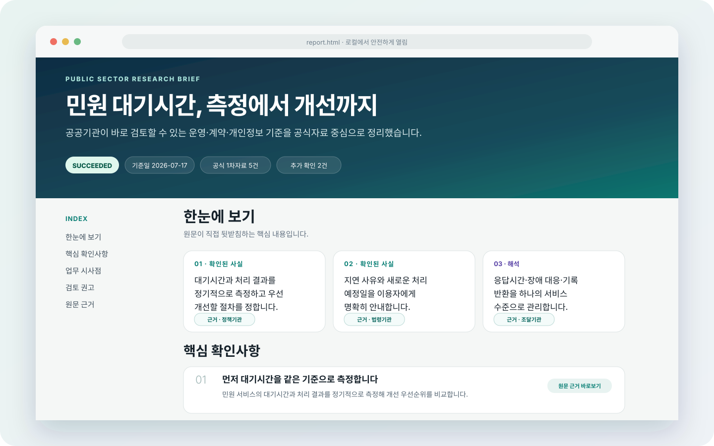
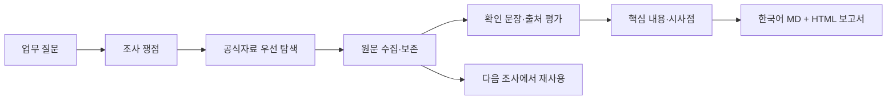

<div align="center">

# 공공복리 · BOKRI

### 공공분야의 복잡한 문제를 근거로 풀어주는 리서치 보조도구

**복리**는 질문 하나를 공식자료·핵심문장·확인할 점이 연결된 읽기 좋은 보고서로 바꿉니다.<br>
조사한 원문과 결과는 내 컴퓨터에 남아 다음 업무에서도 다시 쓸 수 있습니다.

> 검색은 많지만 믿을 근거는 부족할 때, 복리에게 물어보세요.

[](https://github.com/Kminer2053/public-sector-research-skill/actions/workflows/ci.yml)
[](LICENSE)

[](https://agentskills.io/)

[](https://github.com/Kminer2053/public-sector-research-skill/stargazers)

[바로 시작](#5분-시작) · [업무 예시](#이런-순간에-사용하세요) ·
[결과물](#결과물은-이렇게-생겼습니다) · [데이터와 안전](#내-자료는-어디에-저장되나요)

</div>



> [!IMPORTANT]
> 이름은 다음처럼 구분합니다.
>
> - **공공복리**: 제품명
> - **BOKRI**: 영문명
> - **복리**: 대화에서 편하게 부르는 에이전트 이름
> - **복리 조사관**: 문서와 보고서에서 사용하는 공식 역할명
> - `public-sector-research`, `psr`: 기존 설치와 호출을 위한 기술 식별자
>
> 사용자는 “복리야, 이 과제를 조사해줘”라고 요청하고, 시스템은
> `$public-sector-research` Skill과 `psr` CLI를 사용합니다. 기술 식별자는 호환성을 위해 유지합니다.
>
> 현재 `main`은 로그인이나 공개 서버가 필요 없는 **범용 Agent Skill + 로컬 CLI**입니다.
> Codex, Claude Code, Agent Skills 호환 도구에서 사용할 수 있습니다.

## 이런 순간에 사용하세요

### “다른 기관은 민원 대기시간을 어떻게 줄였지?”

```text
복리야, 국내 공공기관의 민원 대기시간 개선 사례를 조사해줘.
기관 보도자료와 공식 성과자료를 우선하고,
성과 수치와 실제 적용조건을 구분해줘.
```

### “이 지침, 지금도 시행 중인가?”

```text
복리야, 이 지침의 시행일, 적용대상, 의무와 권고를 구분해줘.
개정되거나 폐지된 자료가 있으면 현재 원문을 우선해줘.
```

### “내년도 업무계획에 넣을 근거가 필요해.”

```text
복리야, 고령층의 공공서비스 접근성 개선 정책과 사례를 조사해줘.
정부계획, 실태조사, 공공기관 사례를 나눠서 정리하고
우리 기관이 검토할 실행조건을 표시해줘.
```

### “평가보고서에 쓸 공식 출처만 다시 찾아줘.”

```text
복리야, 작년 조사자료에서 공식 원문을 다시 확인하고,
보고서에 인용할 문장과 원문 위치를 연결해줘.
확인되지 않은 수치는 별도로 표시해줘.
```

조달조건, 개인정보, 디지털서비스, 조직혁신, 안전관리, 지역정책,
성과평가, 규정 검토, AI 도입처럼 **근거를 다시 확인해야 하는 공공업무 조사**에 특히 잘 맞습니다.

## 결과물은 이렇게 생겼습니다

조사가 끝나면 Markdown과 함께 브라우저에서 바로 여는 HTML 보고서가 만들어집니다.

- 첫 화면에서 결론, 기준일, 공식자료 수, 미확인 항목을 확인
- 목차를 눌러 원하는 부분으로 바로 이동
- 문장 옆 `근거` 버튼으로 출처 문장과 점수 설명 확인
- 공식 원문과 수집 당시 보존본으로 바로 이동
- 확인된 사실·해석·검토 권고를 색상과 표기로 구분
- 일부 자료를 못 찾았거나 수집에 실패한 경우 숨기지 않고 표시
- 인터넷 연결 없이 열람하고 인쇄 가능
- 모바일·태블릿·PC 화면과 인쇄용 레이아웃 지원

```text
업무 질문
   ↓
어떤 내용을 확인할지 조사계획 작성
   ↓
법령·정부·공공기관 등 공식자료 우선 확인
   ↓
원문과 확인한 문장을 내 컴퓨터에 보존
   ↓
읽기 좋은 한국어 HTML + Markdown 보고서
```

## 무엇이 다른가요?

| 보통의 웹 검색·AI 답변 | 공공복리 |
|---|---|
| 검색 링크와 요약을 받음 | 공식 원문과 실제 확인한 문장을 함께 남김 |
| 어디까지 확인된 내용인지 모호함 | 확인된 사실·해석·권고·미확인 항목을 구분 |
| 링크가 바뀌면 다시 확인하기 어려움 | 수집 당시 원문과 해시를 로컬에 보존 |
| 일부 자료를 못 찾았는지 알기 어려움 | 실패 원인과 조사 공백을 보고서에 표시 |
| 다음 조사에서 처음부터 다시 검색 | 저장된 자료를 먼저 찾아 불필요한 재수집 감소 |
| 보기 좋은 결과와 검증자료가 분리됨 | 보고서 문장에서 근거와 원문으로 바로 이동 |

> **Evidence First, Opinion Later.**
> 먼저 확인 가능한 자료를 남기고, 판단은 그 근거 위에서 합니다.

## 누구에게 유용한가요?

| 업무 | 도움을 받는 지점 |
|---|---|
| 정책·기획 | 정부계획, 유사기관 사례, 적용조건을 한 번에 검토 |
| 법무·감사·개인정보 | 현행성, 적용대상, 의무·권고, 원문 위치 확인 |
| 조달·계약 | 계약조건과 데이터·보안·종속 위험의 공식 근거 정리 |
| 경영평가·성과관리 | 수치와 주장에 연결할 공식 출처 재확인 |
| 민원·서비스 개선 | 사례의 성과와 실제 실행조건을 구분 |
| 디지털·AI | 기술 설명에 치우치지 않고 정책·조직·법적 조건까지 조사 |
| 보고서 작성 | 이전 조사와 출처를 다시 찾아 쓰는 반복업무 감소 |

## 5분 시작

### Codex

```bash
python3 ~/.codex/skills/.system/skill-installer/scripts/install-skill-from-github.py \
  --repo Kminer2053/public-sector-research-skill \
  --path skills/public-sector-research
```

새 작업에서 자연어로 요청합니다.

```text
$public-sector-research를 사용해서
복리야, 고령층의 공공서비스 접근성 개선 정책과 공공기관 사례를
공식자료 중심으로 조사해줘.
```

### Claude Code

```text
/plugin marketplace add Kminer2053/public-sector-research-skill
/plugin install public-sector-research@public-sector-research-agent
```

```text
Use the public-sector-research skill.
복리야, 이 지침의 현행 여부와 적용대상을 공식 원문으로 확인해줘.
```

### 다른 Agent Skills 호환 도구

```bash
git clone https://github.com/Kminer2053/public-sector-research-skill.git
cd public-sector-research-skill
python3 scripts/install_skill.py --target all
```

또는 `skills/public-sector-research/` 폴더를 해당 도구의 Skill 경로에 복사합니다.

## 어떻게 일하나요?

공공복리의 **복리 조사관**은 답을 단정하는 자동 결재자가 아니라, 확인된 사실·해석·권고·미확인 사항을 구분해 남기는 조사 보조자입니다.

1. 담당자의 질문, 기준일, 대상 지역·기관, 필요한 결과물을 확인합니다.
2. 질문을 실제로 확인해야 할 쟁점으로 나눕니다.
3. 법령·정부·공공기관·국제기구 등 공식자료를 먼저 찾습니다.
4. 원문을 안전한 범위에서 수집하고 확인할 문장을 추출합니다.
5. 출처의 공신력, 원문 여부, 질문과의 직접성, 최신성을 설명합니다.
6. 에이전트가 핵심 내용·시사점·권고를 작성하되 근거 ID를 연결합니다.
7. 연결이 잘못됐거나 근거 없는 사실·해석이 있으면 보고서 생성을 중단합니다.
8. 한국어 Markdown과 인터랙티브 HTML을 함께 만듭니다.



## 만들어지는 파일

```text
<project>/.psr/
├─ project.json
├─ research.db
├─ runs/<run-id>/
│  ├─ plan.json       # 조사할 쟁점과 완료조건
│  ├─ result.json     # 수집 결과, 출처, 실패와 공백
│  ├─ brief.json      # 근거 ID가 연결된 핵심 내용·시사점·권고
│  ├─ report.md       # 문서 편집에 쓰기 좋은 보고서
│  └─ report.html     # 읽기·탐색·인쇄에 최적화한 보고서
├─ sources/.../
│  ├─ original.*     # 수집 당시 원문
│  ├─ extracted.md   # 확인 가능한 본문
│  └─ metadata.json  # URL·수집시점·hash
└─ reports/
   ├─ <run-id>.md
   └─ <run-id>.html
```

## 직접 CLI로 실행하기

대부분은 에이전트가 명령을 실행합니다. 직접 확인하려면:

```bash
python3 skills/public-sector-research/scripts/psr.py \
  project init ./example-project --name "민원 서비스 개선"

python3 skills/public-sector-research/scripts/psr.py \
  --project ./example-project research plan \
  "공공기관의 민원 대기시간 개선 사례를 조사하라"
```

법령·정책은 기본 track으로 포함되고, 조달·개인정보·국제표준은 질문과 관련될 때 활성화됩니다.
필요하면 조사 범위를 명시적으로 조정할 수 있습니다.

```bash
python3 skills/public-sector-research/scripts/psr.py \
  --project ./example-project research plan \
  "공공 디지털서비스 접근성 의무를 조사하라" \
  --include-track privacy \
  --exclude-track government-policy

python3 skills/public-sector-research/scripts/psr.py \
  --project ./example-project research run <run-id> \
  --sources-file sources.jsonl
```

수집 후 에이전트가 작성한 `brief.json`으로 두 형식을 다시 만들 수 있습니다.

```bash
python3 skills/public-sector-research/scripts/psr.py \
  --project ./example-project report build <run-id> \
  --brief-file brief.json --format all
```

`--format md`, `--format html`, `--format all`을 지원합니다. 정상 결과는 stdout JSON,
입력·검증 오류는 stderr JSON과 exit code `2`로 반환합니다.

## 조사 결과를 어떻게 믿나요?

종합점수 하나로 진실을 판정하지 않습니다. 다음 구성요소와 설명을 함께 보여줍니다.

| 확인 항목 | 비중 | 담당자가 볼 질문 |
|---|---:|---|
| 발행기관의 공신력 | 25% | 누가 발행한 자료인가? |
| 원문 여부 | 15% | 기사·블로그가 아닌 1차자료인가? |
| 질문과의 직접성 | 20% | 이 문장이 조사 질문을 직접 뒷받침하는가? |
| 원문 확보 | 15% | 수집 당시 파일과 해시가 남아 있는가? |
| 위치의 구체성 | 10% | 페이지·본문 구간을 다시 찾을 수 있는가? |
| 최신성 | 10% | 기준일에 비추어 최신 자료인가? |
| 다른 자료와의 독립성 | 5% | 다른 문서를 단순 재인용한 것은 아닌가? |

점수는 검토 순서를 돕는 지표입니다. 현행성, 적용대상, 상충자료와 기관 판단을 대신하지 않습니다.

## 내 자료는 어디에 저장되나요?

기본 동작은 **local-first**입니다.

- 원문과 보고서는 프로젝트의 `.psr/`에 저장됩니다.
- 별도 중앙 서버로 조사자료를 업로드하지 않습니다.
- 인터넷이 없어도 저장된 자료 검색과 보고서 재생성이 가능합니다.
- HTML 보고서는 외부 폰트·CDN·추적 스크립트를 사용하지 않습니다.
- 같은 출처의 최근 보존본은 기본 7일 동안 재사용합니다.

수집 범위도 제한합니다.

- 공개 HTTP(S) 주소와 기본 포트만 허용
- localhost·사설망·link-local·reserved 주소 차단
- redirect 이후 주소 재검사
- robots.txt의 명시적 차단 준수
- 수집 용량·시간·동시성 제한
- 로그인·CAPTCHA·paywall·접근제한 우회 금지

> [!CAUTION]
> 이 도구는 자동 법률판단, 감사판정, 조달 적격판정 또는 최종 결재를 대신하지 않습니다.
> 원문의 시행일·적용대상·상충자료와 에이전트의 해석은 담당자가 최종 검토해야 합니다.

## 현재 범위와 로드맵

| 단계 | 상태 | 범위 |
|---|---|---|
| Universal Agent Skill | **사용 가능** | 로컬 조사·원문 보존·MD/HTML 보고서·재사용 |
| Local MCP Adapter | 예정 | 같은 기능을 로컬 MCP 도구로 노출 |
| Hosted Public Preview | 후속 검증 | 가입 없는 공개형·단기 임시처리 |
| Account Beta | 장기 계획 | 선택 가입·과거 조사 자동 재사용 |
| Paid Persistent | 장기 계획 | 저장공간·장기실행·고급 변경감지 |
| Enterprise | 장기 계획 | 기관 SSO·권한·감사로그·보안 통제 |

제품별 코드는 범용 Skill과 섞지 않습니다. 자세한 기준은
[Branch Strategy](docs/BRANCH_STRATEGY.md)를 참고하세요.

## 개발과 검증

```bash
python3 -m pip install -e ".[dev,pdf]"
ruff check .
pytest --cov=psr_core --cov-branch --cov-report=term-missing
python3 skills/public-sector-research/scripts/psr.py --version
```

Main Gate:

- Python 3.9·3.12 CI
- 단위·통합·보고서 계약 테스트
- branch 포함 테스트 커버리지 85% 이상
- 잘못된 citation ID와 근거 없는 사실·해석 차단
- 메뉴·푸터·쿠키 문구가 핵심 근거로 선택되지 않는지 검사
- HTML 외부 의존성·모바일·키보드·인쇄 검증
- 일부 출처 실패 시 성공 결과와 `PARTIAL` 보존

상세 검증 항목은 [VALIDATION.md](docs/VALIDATION.md)에 있습니다.

## 문서

| 문서 | 내용 |
|---|---|
| [VISION.md](docs/VISION.md) | 왜 이 제품을 만드는가 |
| [PRD.md](docs/PRD.md) | 사용자·범위·기능 요구사항 |
| [ARCHITECTURE.md](docs/ARCHITECTURE.md) | 모듈·데이터·저장 구조 |
| [ROADMAP.md](docs/ROADMAP.md) | Skill에서 MCP·서비스로 발전하는 단계 |
| [BRANCH_STRATEGY.md](docs/BRANCH_STRATEGY.md) | 제품별 브랜치와 승격 기준 |
| [VALIDATION.md](docs/VALIDATION.md) | 테스트와 릴리스 Gate |

## 라이선스

이 프로젝트는 [MIT License](LICENSE)로 공개됩니다.

## 기여와 피드백

“보고서 첫 화면에서 무엇을 더 먼저 보고 싶은지”, “어떤 공공업무 사례에서 실제로 시간이
줄었는지”를 알려주세요. [Issue 등록](https://github.com/Kminer2053/public-sector-research-skill/issues) 시
개인정보·내부문서·비공개 URL·인증정보는 첨부하지 마세요.

---

<div align="center">

**복잡한 공공업무, 복리가 근거부터 찾아드립니다.**

[처음부터 시작하기](#5분-시작) ·
[설계 문서 보기](docs/ARCHITECTURE.md) ·
[피드백 남기기](https://github.com/Kminer2053/public-sector-research-skill/issues)

</div>
