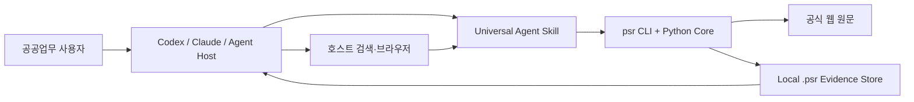
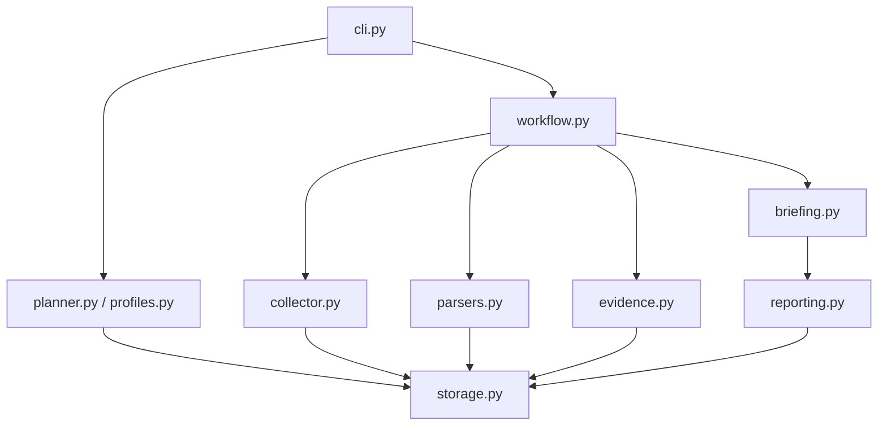
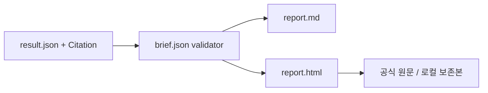

# ARCHITECTURE — Local-First Portable Core

[VISION](VISION.md) · [PRD](PRD.md) · [ROADMAP](ROADMAP.md)

## Context



호스트는 질문 이해와 검색을 담당한다. Core는 계획, 안전 수집, 파싱, 점수, 저장, 보고서를 결정적으로 수행한다.

## Component



## 저장

파일시스템은 원문과 사람이 읽는 extracted Markdown을 저장하고 SQLite는 관계와 검색 색인을 저장한다.

```text
.psr/
├─ project.json
├─ research.db
├─ profiles/
├─ runs/<run-id>/{plan.json,result.json,brief.json,report.md,report.html}
├─ sources/<source-id>/documents/<document-id>/snapshots/<snapshot-id>/
└─ reports/
```

`result.json`은 수집 사실·citation·실패·공백의 시스템 기록이다. `brief.json`은 사람이
읽는 보고서의 제목, 핵심 내용, 시사점, 권고와 citation 연결을 저장한다. `reporting.py`는
검증된 동일 brief에서 Markdown과 HTML을 결정적으로 렌더링한다.



HTML은 외부 runtime 없이 동작하는 단일 파일이다. CSS·JavaScript를 inline으로 포함하고,
모든 사용자 문자열을 escape한다. 외부 링크는 `http`·`https`만 활성화하며 로컬 보존본은
`.psr` 상대경로로 연결한다.

ID:

- `source_id`: canonical locator SHA-256
- `document_id`: 원문 bytes SHA-256
- `snapshot_id`: source ID + document hash
- `passage_id`: snapshot ID + locator + text
- `citation_id`: run ID + track ID + passage ID

## 데이터 모델

SQLite MVP entity:

- Project
- ResearchRun
- Source
- Document
- Snapshot
- Passage
- RunSource
- Citation
- Event

Knowledge Graph, Claim, Review, ChangeEvent는 제품 단계 브랜치에서 추가한다.

`brief.json`의 항목은 DB Claim entity가 아니라 보고서용 projection이다. MVP에서는 파일로
검증·보존하고, 장기 Claim·Review 생명주기는 제품 단계에서 별도 migration한다.

## 안전 경계

- `http`·`https`만 허용
- URL userinfo, 비표준 port, localhost, private/link-local/reserved IP 차단
- redirect마다 URL 재검증
- robots.txt 명시적 disallow 준수
- 기본 20 MiB parser 상한
- 출처별 timeout과 최대 2회 재시도
- cookie·credential을 저장하거나 전달하지 않음
- 원문 header는 allowlist만 저장

로컬 Skill이므로 운영 서버의 완전한 DNS pinning·sandbox와 동일한 보안 경계는 아니다. 민감한 네트워크에서 실행할 때는 조직의 outbound proxy·sandbox를 추가해야 한다.

## 확장 경계

`main`의 Core는 서버 framework, MCP SDK, OAuth, PostgreSQL을 import하지 않는다. 이후 adapter는 CLI/Core public interface를 호출한다.

```text
main
  └─ portable core

product/local-mcp-adapter
  └─ local MCP → portable core

product/hosted-public-preview
  └─ remote MCP/API → isolated runtime → portable core
```
