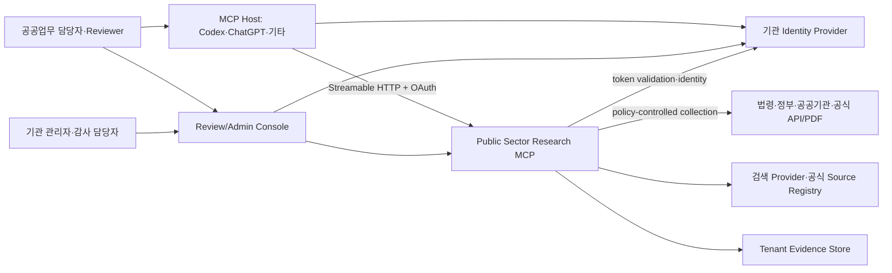
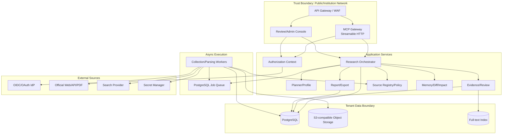
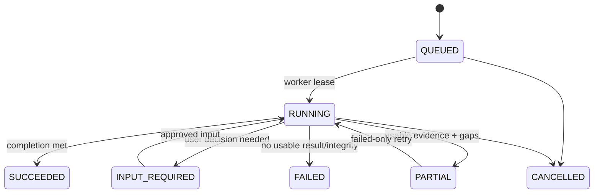
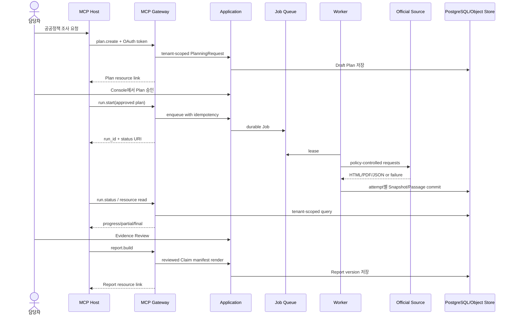
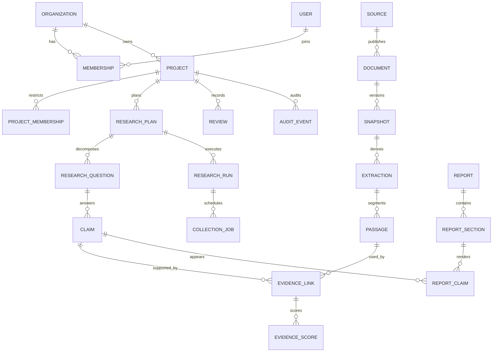

# Public Sector Research MCP — Architecture

> 문서 상태: Proposed · 기준일: 2026-07-16 · Architecture Style: MCP-first modular service

제품 방향은 [VISION](./VISION.md), 요구사항은 [PRD](./PRD.md), 구현 순서는 [ROADMAP](./ROADMAP.md)을 따른다.

## 1. Architecture Drivers

PSR MCP의 아키텍처를 결정하는 우선순위는 다음과 같다.

1. 공공업무 담당자가 사용하는 공식자료 우선 Research Service
2. 다중 Organization과 Project의 강한 데이터 격리
3. 여러 MCP Host가 사용하는 안정적인 Tool·Resource·Prompt 계약
4. 장시간 조사와 부분실패를 견디는 durable application job
5. Claim에서 원문 Passage까지의 추적성과 Review
6. OAuth 기반 최소권한과 감사가능성
7. protocol 변화와 application domain의 분리
8. 기존 crawler의 유용한 저수준 기능만 선택적 재사용

## 2. 현재 확인된 출발점

기존 `planned-web-crawling-skill`의 `adaptive-web-research`는 다음을 제공한다.

- `crawlkit.py probe|fetch`
- `urllib` cookie session과 GET/POST
- HTML link/form/table/JSON-LD probe
- JSON top-level probe
- `pypdf`가 있을 때 PDF page count와 첫 page text
- raw response, metadata, fetched_at, SHA-256 저장
- 순차형 `request`, `paginate`, `follow_links` collection plan

재사용 후보:

- request/response DTO의 개념
- cookie-aware fetch와 local file input
- media probe와 raw hash
- probe-first 운영 흐름

신규 제품에 그대로 사용할 수 없는 부분:

- single-user filesystem path와 이름 기반 overwrite
- 전체 response header 저장(`Set-Cookie` 포함 가능)
- retry·partial transaction·quota·policy 부재
- fail-fast sequential plan runner
- Organization·Project·Review·audit·authorization 부재
- MCP interface와 durable job 부재

코드 이식은 신규 repository에서 characterization test와 security review를 통과한 module에 한정한다.

## 3. MCP Protocol Baseline

### 3.1 현재 안정 기준

2026-07-16 현재 공식 MCP current version은 `2025-11-25`다. 공식 versioning 문서도 current protocol을 `2025-11-25`로 표시한다. PSR MCP MVP는 이 안정 버전을 기준으로 한다.

- [MCP Architecture](https://modelcontextprotocol.io/docs/learn/architecture)
- [MCP Versioning](https://modelcontextprotocol.io/docs/learn/versioning)
- [Tools 2025-11-25](https://modelcontextprotocol.io/specification/2025-11-25/server/tools)
- [Resources 2025-11-25](https://modelcontextprotocol.io/specification/2025-11-25/server/resources)
- [Prompts 2025-11-25](https://modelcontextprotocol.io/specification/2025-11-25/server/prompts)
- [Streamable HTTP](https://modelcontextprotocol.io/specification/2025-11-25/basic/transports)
- [Authorization](https://modelcontextprotocol.io/specification/2025-11-25/basic/authorization)
- [Security Best Practices](https://modelcontextprotocol.io/docs/tutorials/security/security_best_practices)

설계에 반영할 핵심:

- MCP data layer는 JSON-RPC 2.0, server primitive는 Tools·Resources·Prompts다.
- Tools는 model-controlled이므로 사람이 민감 operation을 거부할 수 있어야 한다.
- Tool input/output은 JSON Schema를 사용하고 structuredContent를 제공할 수 있다.
- Resources는 URI로 식별하며 list/read/template/subscription이 가능하다.
- Remote server는 Streamable HTTP를 사용한다.
- HTTP authorization은 OAuth 2.1 resource server, Protected Resource Metadata, audience validation을 따른다.
- client token passthrough는 금지한다.
- Tasks는 `2025-11-25`에서 실험 기능이다.

### 3.2 2026-07-28 Release Candidate

공식 프로젝트는 `2026-07-28` Release Candidate를 공개했지만 기준일 현재 final이 아니다. RC는 protocol-level session과 initialize handshake를 제거하는 stateless architecture를 포함한다.

- [2026-07-28 Release Candidate 안내](https://blog.modelcontextprotocol.io/posts/2026-07-28-release-candidate/)
- [Draft changelog](https://modelcontextprotocol.io/specification/draft/changelog)

정책:

1. MVP production contract는 `2025-11-25`다.
2. transport implementation을 adapter 뒤에 둔다.
3. application state를 `Mcp-Session-Id`에 저장하지 않는다.
4. `research_run_id`, `project_id`, cursor를 명시적 argument/Resource URI로 전달한다.
5. RC final과 Python SDK Tier 지원이 확인된 뒤 opt-in protocol adapter를 추가한다.
6. protocol version과 application schema version을 분리한다.

이 방식은 current session-based client와 future stateless client를 함께 수용한다.

## 4. Context Diagram



## 5. Container Architecture



## 6. Trust Boundaries

| Boundary | 위협 | 통제 |
|---|---|---|
| MCP Host → Gateway | 위조 token, 과다 scope, replay | OAuth validation, audience, expiry, rate, idempotency |
| Organization A → B | ID enumeration, query 누락 | tenant context, RLS, object prefix, negative tests |
| Model → Tool | prompt injection, overreach | schema, scope, state guard, approval nonce |
| Source content → Agent | source 내 악성 instruction | content/data tagging, no instruction execution, output sanitization |
| MCP server → upstream | token passthrough, SSRF | server credential, URL policy, DNS/IP check, redirect revalidation |
| Worker → Storage | cross-tenant object write | scoped job context, key builder, checksum |
| Admin Console | CSRF/session abuse, excessive privilege | OIDC, CSRF, step-up auth, short approval nonce, audit |
| Export | PII·copyright·secret leakage | policy lint, default raw exclusion, classification scope |

## 7. 주요 Container 책임

### 7.1 MCP Gateway

- protocol version negotiation
- Tools·Resources·Prompts capability
- JSON Schema input/output validation
- auth context injection
- Tool Execution Error/Protocol Error 변환
- structuredContent와 Resource link
- pagination·timeout·response size
- application service 호출 외 business logic 금지

### 7.2 Review/Admin Console

- Organization·Project·Membership 관리
- Plan/Evidence/Report Review
- single-use approval nonce 발급
- Source Registry와 profile override
- audit·quota·retention·export

Console은 AI chat UI가 아니다. 사람 책임이 필요한 control plane이다.

### 7.3 Research Orchestrator

- Plan lifecycle
- Run/job 생성·status·cancel·retry
- Question coverage와 stop condition
- transaction·domain event
- report build orchestration

### 7.4 Worker

- Job lease와 heartbeat
- search/result import
- collector·parser execution
- immutable object put
- attempt 단위 partial commit
- progress와 failure summary

### 7.5 Source Registry/Policy

- 기관·domain·source type·official status
- jurisdiction, valid period, owner Review
- allow/deny, robots/terms note, rate
- Organization override

### 7.6 Evidence/Review

- Passage·Claim·EvidenceLink
- Evidence Score와 conflict/gap
- Review supersession
- Project/Organization-scoped search

## 8. MCP Gateway Design

### 8.1 Capability

MVP server capability:

```json
{
  "tools": {"listChanged": false},
  "resources": {"subscribe": false, "listChanged": false},
  "prompts": {"listChanged": false}
}
```

v1.5에서 Resource change notification을 도입할 때 `resources.subscribe`와 `listChanged`를 활성화한다. 동적으로 Tool을 숨기기보다 list는 사용자 scope에 맞게 deterministic하게 필터링한다.

### 8.2 Tool Definition 규칙

- programmatic name: `psr.<domain>.<action>`
- 1~128자, ASCII letter/digit/underscore/hyphen/dot
- human title과 한국어/영어 description
- JSON Schema 2020-12 명시
- `additionalProperties: false` 기본
- input size와 string length 제한
- outputSchema 필수
- annotation: readOnly/destructive/idempotent/openWorld
- `execution.taskSupport: "forbidden"`가 MVP 기본

Tool annotation은 client hint이고 authorization 근거가 아니다.

### 8.3 Tool Result

성공:

```json
{
  "content": [
    {"type": "text", "text": "조사 실행을 시작했습니다: run 019..."},
    {
      "type": "resource_link",
      "uri": "psr://projects/019.../runs/019...",
      "name": "Research run status",
      "mimeType": "application/json"
    }
  ],
  "structuredContent": {
    "schema_version": "1.0",
    "operation_id": "019...",
    "run_id": "019...",
    "status": "QUEUED",
    "status_resource_uri": "psr://projects/019.../runs/019..."
  },
  "isError": false
}
```

Tool execution error:

```json
{
  "content": [
    {"type": "text", "text": "승인되지 않은 조사계획입니다. Plan Review를 완료하세요."}
  ],
  "structuredContent": {
    "schema_version": "1.0",
    "code": "PLAN_NOT_APPROVED",
    "retryable": false,
    "operation_id": "019...",
    "suggested_action": "Open the plan review resource."
  },
  "isError": true
}
```

Unknown tool·malformed JSON-RPC는 protocol error다. domain validation·state·upstream failure는 model이 고칠 수 있는 Tool Execution Error로 반환한다.

### 8.4 Tool Authorization Matrix

Gateway는 다음 순서로 검사한다.

```text
Token signature/issuer/expiry
→ audience/resource binding
→ OAuth scope
→ Organization Membership
→ Project Membership/restriction
→ Entity tenant ownership
→ Role/state guard
→ approval nonce/idempotency/expected version
→ application service
```

어느 단계에서도 annotation만으로 호출을 허용하지 않는다.

## 9. Authorization Architecture

### 9.1 MCP Resource Server

Remote PSR MCP는 OAuth 2.1 protected resource로 동작한다.

- RFC 9728 Protected Resource Metadata 제공
- `WWW-Authenticate`에 resource metadata와 필요한 scope 안내
- Authorization Server Metadata 또는 OIDC Discovery 사용
- authorization/token request의 resource indicator와 server audience 검증
- short-lived access token 권장
- PKCE와 client registration은 IdP/Host capability에 맞춤
- inbound token을 downstream API로 전달하지 않음

PSR MCP가 자체 Authorization Server를 처음부터 구현하지 않는다. 기관 IdP 또는 검증된 authorization product와 통합한다.

### 9.2 Authorization Context

```python
@dataclass(frozen=True)
class AuthorizationContext:
    subject_id: str
    client_id: str
    organization_id: str
    scopes: frozenset[str]
    roles: frozenset[str]
    project_restrictions: frozenset[str] | None
    token_id_hash: str
    authenticated_at: datetime
```

raw token은 context와 log에 저장하지 않는다.

### 9.3 Approval

Approval nonce는 다음에 cryptographically bound된다.

- human subject
- organization/project
- target type/id/version/hash
- allowed verdict/action
- issued_at/expiry
- single-use nonce ID

MCP Host confirmation은 좋은 UX hint지만 PSR server의 approval 조건을 대체하지 않는다.

### 9.4 Upstream Credential

- 공개 source: credential 없음
- 기관 API: Secret Manager의 service credential
- user-delegated upstream: 별도 OAuth client와 token vault
- MCP client access token과 upstream token은 서로 다른 audience와 lifecycle

## 10. Tenant Isolation

### 10.1 Defense in Depth

1. Auth context에 Organization 확정
2. repository method가 organization ID를 필수 argument로 받음
3. PostgreSQL RLS
4. object key에 opaque organization prefix
5. search index namespace
6. job context와 queue partition/quota
7. audit와 cross-tenant canary test

### 10.2 Error Semantics

권한 없는 다른 tenant ID는 존재 여부를 노출하지 않기 위해 일반적으로 `NOT_FOUND_OR_FORBIDDEN`을 반환한다. Admin audit에는 실제 reason을 별도 기록한다.

### 10.3 Shared Public Cache

MVP에서 tenant 간 Evidence row를 공유하지 않는다. exact public object cache를 도입하더라도 tenant별 Snapshot/Document relation과 Review는 분리한다. v1.5에서 검증된 public source metadata만 별도 shared catalog로 투영한다.

## 11. Tool Catalog와 Application Service

| Tool | Service method | Transaction | Network |
|---|---|---|---|
| `psr.project.list/get` | `ProjectQueryService` | read-only | 없음 |
| `psr.research.plan.create/get` | `PlanningService` | short write/read | optional model provider |
| `psr.research.plan.submit_review` | `ReviewService` | short write | 없음 |
| `psr.research.run.start` | `ResearchJobService.enqueue` | short write | 없음 |
| `psr.research.run.status` | `ResearchJobService.get` | read-only | 없음 |
| `psr.research.run.cancel` | `ResearchJobService.cancel` | short write | 없음 |
| `psr.evidence.search/get` | `EvidenceQueryService` | read-only | 없음 |
| `psr.evidence.submit_review` | `ReviewService` | short write | 없음 |
| `psr.report.build` | `ReportService.enqueue/build` | short write | 없음 |
| `psr.report.get` | `ReportQueryService` | read-only | 없음 |

MCP request가 외부 수집이 끝날 때까지 DB transaction이나 HTTP connection을 점유하지 않는다.

## 12. Resource Architecture

### 12.1 Custom URI

`psr://`는 application-level custom scheme이다. URI는 opaque ID와 hierarchy를 사용하고 filesystem path나 Organization slug를 노출하지 않는다.

```text
psr://projects/<project-id>
psr://projects/<project-id>/plans/<plan-id>
psr://projects/<project-id>/runs/<run-id>
psr://projects/<project-id>/evidence/<evidence-id>
psr://projects/<project-id>/passages/<passage-id>
psr://projects/<project-id>/reports/<report-id>/versions/<n>
```

### 12.2 Resolver

```python
class ResourceResolver(Protocol):
    def list(self, auth: AuthorizationContext, cursor: str | None) -> ResourcePage: ...
    def read(self, auth: AuthorizationContext, uri: str) -> ResourceContents: ...
```

Resolver는 URI parse 후 반드시 repository를 tenant-scoped query로 호출한다.

### 12.3 Content Policy

- status/metadata: `application/json`
- Plan/Report: `text/markdown` 또는 JSON
- Passage/Evidence: excerpt+locator+score JSON/Markdown
- raw original: 기본 list 제외, binary embedding 금지 또는 size threshold
- 큰 원문: authorized expiring download handle
- Resource content에 access classification과 lastModified annotation

### 12.4 Subscription

v1.5에서 Claim/Report change resource에 subscription을 제공한다. Notification은 “무엇이 바뀌었다”는 URI와 최소 metadata만 전달하고 민감 content를 push하지 않는다.

## 13. Prompt Architecture

Prompts는 user-controlled entry point다. Prompt template은 다음을 포함한다.

- 업무 목적과 사용자 확인 질문
- 적합한 Tool 호출 순서
- 공식자료 우선과 limitation 출력
- approval 필요 지점
- Report template와 citation policy

Prompt는 server-side authorization이나 business state를 우회할 수 없다. Prompt version과 Project override를 관리하고 Tool/resource name 변경에 대한 contract test를 둔다.

## 14. Async Job Architecture

### 14.1 MCP Tasks 비의존

`2025-11-25` Tasks는 experimental이므로 MVP Tool은 task augmentation을 요구하지 않는다.

```text
run.start tool
  → application Job row + idempotency record
  → run_id/status URI 즉시 반환
  → worker가 Job lease
  → status tool/resource로 polling
  → 완료 result는 Evidence/Report Resource
```

### 14.2 Job State



### 14.3 Queue MVP

PostgreSQL-backed queue를 추천한다.

- `SELECT ... FOR UPDATE SKIP LOCKED`
- lease expiry와 heartbeat
- attempt count와 next_run_at
- tenant concurrency/quota
- idempotency key unique constraint
- cooperative cancel flag
- outbox event

Redis/managed queue는 처리량이나 scheduling 요구가 측정된 뒤 분리한다.

### 14.4 Future Tasks Adapter

Protocol Tasks가 안정되고 Host가 지원하면 다음 mapping adapter를 추가한다.

```text
MCP task_id ↔ application job_id
```

Task TTL은 Evidence retention이 아니다. Task access는 authorization context에 묶고 application Job은 별도 lifecycle을 유지한다.

## 15. Data Flow



## 16. Application Module Structure

```text
src/psr_mcp/
├─ cli/
│  ├─ main.py
│  ├─ serve.py
│  ├─ migrate.py
│  ├─ profiles.py
│  ├─ sources.py
│  ├─ legacy.py
│  └─ doctor.py
├─ mcp/
│  ├─ server.py
│  ├─ protocol_versions.py
│  ├─ tools/
│  ├─ resources/
│  ├─ prompts/
│  └─ errors.py
├─ api/
│  ├─ review_console.py
│  └─ admin.py
├─ auth/
│  ├─ oauth.py
│  ├─ context.py
│  ├─ policy.py
│  └─ approval.py
├─ application/
│  ├─ planning.py
│  ├─ research_jobs.py
│  ├─ evidence.py
│  ├─ reviews.py
│  ├─ reports.py
│  └─ maintenance.py
├─ domain/
│  ├─ models.py
│  ├─ states.py
│  ├─ events.py
│  └─ policies.py
├─ planner/
├─ profiles/
├─ source_registry/
├─ search/
├─ collectors/
├─ parsers/
├─ evidence/
├─ scoring/
├─ provenance/
├─ memory/
├─ diff/
├─ reporting/
├─ jobs/
├─ storage/
│  ├─ postgres/
│  ├─ object_store/
│  └─ migrations/
├─ observability/
└─ common/
```

Dependency direction:

```text
MCP/API adapters → Application → Domain ← Infrastructure adapters
```

Domain은 MCP SDK, HTTP framework, PostgreSQL client를 import하지 않는다.

### 16.1 운영 CLI 경계

`psrctl`은 service bootstrap, migration, profile/source 검증, legacy dry-run, conformance에 한정한다. CLI handler도 MCP Gateway와 마찬가지로 Application Service 또는 Infrastructure maintenance interface를 호출하며 domain table을 임의로 수정하지 않는다.

```text
psrctl command
→ config/secret reference resolve
→ operator identity 확인
→ dry-run 또는 explicit apply
→ Application/Maintenance Service
→ AuditEvent + versioned JSON/text result
```

Production의 `source import --apply`, migration, recovery는 deployment role이 필요하다. Project research 기능을 CLI에 다시 만들지 않아 MCP의 schema·authorization·Review contract가 우회되지 않게 한다.

## 17. 핵심 Interface

```python
class PlanningService(Protocol):
    async def create_plan(
        self, auth: AuthorizationContext, command: CreatePlan
    ) -> ResearchPlan: ...

class ResearchJobService(Protocol):
    async def enqueue(
        self, auth: AuthorizationContext, command: StartResearch
    ) -> ResearchRun: ...
    async def get(
        self, auth: AuthorizationContext, run_id: str
    ) -> ResearchRunStatus: ...

class Collector(Protocol):
    async def collect(
        self, request: CollectionRequest, policy: CollectionPolicy
    ) -> CollectionResult: ...

class EvidenceRepository(Protocol):
    async def search(
        self, organization_id: str, project_id: str, query: EvidenceQuery
    ) -> EvidencePage: ...

class ObjectStore(Protocol):
    async def put_verified(
        self, organization_id: str, content: AsyncIterable[bytes], metadata: ObjectMeta
    ) -> StoredObject: ...
```

Repository method에서 `organization_id`와 `project_id`를 implicit global로 읽지 않는다.

## 18. Domain Data Model



모든 Project-scoped entity는 `organization_id`와 `project_id`를 포함한다. Source Registry의 공통 seed와 Organization override는 별도 namespace다.

## 19. Identifier Strategy

- domain ID: application-generated UUIDv7
- object identity: SHA-256
- Tool/result에 UUID string 사용
- Resource URI가 entity type과 Project context를 제공
- 사용자 slug는 identity가 아님
- public error에 sequential DB ID 노출 금지
- approval nonce와 idempotency key는 cryptographically random

UUIDv7 library와 database support는 ADR에서 고정한다. Protocol Task ID와 domain Job ID는 별개다.

## 20. PostgreSQL Schema Draft

아래는 MVP의 핵심 모양이다. 실제 migration은 smaller change set으로 나눈다.

```sql
CREATE TABLE organizations (
    id uuid PRIMARY KEY,
    name text NOT NULL,
    status text NOT NULL,
    retention_policy jsonb NOT NULL,
    created_at timestamptz NOT NULL
);

CREATE TABLE users (
    id uuid PRIMARY KEY,
    issuer text NOT NULL,
    subject text NOT NULL,
    display_name text,
    created_at timestamptz NOT NULL,
    UNIQUE (issuer, subject)
);

CREATE TABLE memberships (
    organization_id uuid NOT NULL REFERENCES organizations(id),
    user_id uuid NOT NULL REFERENCES users(id),
    role text NOT NULL,
    status text NOT NULL,
    created_at timestamptz NOT NULL,
    PRIMARY KEY (organization_id, user_id)
);

CREATE TABLE projects (
    id uuid PRIMARY KEY,
    organization_id uuid NOT NULL REFERENCES organizations(id),
    name text NOT NULL,
    classification text NOT NULL,
    active_profile_key text NOT NULL,
    status text NOT NULL,
    created_at timestamptz NOT NULL,
    updated_at timestamptz NOT NULL,
    row_version bigint NOT NULL DEFAULT 1
);

CREATE TABLE research_plans (
    id uuid PRIMARY KEY,
    organization_id uuid NOT NULL,
    project_id uuid NOT NULL REFERENCES projects(id),
    version integer NOT NULL,
    status text NOT NULL,
    question text NOT NULL,
    decision_context text,
    plan_json jsonb NOT NULL,
    content_sha256 char(64) NOT NULL,
    created_by uuid NOT NULL REFERENCES users(id),
    created_at timestamptz NOT NULL,
    UNIQUE (id, version)
);

CREATE TABLE research_runs (
    id uuid PRIMARY KEY,
    organization_id uuid NOT NULL,
    project_id uuid NOT NULL REFERENCES projects(id),
    plan_id uuid NOT NULL,
    plan_version integer NOT NULL,
    status text NOT NULL,
    initiated_by uuid NOT NULL REFERENCES users(id),
    progress jsonb NOT NULL,
    failure_summary jsonb,
    created_at timestamptz NOT NULL,
    started_at timestamptz,
    ended_at timestamptz,
    row_version bigint NOT NULL DEFAULT 1
);

CREATE TABLE jobs (
    id uuid PRIMARY KEY,
    organization_id uuid NOT NULL,
    project_id uuid NOT NULL,
    run_id uuid NOT NULL REFERENCES research_runs(id),
    job_type text NOT NULL,
    status text NOT NULL,
    priority integer NOT NULL,
    payload jsonb NOT NULL,
    idempotency_key text NOT NULL,
    attempt integer NOT NULL DEFAULT 0,
    next_run_at timestamptz NOT NULL,
    lease_owner text,
    lease_expires_at timestamptz,
    cancel_requested boolean NOT NULL DEFAULT false,
    created_at timestamptz NOT NULL,
    UNIQUE (organization_id, idempotency_key)
);

CREATE TABLE sources (
    id uuid PRIMARY KEY,
    organization_id uuid,
    canonical_name text NOT NULL,
    canonical_host text,
    source_type text NOT NULL,
    jurisdiction text,
    official_status text NOT NULL,
    registry_status text NOT NULL,
    policy jsonb NOT NULL,
    created_at timestamptz NOT NULL
);

CREATE TABLE documents (
    id uuid PRIMARY KEY,
    organization_id uuid NOT NULL,
    project_id uuid NOT NULL,
    source_id uuid REFERENCES sources(id),
    title text,
    document_type text NOT NULL,
    canonical_identifier text,
    published_at timestamptz,
    effective_at timestamptz,
    superseded_at timestamptz,
    metadata jsonb NOT NULL,
    created_at timestamptz NOT NULL
);

CREATE TABLE objects (
    organization_id uuid NOT NULL,
    sha256 char(64) NOT NULL,
    byte_length bigint NOT NULL,
    media_type text NOT NULL,
    object_key text NOT NULL,
    integrity_status text NOT NULL,
    created_at timestamptz NOT NULL,
    PRIMARY KEY (organization_id, sha256)
);

CREATE TABLE snapshots (
    id uuid PRIMARY KEY,
    organization_id uuid NOT NULL,
    project_id uuid NOT NULL,
    document_id uuid NOT NULL REFERENCES documents(id),
    object_sha256 char(64) NOT NULL,
    capture_method text NOT NULL,
    original_available boolean NOT NULL,
    requested_url text,
    final_url text,
    fetched_at timestamptz NOT NULL,
    validation_status text NOT NULL,
    validation_detail jsonb NOT NULL,
    created_at timestamptz NOT NULL,
    UNIQUE (organization_id, document_id, object_sha256, capture_method)
);

CREATE TABLE passages (
    id uuid PRIMARY KEY,
    organization_id uuid NOT NULL,
    project_id uuid NOT NULL,
    snapshot_id uuid NOT NULL REFERENCES snapshots(id),
    ordinal integer NOT NULL,
    text text NOT NULL,
    text_sha256 char(64) NOT NULL,
    locator jsonb NOT NULL,
    source_language text,
    created_at timestamptz NOT NULL,
    UNIQUE (snapshot_id, ordinal)
);

CREATE TABLE claims (
    id uuid PRIMARY KEY,
    organization_id uuid NOT NULL,
    project_id uuid NOT NULL,
    run_id uuid REFERENCES research_runs(id),
    claim_kind text NOT NULL,
    statement text NOT NULL,
    verification_status text NOT NULL,
    review_status text NOT NULL,
    freshness_status text NOT NULL,
    created_by uuid NOT NULL REFERENCES users(id),
    created_at timestamptz NOT NULL,
    updated_at timestamptz NOT NULL,
    row_version bigint NOT NULL DEFAULT 1
);

CREATE TABLE evidence_links (
    id uuid PRIMARY KEY,
    organization_id uuid NOT NULL,
    project_id uuid NOT NULL,
    claim_id uuid NOT NULL REFERENCES claims(id),
    passage_id uuid NOT NULL REFERENCES passages(id),
    relation_type text NOT NULL,
    score_card jsonb NOT NULL,
    provenance_cluster_id uuid,
    review_status text NOT NULL,
    created_at timestamptz NOT NULL,
    UNIQUE (claim_id, passage_id, relation_type)
);

CREATE TABLE reviews (
    id uuid PRIMARY KEY,
    organization_id uuid NOT NULL,
    project_id uuid NOT NULL,
    target_type text NOT NULL,
    target_id uuid NOT NULL,
    target_version text NOT NULL,
    verdict text NOT NULL,
    reviewer_id uuid NOT NULL REFERENCES users(id),
    comment text NOT NULL,
    supersedes_review_id uuid REFERENCES reviews(id),
    created_at timestamptz NOT NULL
);

CREATE TABLE reports (
    id uuid PRIMARY KEY,
    organization_id uuid NOT NULL,
    project_id uuid NOT NULL,
    run_id uuid NOT NULL REFERENCES research_runs(id),
    status text NOT NULL,
    current_version integer NOT NULL,
    manifest jsonb NOT NULL,
    created_at timestamptz NOT NULL,
    updated_at timestamptz NOT NULL
);

CREATE TABLE audit_events (
    id uuid NOT NULL,
    organization_id uuid NOT NULL,
    project_id uuid,
    actor_id uuid,
    client_id text,
    operation_id uuid NOT NULL,
    event_type text NOT NULL,
    target_type text,
    target_id uuid,
    outcome text NOT NULL,
    data jsonb NOT NULL,
    occurred_at timestamptz NOT NULL,
    PRIMARY KEY (organization_id, id)
) PARTITION BY RANGE (occurred_at);
```

모든 composite relation에 organization consistency를 보장하려면 `(organization_id, id)` unique key와 composite foreign key를 migration에 적용한다. 위 초안은 가독성을 위해 일부 FK를 생략했다.

### 20.1 Row-Level Security 예시

```sql
ALTER TABLE projects ENABLE ROW LEVEL SECURITY;

CREATE POLICY projects_tenant_isolation ON projects
USING (
    organization_id = current_setting('app.organization_id', true)::uuid
);
```

connection pool checkout마다 transaction-local setting을 주입하고 반환 전에 reset한다. RLS는 application filter를 대체하지 않는 방어층이다.

## 21. Object Storage

Production key:

```text
org/<opaque-org-id>/sha256/<first-2>/<full-sha256>/original.<ext>
org/<opaque-org-id>/derived/<extraction-id>/normalized.txt
org/<opaque-org-id>/reports/<report-id>/<version>/report.md
org/<opaque-org-id>/exports/<export-id>/manifest.json
```

정책:

- key는 사용자 filename과 domain을 포함하지 않음
- server-side encryption
- checksum metadata와 upload 후 verification
- object immutability/version lock은 운영 요구에 따라 선택
- signed URL은 짧은 TTL, actor·object audit
- bucket list 권한은 application service에만 제공
- object delete는 DB ref count와 retention workflow를 거침

Local development는 filesystem adapter를 사용하되 production semantics를 contract test로 맞춘다.

## 22. Evidence Model

### 22.1 Provenance chain

```text
Organization/Project
→ Source Registry Entry
→ Document
→ CollectionAttempt
→ Snapshot/Object
→ Extraction
→ Passage
→ EvidenceLink
→ Claim
→ ReportSection/Decision
```

### 22.2 Score

EvidenceLink 단위 8차원:

| Dimension | 기본 weight |
|---|---:|
| Authority | 0.18 |
| Primaryness | 0.15 |
| Direct relevance | 0.18 |
| Currentness | 0.15 |
| Original availability | 0.10 |
| Independence | 0.08 |
| Specificity | 0.08 |
| Scope clarity | 0.08 |

각 값은 0~5와 rationale을 가진다.

```text
raw_total = 20 × Σ(weight × value)
adjusted_total = raw_total - unresolved_conflict_penalty
```

총점은 보조값이다. official source라도 outdated·wrong jurisdiction이면 낮아질 수 있다. 사람 override는 새 ScoreCard와 Review를 생성한다.

### 22.3 Claim State

세 축을 분리한다.

- verification: `DRAFT`, `SUPPORTED`, `CONTESTED`, `UNSUPPORTED`, `INFERENCE`
- review: `PENDING`, `APPROVED`, `REJECTED`, `CHANGES_REQUESTED`, `SUPERSEDED`
- freshness: `CURRENT`, `CHECK_DUE`, `STALE`, `UNKNOWN`

## 23. Source Registry와 Collection Policy

### 23.1 Source Tier

| Tier | 예 | 기본 사용 |
|---|---|---|
| A | 법령·정부·공공기관·공식 표준·공시 | 핵심 Evidence 우선 |
| B | 공식 기업·연구기관·학술 원문 | 주제에 따라 핵심/보조 |
| C | 신뢰 언론·전문기관 분석 | 독립 검증·맥락 |
| D | 블로그·커뮤니티·재가공 | 발견·약한 맥락, 핵심 결론 금지 기본 |
| U | 미검증 | Reviewer 확인 전 Evidence 채택 금지 |

Tier는 기관 권위를 나타낼 뿐 질문 직접성과 currentness를 대체하지 않는다.

### 23.2 Request Policy

```text
normalized URL
→ source registry/domain policy
→ scheme/port allowlist
→ DNS resolve and private/link-local IP block
→ robots/terms/access classification
→ tenant/source rate and budget
→ credential selection
→ request
→ redirect URL 재검증
→ status/body/media/login/error validation
→ secret redaction
→ immutable object
```

### 23.3 Retry

- timeout, connection reset, 408, 429, 500/502/503/504: bounded retry
- 401/403/404/410: 기본 no retry
- `Retry-After` 존중
- POST는 idempotency 선언 없으면 자동 retry 금지
- request attempt별 독립 transaction

## 24. Parsing

### HTML

- raw bytes와 encoding evidence
- canonical/title/publisher/date/JSON-LD
- heading hierarchy와 main content
- table caption/header/cell locator
- script/style/navigation 분리
- passage heading path + DOM locator + text hash

### PDF

- magic byte와 page count
- page별 text/locator
- metadata 신뢰도
- text coverage 낮으면 `OCR_REQUIRED`
- encrypted/corrupt typed error
- OCR은 optional worker profile

### JSON

- raw bytes
- canonical serialization은 derived object
- JSON Pointer Passage
- API pagination과 version metadata

Parser name/version을 Extraction에 저장한다. Parser upgrade로 text가 바뀌면 source content change와 분리한다.

## 25. Deduplication·Provenance

단계:

1. conservative URL normalization
2. exact object SHA-256
3. canonical URL/법령 ID/DOI/report number
4. publisher+title+date candidate
5. near-duplicate candidate
6. `MIRROR_OF`, `REPUBLISHES`, `DERIVED_FROM`, `REVISION_OF`, `SUPERSEDES`, `CITES`

near-duplicate는 자동 Document 병합을 하지 않는다. 같은 보도자료를 인용한 기사·블로그는 provenance cluster의 독립 source count 1로 처리할 수 있다.

## 26. Diff·Impact

MVP는 raw/normalized hash와 freshness를 저장한다. v1.5:

1. conditional request
2. raw hash same → unchanged
3. raw changed, normalized same → layout-only
4. heading/page/JSON Pointer segment diff
5. old/new Passage mapping
6. EvidenceLink→Claim→ReportSection impact
7. Review queue와 Resource update

Parser version만 바뀐 경우 `PARSER_ONLY`다. Decision을 자동 변경하지 않고 Review required만 표시한다.

## 27. Report Architecture

Report는 versioned artifact와 dependency manifest다.

필수:

- question, scope, jurisdiction, as-of date
- Plan version, profile, completion/stop reason
- Claim ID와 fact/inference label
- Evidence Score breakdown과 locator
- conflicts, gaps, failures, original unavailable
- reused/new/refreshed evidence
- reviewer와 approval state
- artifact hash와 dependency IDs

Report builder는 unlinked FACT를 lint하고 stale/material conflict가 있으면 publish를 막는다. LLM writer는 optional adapter이며 source content를 instruction으로 취급하지 않는다.

## 28. Configuration

### Organization policy

- default profiles
- source allow/deny/owner review
- retention
- tenant quota/concurrency
- raw export
- allowed upstream providers
- required Review roles

### Service config

- database/object/queue endpoints
- protocol versions
- IdP metadata URL와 expected issuer/audience
- secret references
- telemetry endpoint
- parser/collector plugin allowlist

Secret 값은 config file이나 MCP Tool argument로 받지 않는다.

## 29. Deployment

### MVP Internal Alpha

```text
1 MCP/API service instance
1+ worker
PostgreSQL
S3-compatible object storage
Institution/dev OIDC
Reverse proxy/TLS
Review Console
```

현재 안정 protocol의 session 특성을 단순화하기 위해 MCP Gateway는 MVP에서 단일 instance 또는 sticky routing을 사용한다. Application job과 evidence는 외부 store에 있으므로 Gateway loss가 연구 상태를 잃지 않는다.

### v1.0 Pilot

- multiple workers
- service health/readiness
- backup/restore
- WAF/rate limit
- OpenTelemetry
- secret manager
- vulnerability/dependency scan
- admin/audit export

### Protocol 2026 Migration

final 안정화 후 stateless Gateway를 별도 canary로 배포하고 client protocol negotiation test를 수행한다. 같은 Application Service와 Resource URI를 사용한다.

## 30. Observability

Trace context:

```text
MCP request ID
→ operation ID
→ application command
→ job ID/run ID
→ collection attempt
→ object/snapshot
→ claim/report/review
```

Metric:

- MCP Tool latency/error by tool/client/tenant(PII 제외)
- auth/scope/tenant denial
- job queue depth/age/lease/retry
- source status/rate/policy block
- Snapshot bytes/dedup/reuse
- parser/OCR failure
- claim coverage/conflict/review SLA
- object/database integrity
- export/purge

로그에는 raw token, Cookie, original text, approval nonce를 남기지 않는다.

## 31. Security Controls

### MCP/OAuth

- issuer/audience/signature/expiry/resource validation
- Protected Resource Metadata
- least-privilege scopes와 step-up
- no token passthrough
- short-lived approval nonce
- Tool input/output validation
- user consent와 server-side state guard

### Web/Collector

- SSRF protection
- redirect revalidation
- DNS rebinding 방어
- private/link-local/metadata IP 차단
- response size/time limit
- archive/PDF bomb 방어
- content type/magic validation
- HTML 실행 금지

### Tenant/Data

- RLS + application filters
- encrypted transport/storage
- scoped object keys/signed URL
- secret manager
- immutable review/audit
- backup/restore and purge
- export policy lint

### Agent

- source text와 system instruction 분리
- prompt injection fixture
- model output을 Review 전 Decision으로 저장 금지
- external tool chaining은 explicit allowlist

## 32. Testing Strategy

### Protocol

- official/current schema validation
- capability negotiation
- tools/list/call
- resources/list/read/templates
- prompts/list/get
- pagination/cursor
- structuredContent/outputSchema
- protocol vs execution error
- two MCP Host smoke
- future RC canary suite

### Security

- wrong issuer/audience/scope
- token passthrough detection
- cross-tenant ID enumeration
- RLS connection-pool context leak
- nonce replay/expiry/version mismatch
- SSRF/private IP/redirect
- prompt injection
- secret log scan
- signed URL expiry

### Research

- official HTML/PDF/JSON
- empty 200/login page/octect-stream PDF
- 403/429/timeout/partial
- source tier and score
- Claim locator/report lint
- legacy probe import

### Failure

- worker crash and lease recovery
- object put then DB failure
- DB commit then event delivery failure
- duplicate run.start idempotency
- cancel race
- backup/restore

## 33. Legacy Migration

### Repository

- 기존 repository는 독립 유지
- 신규 repository에 crawler history를 merge하지 않음
- code reuse는 package copy가 아니라 reviewed extraction 또는 versioned dependency
- license/ownership 확인 후 attribution

### Code

1. existing fetch/probe characterization
2. secure request/response DTO
3. Collector protocol 뒤 `UrllibCollector`
4. parser registry로 HTML/PDF/JSON 분리
5. secret redaction/content validation/retry
6. multi-tenant worker integration

### Data

Legacy `probe.json` import는 다음 mapping을 사용한다.

- URL/final URL → DocumentURL/CollectionAttempt
- fetched_at/status/content type/hash → Attempt/Snapshot
- sibling body → Object
- empty body → invalid Attempt
- web extract → `WEB_READER`, original unavailable
- evidence.md → Claim candidate, Review pending
- stale absolute path → warning, sibling relative path 우선

원본 legacy directory를 자동 수정하지 않는다.

## 34. Architecture Decision Records

| ADR | 결정 | 추천안 | 시점 |
|---|---|---|---|
| ADR-001 | Product boundary | 신규 repository, legacy 독립 | 확정 |
| ADR-002 | Protocol baseline | current `2025-11-25`, RC adapter | 확정 |
| ADR-003 | MCP SDK | 공식 Python SDK stable + compatibility spike | 첫 구현 |
| ADR-004 | Application state | explicit Job/Resource handles, session 비의존 | 확정 |
| ADR-005 | Production storage | PostgreSQL + S3-compatible object | 확정 |
| ADR-006 | Tenant isolation | application filter + RLS + object namespace | 확정 |
| ADR-007 | Authorization | external IdP, OAuth resource server, no passthrough | 확정 |
| ADR-008 | Approval | Console-issued subject/version-bound nonce | MVP |
| ADR-009 | Job queue | PostgreSQL-backed initially | MVP spike |
| ADR-010 | ID | UUIDv7 | schema 시작 전 |
| ADR-011 | Tool catalog/versioning | `psr.*`, schema 1.0 | MCP vertical slice |
| ADR-012 | Source Registry | shared seed + tenant override | MVP |
| ADR-013 | Evidence Score | 8 dimensions + Review | MVP |
| ADR-014 | 2026 protocol adoption | final+SDK+Host support 후 opt-in | protocol final 후 |
| ADR-015 | MCP Tasks | core 미의존, future adapter | v2 |

---

이 아키텍처의 핵심은 crawler를 MCP로 감싸는 것이 아니라, **Organization-scoped Evidence Platform을 만들고 MCP를 그 공식 계약으로 제공하는 것**이다.
