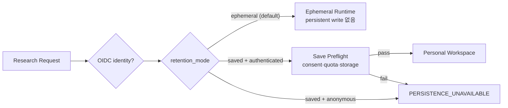
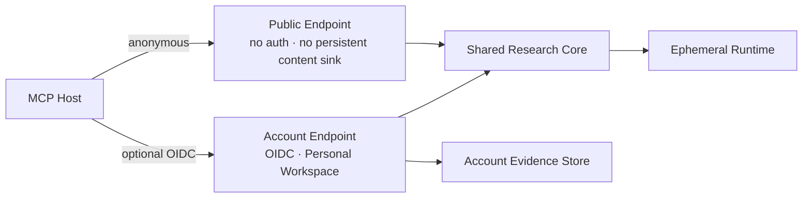
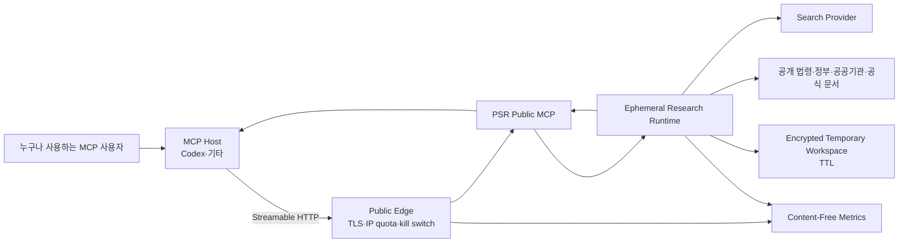
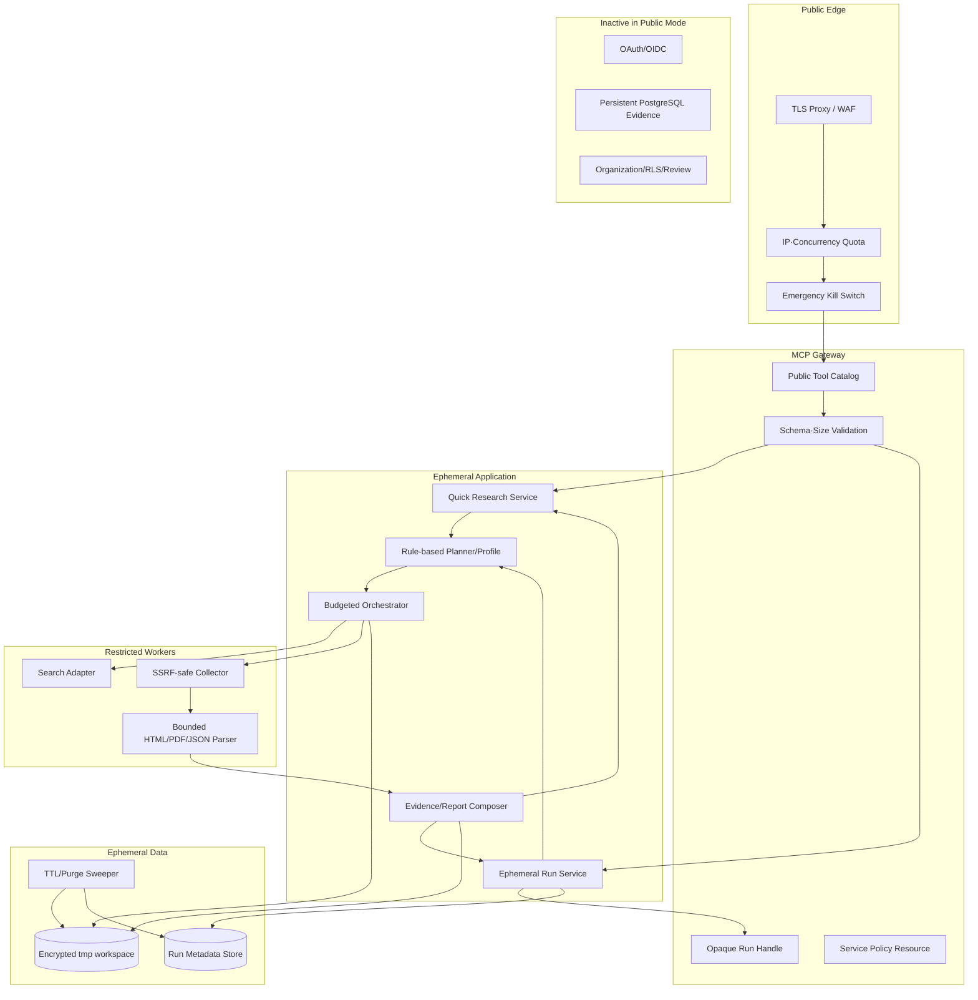
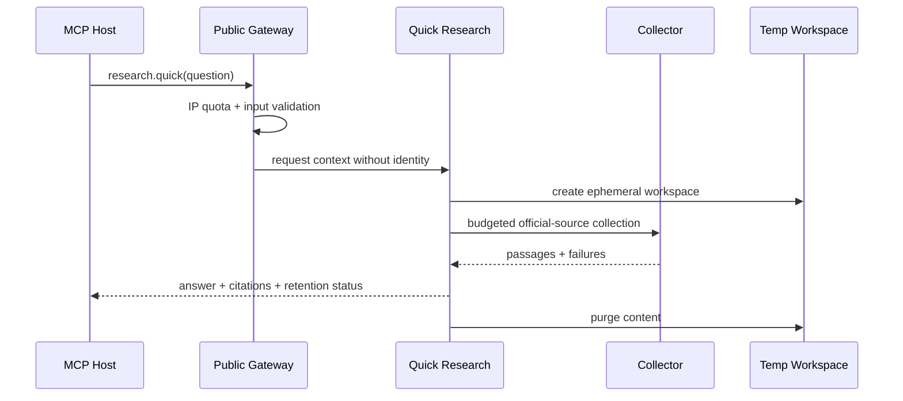
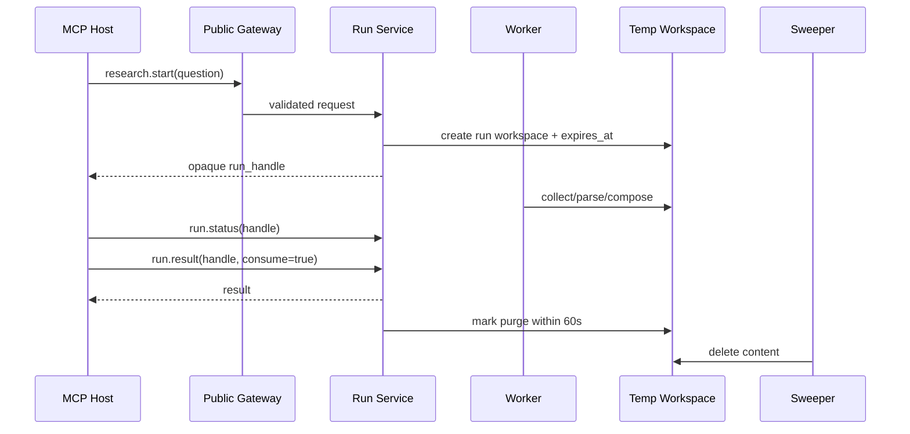
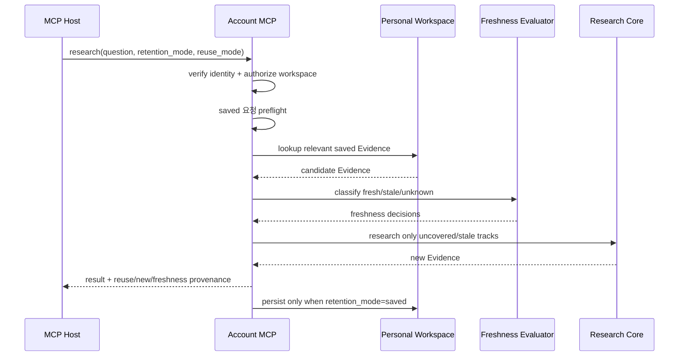

# Public Sector Research MCP — Architecture

> 문서 상태: Accepted · 기준일: 2026-07-16 · Current Mode: `PUBLIC_EPHEMERAL`

[VISION](./VISION.md) · [PRD](./PRD.md) · [ROADMAP](./ROADMAP.md) · [ADR-0009](./adr/0009-public-zero-retention-first.md) · [ADR-0010](./adr/0010-progressive-identity-and-opt-in-persistence.md)

## 1. Architecture Drivers

우선순위는 다음과 같다.

1. 가입 없이 첫 조사결과를 빠르게 제공
2. 공식자료 우선과 citation traceability
3. 질문·원문·보고서의 기본 무보관
4. 공개 endpoint의 SSRF·남용·비용 통제
5. 연결 종료와 worker crash를 견디는 짧은 ephemeral lifecycle
6. MCP current stable과 여러 Host 호환
7. 향후 opt-in account·영구저장·Enterprise 확장
8. 기존 crawler 기능의 안전한 최소 재사용

초기 아키텍처는 최대 기능이 아니라 **유용한 조사 한 건을 안전하게 완료하고 지우는 경로**를 최적화한다.

## 2. Architecture Modes

하나의 codebase가 서로 다른 저장·인증 mode를 명시적으로 지원한다.

| Mode | 인증 | content 저장 | 대상 |
|---|---|---|---|
| `PUBLIC_EPHEMERAL` | 없음 | memory/tmp + 강제 TTL | Public Preview |
| `ACCOUNT_OPT_IN` | OIDC | `retention_mode=saved`만 Personal Workspace | Free Account Beta |
| `PAID_PERSISTENT` | OIDC | 계약 quota·retention | Paid |
| `ENTERPRISE` | 기관 OIDC/SSO | Organization 격리·정책 보존 | Team/기관 |

mode는 요청별 임의 flag가 아니라 process/deployment configuration이다. Public deployment에서 persistent repository를 실수로 content sink로 사용하지 못하도록 composition root를 분리한다.

```python
class ServiceMode(StrEnum):
    PUBLIC_EPHEMERAL = "public_ephemeral"
    ACCOUNT_OPT_IN = "account_opt_in"
    PAID_PERSISTENT = "paid_persistent"
    ENTERPRISE = "enterprise"
```

미구현 mode는 기존 Foundation composition으로 대체 실행하지 않는다. 각 mode의 전용 인증·저장
adapter가 완성될 때까지 startup에서 fail closed한다.

### 2.1 Account Beta의 요청별 보존 선택

Account deployment 안에서는 인증 여부와 보존 의도를 별도 값으로 취급한다.



`saved`를 요청한 작업은 preflight가 실패하면 시작하지 않는다. 사용자가 요청한 저장을 보장하지
못하면서 결과만 ephemeral로 반환하는 묵시적 downgrade는 금지한다.

### 2.2 Account Beta의 자동 재사용 선택

인증과 저장 의도, 재사용 의도는 서로 다른 축이다.

```python
class RetentionMode(StrEnum):
    EPHEMERAL = "ephemeral"
    SAVED = "saved"


class ReuseMode(StrEnum):
    OFF = "off"
    PREFER_FRESH = "prefer_fresh"
    SAVED_ONLY = "saved_only"
```

| retention | reuse | 동작 |
|---|---|---|
| `ephemeral` | `off` | 저장자료를 읽거나 새 결과를 저장하지 않음 |
| `ephemeral` | `prefer_fresh` | 저장 Evidence를 읽을 수 있지만 새 결과는 저장하지 않음 |
| `saved` | `off` | 새 조사만 실행하고 결과를 저장 |
| `saved` | `prefer_fresh` | fresh 저장 Evidence를 우선 사용하고 부족한 부분만 새 조사한 뒤 저장 |
| `saved` | `saved_only` | network 없이 저장 Evidence로만 결과를 만들고 부족한 부분은 gap |

신규 계정의 기본값은 `retention_mode=ephemeral`, `reuse_mode=off`다. Workspace에서 재사용을
명시적으로 활성화한 뒤에만 `prefer_fresh`를 사용자 기본값으로 기억한다.

### 2.3 배포 경계

Public과 Account는 같은 endpoint가 요청별로 repository를 바꾸는 구조가 아니다.



- Public deployment는 Account IdP, Membership과 persistent content repository 없이 기동한다.
- Account deployment는 verified identity가 없으면 저장·재사용 Tool을 노출하지 않는다.
- 공통 Planner, Collector, Parser, Evidence Composer와 Writer는 공유하되 composition root,
  Tool catalog, data sink와 배포 장애영역은 분리한다.
- Account 또는 결제 서비스 장애가 Public endpoint의 availability를 낮추지 않는다.

## 3. Current Foundation Assessment

현재 codebase에는 다음 foundation이 구현돼 있다.

- MCP `2025-11-25` Streamable HTTP
- 5개 Project/Run Tool, Resource, Prompt
- PostgreSQL 17.10 repository와 durable Job
- OAuth/OIDC JWT/JWKS와 Membership
- Organization RLS와 audit
- request size·timeout·process-local rate
- SDK·Inspector·Codex Tool conformance

재사용:

- MCP server composition, schema/error conventions
- bounded HTTP middleware와 request ID
- domain Job lifecycle, idempotency, worker lease
- PostgreSQL/OAuth adapter의 mode 분리 구조
- conformance, coverage, supply-chain CI

Public Preview 구현 완료:

- public access provider와 public Tool catalog
- ephemeral workspace store와 purge sweeper
- quick application service
- official-first Planner/Profile v0
- official query builder, source registry, 제한적 curated seed와 선택형 Brave Search adapter
- SSRF-safe SafeCollector와 robots source policy
- HTML·JSON·text parser와 subprocess-isolated PDF parser
- component Evidence Score, citation/result composer, citation-constrained Writer와 최소 dedup
- IP+anonymous bucket quota

Public Preview 후속 구현:

- start/status/result/cancel application service
- trusted edge IP와 source-host/global 운영 quota
- content-free metric와 feedback
- 실제 공식 웹 golden scenario와 citation-constrained Writer

후속 mode 전에 수정:

- tenant actor composite FK
- unknown `kid` JWKS refresh cooldown/negative cache

## 4. Context Diagram



Public Preview 경로에는 IdP, Membership, Organization Evidence Store가 없다.

향후 Account endpoint는 별도 URL과 OAuth protected resource metadata를 사용한다. Public
endpoint는 Account Beta 출시 뒤에도 OAuth challenge를 요구하지 않는다.

## 5. Container Architecture



## 6. Trust Boundaries

| Boundary | 주요 위협 | 통제 |
|---|---|---|
| Internet → Edge | flood, cost abuse, malformed request | IP quota, body limit, timeout, concurrency, kill switch |
| MCP Host → Gateway | oversized question, handle guessing | schema, length, opaque capability, uniform not-found |
| Planner → Search | private content disclosure | Public Preview 질문만, provider notice, query no-log policy |
| Collector → Internet | SSRF, redirect escape, credential leak | scheme/host/IP policy, DNS pin/recheck, no client credential |
| Source → Parser | parser bomb, prompt injection | byte/page/time limits, sandbox boundary, data tagging |
| Worker → Workspace | content leakage, orphan files | per-run directory, restrictive permission, TTL, startup purge |
| Runtime → Metrics | question/result leakage | allowlisted fields only, canary scan |
| Future persistent mode | cross-user data | opt-in, OAuth, RLS, composite tenant FK |

## 7. Public Request Flows

### 7.1 Quick Flow



Quick hard deadline은 30초다. 완료 가능성이 낮으면 작업을 계속 끌지 않고 async 전환을 제안한다.

### 7.2 Async Flow



## 8. Ephemeral Data Model

### 8.1 Operational Run Metadata

Run metadata는 User Content를 포함하지 않는다.

```text
EphemeralRun
- handle_digest
- state
- created_at
- started_at
- completed_at
- expires_at
- purge_deadline
- progress_bucket
- source_count
- request_bytes_bucket
- result_bytes_bucket
- cost_bucket
- failure_codes[]
- workspace_locator
- delivery_count
- purge_state
```

금지 field:

- question
- search query
- source URL 전체
- original/extracted/result text
- raw IP
- token/cookie

`workspace_locator`는 application 내부 opaque reference이며 MCP 응답이나 일반 log에 노출하지 않는다.

### 8.2 Temporary Workspace

```text
<ephemeral-root>/
└─ <random-run-dir>/
   ├─ lease.json
   ├─ source/
   ├─ extracted/
   ├─ result/
   └─ purge.marker
```

- directory mode `0700`
- file mode `0600`
- 이름에 user input, URL, 기관명 사용 금지
- 가능하면 encrypted volume/tmpfs 사용
- `lease.json`에는 content가 아닌 시간·state만 기록
- raw source는 result assembly 뒤 즉시 삭제
- final result는 delivery/TTL까지 최소 시간만 보관

### 8.3 TTL

| State | Content TTL |
|---|---:|
| quick request | response 완료 즉시 |
| running workspace | 기본 60분 |
| hard orphan ceiling | 생성 후 2시간 |
| completed undelivered result | 60분 |
| delivered result | purge target 60초 |
| failed content | 10분 |
| deletion retry | 접근 차단 후 exponential retry |

서비스 시작과 1분 주기 sweeper가 만료 workspace를 검사한다. `purge.marker`가 있는
workspace는 정상 TTL 전이라도 즉시 삭제 후보가 된다. batch scan은 개별 삭제 실패를
집계하되 다른 workspace의 성공 결과를 보존한다. 실패한 sweep은 1→2→4초로 재시도하고
정규 sweep 주기에서 상한을 두며, 3회 연속 실패부터 content-free alert를 낸다.

`PurgeBatchError`는 실패한 workspace ID나 예외 message를 보유·출력하지 않고
`failure_count`와 이미 성공한 `PurgeResult`만 전달한다. `PurgeSweeper` log는 count,
consecutive failure, retry delay, alert state, duration bucket만 허용한다.

## 9. Handle Security

Public Preview는 계정 대신 bearer capability인 `run_handle`을 사용한다.

- CSPRNG 192-bit 이상
- DB/metadata에는 keyed digest만 저장
- constant-time digest compare
- state 조회와 결과 수령에 동일 handle 사용
- result 수령 후 handle은 content access 권한을 잃음
- 만료·오입력·존재하지 않음은 같은 오류
- URL query에 handle을 넣지 않고 Tool argument로만 전달
- telemetry/log에는 handle을 기록하지 않음

공유된 handle은 결과 접근권한과 같다. Public Preview는 handle recovery를 제공하지 않는다.

## 10. Public Access and Quota

로그인 없는 공개 mode는 다음 quota를 동시에 적용한다.

1. gateway raw IP connection/request quota
2. application daily-rotating HMAC IP bucket
3. anonymous client bucket(Host가 안정적 식별자를 제공할 때만)
4. active run count
5. global outbound concurrency
6. source host concurrency와 운영 rate
7. 일·시간 비용 budget

토큰·run handle을 바꾸어도 IP quota를 새로 얻을 수 없어야 한다.

현재 `PublicQuickResearchService`는 `PSR_PUBLIC_MAX_ACTIVE_QUICK` 값으로 한 application
process에서 동시에 실행할 quick 조사 수를 제한한다. 상한 확인과 slot 확보는 Planner,
ephemeral workspace 생성과 외부 source network보다 먼저 수행한다. slot은 성공, typed error,
예상하지 못한 오류와 task 취소의 `finally` 경로에서 반환된다. 이 counter는 의도적으로
process-local이므로 replica가 둘 이상이면 gateway 또는 공유 limiter backend에서 별도의
배포 전체 상한을 적용해야 한다.

`PSR_PUBLIC_DAILY_QUICK_BUDGET`은 UTC 날짜별로 실제 backend 진입이 승인된 quick 횟수를
제한한다. 입력·계획 검증을 통과한 뒤 workspace 생성 전에 원자적으로 1회를 차감한다. 따라서
잘못된 입력과 active quick 초과 요청은 차감하지 않지만, 이미 외부 비용을 만들 수 있었던
backend 오류·취소는 차감한다. 개발환경의 0은 비활성화를 뜻하며 production public mode는
1 이상의 명시값 없이는 startup에 실패한다. 이 counter도 process-local이므로 provider billing
hard cap이나 replica 전체 비용보장을 대신하지 않는다.

`PSR_PUBLIC_PAUSE_FILE`은 control plane이 관리하는 절대경로 sentinel이다. application은
내용을 읽거나 쓰지 않고 `lstat`으로 존재 여부만 확인한다. regular file, directory, symlink와
broken symlink는 모두 pause로 처리하며 예상하지 못한 stat 오류도 fail closed한다. pause는
새 quick admission만 막고 이미 실행 중인 coroutine, access block과 purge를 취소하지 않는다.
Public MCP에는 pause를 생성·삭제하는 관리 Tool을 노출하지 않는다.

`ProcessOutboundLimiter`는 Brave Search, robots 확인과 원문 `SafeCollector`가 같은
process-local instance를 공유하게 한다. 기본값은 전체 동시 외부요청 8개,
정규화된 source host별 동시 2개와 1초 창당 2회 token bucket이다. 같은 host의 요청은
host slot과 rate permit을 먼저 획득하고 global slot을 나중에 획득하므로, 한 기관의 대기열과
pacing wait가 다른 기관이 쓸 global slot을 선점하지 못한다.
redirect는 검증된 새 host로 slot을 다시 획득한다. 성공·오류·timeout·task cancellation의
`finally` 경로에서 slot을 반환하고 active/waiting 요청이 0인 host gate는 즉시 제거한다.
rate bucket은 full refill window 뒤 lazy prune하며 최대 10,000개로 fail closed한다.
이 제한은 단일 process 안전망이며, multi-replica 전체 상한, provider billing hard cap과
실패분류 기반 circuit breaker를 대신하지 않는다.

reverse proxy 뒤의 application은 `PSR_TRUSTED_PROXY_CIDRS`에 포함된 peer에서 온 요청만
`X-PSR-Client-IP` 단일 값을 신뢰한다. 값은 IPv4/IPv6 한 개여야 하며 누락·쉼표 목록·비정상
값은 fail closed한다. trusted network 밖에서 보낸 같은 header는 quota 계산에 사용하지 않고
downstream application에 전달하기 전에 제거한다. gateway는 외부 입력 header를 폐기하고
자신이 확인한 client IP로 overwrite해야 한다.

초기 구성 예:

```text
quick: IP당 분당 5회
async start: IP당 시간당 3회
active run: IP당 1개
active quick: process당 8개(초기 기본값)
outbound HTTP: process당 동시 8개(초기 기본값)
source host: host당 동시 2개(초기 기본값)
source rate: host당 1초 창에 2회, token bucket
daily quick: process·UTC 일자별 operator config
source documents: run당 12개
download: run당 30MB
runtime: run당 10분
global cost budget: operator config
```

수치는 load/cost test 후 변경할 수 있다. `service.policy`는 실제 현재 한도를 알려준다.

## 11. Search and Collector Architecture

### 11.1 Search

- 모든 검색은 `SearchProvider` port 뒤에 둔다.
- `GovernmentQueryBuilder`가 Planner track별 query와 preferred official domain을 만든다.
- `GovernmentSourceRegistry`가 hostname과 신뢰 가능한 path 규칙으로 publisher와 source tier를
  보수적으로 분류한다.
- 공식기관 domain이 제3자 제출자료를 호스팅할 수 있으므로 host만으로 저자·1차자료 여부를
  확정하지 않는다. 예: NIST publication catalog는 primary, 일반 `system/files`는
  authorship 미확인 secondary다.
- 검색어는 provider에 전달되지만 PSR log/DB에 보관하지 않는다.
- provider별 개인정보·약관 고지를 서비스 정책에 포함한다.
- 검색 결과는 Evidence가 아니라 candidate다.
- provider 기본값은 `disabled`이며 key가 없으면 `research_available=false`다.
- `CuratedOfficialSourceProvider`는 API key 없이 한국 공공부문 AI 조달 질문에 한해 검토된
  URL seed를 track별 candidate로 반환한다. 실시간 검색이 아니며, 범위 밖 질문은
  `CURATED_SCOPE_UNSUPPORTED`로 종료한다.
- Brave adapter는 fixed endpoint, no redirect, `trust_env=false`, strict safe search,
  한국 locale, bounded JSON과 server-side key를 사용한다.
- 표준 Brave provider가 query를 보관할 수 있으므로 `service.policy`에 외부 보존경계를
  표시한다. PSR 무보관과 provider-side ZDR을 동일하게 표현하지 않는다.
- `service.policy.source_discovery`와 결과 `scope.source_discovery`는 `disabled`,
  `development_fixture`, `curated_seed`, `brave_live_search` 중 실제 composition을 표시한다.

### 11.2 URL Policy

수집 전과 redirect마다 다음을 검증한다.

- scheme `https`
- username/password 없음
- hostname 정상화
- DNS A/AAAA resolve
- loopback, private, link-local, multicast, reserved, unspecified 차단
- cloud metadata hostname/IP 차단
- port allowlist(기본 443)
- redirect 횟수 제한
- redirect target 전체 재검증
- resolved IP 연결 또는 DNS rebinding 방어

사용자가 제공한 cookie, bearer, client certificate를 받지 않는다.

현재 구현은 single-label·`.local`·`.internal` 등 non-public hostname도 거부한다.
`ValidatedUrl`에 승인된 IP 목록을 포함하고 `PinnedNetworkBackend`가 그 IP로만 TCP 연결한다.
TLS SNI와 HTTP `Host`는 원래 domain을 유지하므로 인증서 검증을 우회하지 않는다. 일반 DNS
이름으로 다시 연결하는 transport는 Public SafeCollector에 사용할 수 없다.

### 11.3 Bounded Fetch

- connect/read/total timeout
- response header limit
- compressed/raw byte limit
- decompression ratio limit
- MIME sniff와 declared type 비교
- login/error/empty page detection
- source별 concurrency, 운영 rate와 retry budget

현재 HTTP/1.1 transport는 `Accept-Encoding: identity`, manual redirect, response byte/time limit,
response header allowlist를 적용한다. `Set-Cookie` 등 credential-bearing header는 수집 결과에
포함하지 않는다. 실제 network fetch 직전에는 공유 outbound limiter를 통과하며 robots와
문서 fetch, redirect target도 같은 규칙을 사용한다.

production quick backend는 candidate별로 다음 순서를 강제한다.

```text
robots.txt SafeCollector fetch
→ robots allow/disallow/unavailable 판정
→ 남은 per-source byte budget 계산
→ 원문 SafeCollector fetch
→ document parser
→ document quality
```

404/410 robots는 파일 없음으로 허용하고, 401/403은 접근제한으로 거부한다. 기타 robots 실패는
`UNAVAILABLE`로 fail closed한다. robots는 사이트별 이용약관·저작권 허용여부를 완전히 대체하지
않으므로 source registry 운영검토는 별도다.

### 11.4 Parser

- `DocumentParser`가 magic byte와 declared MIME을 비교해 HTML, JSON, PDF, text, binary를
  분류한다.
- HTML은 script/style/template 등 active content를 무시하고 heading/element locator를 만든다.
- JSON은 bounded traversal과 escaped JSON Pointer locator를 사용한다.
- text는 paragraph별 line-range locator를 사용한다.
- PDF는 `python -m psr_mcp.parser_workers.pdf` subprocess에서 pypdf로 읽고 page locator를
  만든다.
- PDF worker는 wall-time, page, total text, stdin/output 상한을 적용하고 지원 OS에서는
  address-space, CPU와 file-descriptor limit을 적용한다.
- blank scanned PDF는 `OCR_REQUIRED`, password PDF는 `ENCRYPTED_DOCUMENT`, malformed 문서는
  `INVALID_DOCUMENT`다.
- login, CAPTCHA/access denied, error page와 지나치게 짧은 문서는 Evidence에서 제외한다.
- 국가법령정보센터 `lsInfoP.do`처럼 article 본문 없이 shell만 수집된 문서는
  `DYNAMIC_CONTENT_MISSING`으로 제외한다. 정적 조문정보 또는 향후 source adapter가 확보한
  본문만 Evidence가 된다.
- 같은 canonical URL이 여러 track에 배정되면 source limit과 byte budget은 URL 한 건으로
  계산하고 network collection·parse는 한 번만 수행한다. 수집된 document는 각 track의
  `SourceCandidate`에 다시 연결해 provenance와 citation `track_id`를 보존한다.
- source text는 instruction이 아닌 untrusted data다.
- executable attachment, macro document와 OCR은 현재 미지원이다.

## 12. Planner and Evidence Composer

Public Planner v0는 deterministic rule-based baseline을 먼저 제공한다.

입력:

- question
- optional as-of date
- optional jurisdiction
- profile
- budget

출력:

- normalized scope
- subquestions
- source tracks
- completion criteria
- stop conditions

Government Profile v0:

```text
법령·규정
정부 정책·가이드
공공기관 공식자료
조달·개인정보
국제기구·표준
공식 사례
```

Evidence Composer는 영구 ID graph 대신 한 결과 안에서만 안정적인 local citation ID를 사용한다.

```text
Finding --citation_ids--> Citation
Citation --> track_id/publisher/url/retrieved_at/locator/excerpt/tier
```

FACT는 citation이 없으면 finding으로 확정하지 않고 gap 또는 inference로 낮춘다.

현재 구현:

- 같은 track 안에서 canonical URL로 Search candidate 중복 제거
- 같은 track 안에서 exact document SHA-256로 mirror snapshot 중복 제거
- 같은 track 안에서 normalized passage text로 재인용 구간 중복 제거
- 하나의 문서·passage가 여러 track을 지지하면 각 track 연결은 보존
- 각 represented track의 citation을 먼저 확보한 뒤 score 순으로 채움
- track별 한·영 selection term과 공백·구두점 정규화로 다국어 passage 선택
- `authority`, `primary_source`, `direct_relevance`, `original_snapshot`, `specificity`,
  `freshness`, `independence`를 0..1 값과 설명으로 반환
- 관련 구문 주변 excerpt 500자 상한, `track_id`, locator와 document SHA-256 필수

현재 `CitationConstrainedWriter`는 모든 citation을 extractive FACT로 남기고, 사전 검토된
track별 anchor group이 모두 excerpt에서 확인될 때만 “조달 원칙 검토안”을
`RECOMMENDATION`으로 추가한다. recommendation은 citation ID를 필수로 가지며, anchor가 하나라도
없으면 생성하지 않고 curated mode에서는 부족한 anchor label을 track별 gap으로 반환한다.
이는 적용대상·법적 의무 여부를 판정하는 법률 Writer가 아니고,
conflict synthesis와 최종 규정문 생성은 여전히 사람 QA 후속 범위다.

### 12.1 Content-Free Feedback

quick 결과는 workspace purge가 확인된 뒤에만 feedback token을 발급한다. token의 서명 key는
abuse HMAC key에서 domain-separated HMAC으로 파생하며 payload에는 다음만 포함한다.

```text
version
cryptographic nonce
expiry
```

token에는 operation ID, run ID, 질문, citation, IP, 사용자나 Host 식별자를 넣지 않는다.
`psr.feedback.submit`은 `helpful`과 `save_feature_interest` boolean만 받고 free text를
허용하지 않는다. raw token은 저장·로그하지 않고 SHA-256 digest만 만료시각까지 process
memory에 유지해 replay를 거부한다. 기존 purge 주기와 같은 background sweeper가 만료된
digest를 최대 60초 안에 제거한다. aggregate submitted/helpful/save-interest count만
content-free metric으로 남긴다.

현재 replay cache와 aggregate counter는 single-process다. process restart 또는 multi-replica
환경의 전역 one-time 보장은 아직 없으므로 Public Preview는 single-node/sticky routing에서
먼저 검증하고, 확장 전 content-free shared dedup/metric backend를 도입한다.

## 13. MCP Contract

Public catalog:

```text
psr.research.quick
psr.research.start
psr.research.run.status
psr.research.run.result
psr.research.run.cancel
psr.service.policy
psr.feedback.submit
```

Resource와 Prompt:

- Public Preview 핵심 계약은 Tool-first다.
- 정책·profile 설명은 Resource로 제공할 수 있다.
- Prompt는 workflow convenience이며 authorization·retention rule을 바꾸지 않는다.
- 결과가 크면 Resource에 영구 저장하지 않고 result Tool에서 제한된 payload로 반환한다.

기존 `psr.project.*`와 승인된 Run Tool은 `ACCOUNT_OPT_IN`/`ENTERPRISE` catalog로 이동한다.

## 14. Configuration

```text
PSR_SERVICE_MODE=public_ephemeral
PSR_PUBLIC_ACCESS_ENABLED=true
PSR_EPHEMERAL_ROOT=/restricted/path
PSR_QUICK_TIMEOUT_SECONDS=20
PSR_PUBLIC_MAX_ACTIVE_QUICK=8
PSR_PUBLIC_DAILY_QUICK_BUDGET=500
PSR_PUBLIC_PAUSE_FILE=/run/psr/public.pause
PSR_FEEDBACK_TOKEN_TTL_SECONDS=86400
PSR_RUN_TTL_SECONDS=3600
PSR_DELIVERED_PURGE_SECONDS=60
PSR_ORPHAN_MAX_AGE_SECONDS=7200
PSR_MAX_RUN_BYTES=31457280
PSR_MAX_RUN_SOURCES=12
PSR_PUBLIC_KILL_SWITCH=false
PSR_ABUSE_HMAC_KEY_REF=env://...
PSR_SEARCH_PROVIDER=disabled|curated|brave
PSR_SEARCH_API_KEY_REF=env://...
PSR_SEARCH_TIMEOUT_SECONDS=5
PSR_SEARCH_MAX_RESPONSE_BYTES=1048576
PSR_SEARCH_MAX_CONCURRENCY=7
PSR_COLLECTION_MAX_CONCURRENCY=4
PSR_OUTBOUND_MAX_CONCURRENCY=8
PSR_SOURCE_HOST_MAX_CONCURRENCY=2
PSR_SOURCE_HOST_RATE_REQUESTS=2
PSR_SOURCE_HOST_RATE_WINDOW_SECONDS=1
```

fixture와 curated/Brave를 동시에 켜면 startup이 실패한다. `curated`는 Search key를 허용하지
않고, `brave`는 Search key가 없으면 startup이 실패한다. public production은 fixture를
금지한다. Search key와 abuse key는 diagnostic에 값이 아니라 설정 여부만 나타난다.

### 14.1 Read-only Doctor

`psrctl doctor`는 server를 시작하거나 workspace를 만들지 않고 public 설정을 점검한다.

- `local_smoke_ready`: fixture를 포함해 로컬 lifecycle smoke를 실행할 최소 조건
- `public_deployment_config_ready`: production 환경, 실제 source mode, restricted ephemeral
  root, 사용 가능한 secret, trusted proxy, daily budget, runtime pause 경계가 모두 준비된 상태
- `accepting_new_research`: config가 실행 가능하고 static/runtime pause가 열려 있는 상태
- `external_gates_pending`: gateway, multi-replica quota, provider hard cap, staging retention과
  실제 사용자 검증처럼 로컬 설정만으로 승인할 수 없는 항목

secret은 `env://` reference가 가리키는 값의 존재와 최소 길이만 확인하고 값이나 환경변수명을
출력하지 않는다. `--require-public-ready`는 configuration gate 미달 시 exit 5를 반환한다.
이는 PG3 release approval이 아니라 배포 전 정적·로컬 운영설정 gate다.

Fail-closed rules:

- public mode에서 ephemeral root가 없으면 startup 실패
- public mode에서 content telemetry가 켜져 있으면 startup 실패
- TTL이 ADR 최대값을 넘으면 startup 실패
- kill switch가 켜지면 새 quick/start는 실패하되 status/result/cancel/purge는 유지
- account mode에서 OAuth/persistent store가 없으면 startup 실패

## 15. Observability

허용 log/metric:

```text
request_id
tool
status/failure_code
duration_bucket
byte/source/cost bucket
purge state/latency
quota decision
feedback aggregate count
```

금지:

```text
question/search query
source/result content
full URL query
raw IP
run handle
token/cookie
raw feedback token
workspace path
```

테스트는 고유 canary를 질문·HTML·PDF·결과에 심고 log, metadata DB, tmp orphan, crash output을 검색한다.

## 16. Deployment

### Public Preview

```text
1 public MCP/API instance
1 restricted worker process 또는 작은 worker pool
TLS reverse proxy/WAF
ephemeral encrypted volume
minimal operational metadata store
content-free metrics
```

초기에는 단일 region·단일 node 또는 sticky routing을 허용한다. 유용성 검증 전에 Kubernetes, Redis cluster, multi-region을 도입하지 않는다.

현재 OCI artifact는 다음 배포계약을 코드로 고정한다.

- pinned Python 3.12 slim multi-platform base digest
- SHA-256 검증된 `uv`·Hatchling build tool과 wheel-only dependency resolution
- builder wheel과 final runtime 분리
- `USER 10001:10001`
- production/public/static/memory fail-closed 기본값
- read-only root + `/tmp`, ephemeral root, `/run/psr` tmpfs 실행
- `VOLUME`, `HEALTHCHECK`, Account DB credential 없음
- CI의 network-none fixture conformance와 purge-after-smoke

상세 실행절차는 [Container Runbook](./runbooks/container-public-preview.md)을 따른다. image build
통과는 gateway, egress와 실제 사용자 검증을 대신하지 않는다.

Direct-ingress gateway reference는 다음을 코드로 고정한다.

- pinned official NGINX image digest와 non-root/read-only/tmpfs syntax gate
- TLS 1.2/1.3, unknown SNI 거부, canonical public Host
- IP/global request·connection quota
- 외부 `Authorization`, cookie와 forwarding identity 전부 제거
- gateway direct TCP peer로 `X-PSR-Client-IP` overwrite
- request/response buffering·cache·POST retry 금지
- IP·URI·Host·header·body 없는 content-free access log

이 구성은 NGINX가 인터넷 ingress를 직접 받는 topology 전용이다. CDN/LB 앞단은 명시적
trusted-CIDR real-IP 설계와 별도 spoof test 전 지원하지 않는다. 상세 계약은
[Direct Gateway Runbook](./runbooks/direct-nginx-gateway.md)을 따른다.

### Account Beta

- OIDC broker
- Personal Workspace
- PostgreSQL persistent metadata
- opt-in object storage
- Evidence reuse planner와 freshness evaluator
- export/delete worker

Account Beta는 초기 무료·제한 quota로 운영한다. Public과 별도 process/deployment, 별도
resource URL과 별도 persistent credential을 사용한다. Public image에는 account DB credential을
주입하지 않는다.

### Paid/Enterprise

- billing meter
- backup/restore
- per-user/team quota
- KMS/secret manager
- Organization/RLS/SSO/Review/audit
- multi-replica global quota

## 17. Security Hardening Order

Public Preview 전:

1. IP quota 우회 수정
2. ephemeral composition root
3. TTL sweeper와 crash purge
4. SSRF-safe collector
5. parser/resource budget
6. content-free logging test
7. global cost kill switch
8. public conformance와 load test

Account Beta 전:

1. unknown `kid` JWKS refresh cooldown
2. tenant actor composite FK
3. self-service provisioning
4. opt-in consent·export·delete
5. account abuse control

Paid/Enterprise 전:

1. encryption and key rotation
2. backup/restore/deletion manifest
3. billing correctness
4. penetration test
5. independent Security/Privacy/Legal review

## 18. Failure and Recovery

| Failure | Public behavior |
|---|---|
| gateway restart | quick 손실 가능, async는 metadata+workspace로 재조회 |
| worker crash | lease 만료 후 1회 재시도 또는 partial, orphan TTL 유지 |
| metadata store 장애 | 새 async Run fail closed, quick은 config에 따라 제한 |
| temp disk full | 새 Run 거부, 기존 result/purge 우선 |
| purge 실패 | content 접근 차단, retry, alert |
| curated 범위 밖 질문 | 관련 없는 seed를 반환하지 않고 typed partial |
| live search provider 장애 | curated 지원범위면 별도 mode로 재시도하거나 partial |
| one source 장애 | 다른 source 결과 보존 |
| cost limit 도달 | 새 collection 중단, partial 결과 |

Public Preview는 결과 복구 보장을 판매하지 않는다. 대신 content가 장기 잔존하지 않는 것을 우선한다.

## 19. Testing Strategy

### Unit

- Planner rule
- URL/IP policy
- quota composition
- handle digest/expiry
- TTL calculation
- result schema/citation lint

### Integration

- quick end-to-end with fake official sources
- start/status/result/consume
- delivered/expired/cancelled purge
- redirect SSRF corpus
- HTML/PDF/JSON limits
- content canary leakage

### Fault

- worker SIGKILL
- process restart
- temp disk full
- deletion permission error
- metadata store timeout
- source slowloris/oversize

### Public Acceptance

- two MCP Hosts
- anonymous call
- rate/quota behavior
- no User Content after TTL
- useful public-policy golden scenarios

## 20. Migration from Current Foundation

현재 코드를 버리지 않고 adapter를 추가한다.

```text
기존
Settings: development | production
Auth: static | oauth
Storage: memory | postgres
ProjectService / ResearchRunService

추가
ServiceMode
PublicAccessContext
EphemeralWorkspaceStore
PublicResearchService
SafeCollector
ResultComposer
PurgeSweeper
Public Tool Catalog
```

구현 순서:

1. 기존 regression suite 유지 — 완료
2. `ServiceMode.PUBLIC_EPHEMERAL`과 public composition root — 완료
3. fixture quick과 purge lifecycle — 완료
4. legacy `crawlkit.py` characterization과 SafeCollector 이식 판단 — 완료
5. Search/robots/Collector/Parser/Evidence quick 수직 슬라이스 — 완료
6. 실제 official-source golden scenario와 human usefulness review — 다음
7. Writer 사람 QA와 conflict 보강, 이후 async lifecycle과 public edge — 후속

### 20.1 Account Beta 전환 설계

현재 Foundation identity schema는 Organization Membership을 전제로 하므로 self-service 개인
계정 bootstrap에 그대로 사용하지 않는다. A0에서 다음 중 하나를 ADR로 확정한다.

1. OIDC broker가 발급하는 내부 `account_id`를 검증하고 Personal Workspace에 매핑
2. global `AccountIdentity(issuer, subject)` bootstrap table을 추가한 뒤 개인 tenant를 생성

추천안은 2번이다. 외부 `issuer + subject`를 DB에서 한 번 더 확인하고, Account와 Personal
Workspace를 명시적으로 분리할 수 있다. 기존 Organization/Membership schema는 팀·기관 전환에
재사용한다.

미래 최소 persistent model:

```text
Account
AccountIdentity
PersonalWorkspace
RetentionConsent
SavedResearch
SavedEvidence
FreshnessCheck
ReuseDecision
ImportReceipt
DeletionManifest
```

`ReuseDecision`은 어떤 저장 Evidence를 어떤 freshness 상태로 사용했고 어떤 track을 새로
조사했는지 기록한다. 질문·결과의 장기 보관은 `retention_mode=saved`와 유효한 consent가
있을 때만 허용한다.

### 20.2 Account Reuse Flow



freshness evaluator는 단일 전역 TTL이 아니라 Research Profile 규칙을 사용한다. 법령은
현행성·시행일·개정일, 정부 가이드는 발행·개정일과 source diff, 기술문서는 release/version,
기업자료는 공시기간을 우선한다.

## 21. Extension Points

- `SearchProvider`
- `SourcePolicy`
- `Collector`
- `Parser`
- `ResearchProfile`
- `Writer`
- `EphemeralWorkspaceStore`
- `OperationalRunStore`
- `AbuseLimiter`
- `FeedbackSink`
- `PersistentWorkspaceStore`(future)
- `AccountIdentityResolver`(future)
- `SavedEvidenceSearch`(future)
- `FreshnessEvaluator`(future)
- `ReusePolicy`(future)

domain/application은 MCP SDK, PostgreSQL, 특정 search provider를 직접 import하지 않는다.

## 22. Architecture Decisions

| ADR | 결정 |
|---|---|
| ADR-0001 | Python runtime과 MCP SDK |
| ADR-0002 | Authentication/Tenant boundary |
| ADR-0003 | PostgreSQL Job lease |
| ADR-0004 | MCP contract boundary |
| ADR-0005 | Persistent PostgreSQL stack |
| ADR-0006 | OAuth Resource Server |
| ADR-0007 | Remote HTTP boundary |
| ADR-0008 | Capability-aware Host conformance |
| ADR-0009 | Public Zero-Retention First |
| ADR-0010 | Progressive Identity, Opt-in Persistence, and Evidence Reuse |

ADR-0002·0005·0006은 폐기되지 않았으며 Account/Enterprise mode에 적용된다. Public Preview의
현재 제품 경계는 ADR-0009가 우선하고, 향후 선택 가입·저장 경계는 ADR-0010을 따른다.

---

현재 아키텍처의 핵심은 Evidence를 많이 저장하는 것이 아니다. **공식자료를 안전하게 조사해 사용자에게 전달하고, 서비스는 content를 신뢰성 있게 지우는 것**이다.
