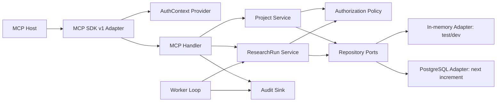
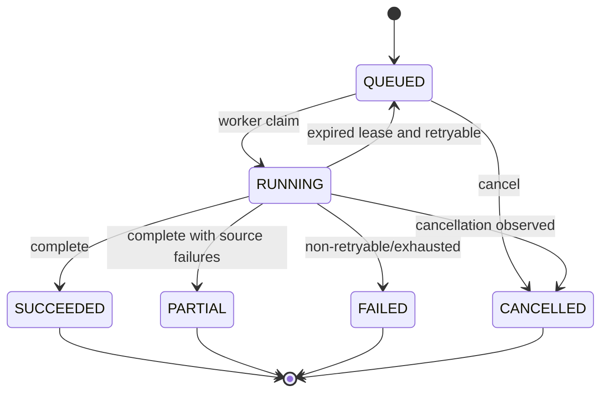

# Public Sector Research MCP — Foundation Detailed Design

> 문서 상태: Implemented Foundation Reference · 기준일: 2026-07-16 · 설계 단위: Foundation Vertical Slice
>
> 현재 제품 목표는 [ADR-0009](./adr/0009-public-zero-retention-first.md)의 `PUBLIC_EPHEMERAL` Public Preview다. 이 문서는 이미 구현된 OAuth·Tenant·durable ResearchRun 기반을 설명하며, Public Preview의 현재 상세 구현순서는 [ARCHITECTURE](./ARCHITECTURE.md)와 [IMPLEMENTATION PLAN](./IMPLEMENTATION_PLAN.md)을 따른다. 아래 Foundation 설계를 익명 공개 요청의 필수 경로로 해석하지 않는다.

[VISION](./VISION.md) · [PRD](./PRD.md) · [ARCHITECTURE](./ARCHITECTURE.md) · [IMPLEMENTATION PLAN](./IMPLEMENTATION_PLAN.md) · [VALIDATION CRITERIA](./VALIDATION_CRITERIA.md)

## 1. 목적과 범위

이 문서는 PSR MCP의 첫 구현 단위인 **MCP + Tenant + durable ResearchRun vertical slice**를 구현자가 추가 해석 없이 개발할 수 있도록 구체화한다.

이번 slice가 증명할 질문은 다섯 가지다.

1. 공식 MCP Python SDK의 안정 버전으로 versioned Tool·Resource·Prompt를 제공할 수 있는가?
2. 모든 호출이 Organization·Project 경계를 통과하는가?
3. 승인된 Plan에서 idempotent ResearchRun을 만들고 연결이 끊겨도 상태를 보존할 수 있는가?
4. 동일 domain service를 MCP, Worker, 향후 Console이 재사용할 수 있는가?
5. actor·operation·target·result를 감사 가능한 형태로 남길 수 있는가?

Collector, Planner의 LLM 분해, Evidence parsing은 이 기반 경로를 통과한 뒤 붙인다. 이번 slice에는 실제 웹 수집이 없다.

## 2. 확정 결정

| ID | 결정 | 값 |
|---|---|---|
| DD-001 | Python runtime | Python 3.12 |
| DD-002 | MCP SDK | 안정 v1.x, `mcp>=1.28,<2`, lock은 `1.28.1`부터 시작 |
| DD-003 | MCP protocol | current stable `2025-11-25` |
| DD-004 | Transport | Streamable HTTP; application state는 session 외부 저장 |
| DD-005 | Domain dependency | Domain은 MCP·Pydantic·DB framework를 import하지 않음 |
| DD-006 | Production metadata | PostgreSQL 16+ |
| DD-007 | Raw object | S3-compatible object store; Foundation slice에서는 port만 정의 |
| DD-008 | Job queue | PostgreSQL table + lease + `SKIP LOCKED` |
| DD-009 | Tenant | application authorization + PostgreSQL RLS + object namespace |
| DD-010 | Identity | 외부 OIDC/OAuth AS, MCP는 Resource Server |
| DD-011 | Development auth | 명시적 development profile의 static verified context만 허용 |
| DD-012 | ID | UUIDv7 compatible generator; 표준 library 지원 전 injectable port |
| DD-013 | Time | UTC aware datetime만 저장·비교 |
| DD-014 | Review | 승인상태는 immutable Plan version과 human subject에 연결 |
| DD-015 | MCP Tasks | core flow에서 사용하지 않음 |

근거:

- [MCP Python SDK v1.x](https://github.com/modelcontextprotocol/python-sdk/tree/v1.x)는 production 권장 안정선이며 `<2` 상한을 권고한다.
- [MCP Authorization](https://modelcontextprotocol.io/specification/2025-11-25/basic/authorization)은 Resource Server, Protected Resource Metadata, audience-bound token을 요구한다.
- [Python SDK Authorization](https://py.sdk.modelcontextprotocol.io/authorization/)은 `TokenVerifier`와 `AuthSettings` integration을 제공한다.

## 3. 구현 단위와 비목표

### 3.1 Foundation slice 포함

- Python package와 dependency lock
- `Organization`, `Membership`, `Project`, `ResearchPlan`, `ResearchRun`, `Job`, `AuditEvent`
- `AuthorizationContext`와 policy evaluator
- Project list/get application service
- approved Plan 기반 Run start/status/cancel service
- idempotency와 optimistic version
- Job claim/lease/complete state machine
- in-memory adapter와 PostgreSQL migration 초안
- MCP Tools 5개, Project/Run Resources, Prompt 1개
- development-only composition root
- unit, contract, in-memory MCP integration test

### 3.2 Foundation slice 제외

- 실제 OIDC issuer 연동과 JWKS cache
- 운영 PostgreSQL deployment와 RLS integration 실행
- Review Console UI
- Planner LLM adapter
- source search·collection·parsing
- object store client
- Evidence와 Report 생성
- MCP Tasks
- production 배포

제외 항목은 미구현을 숨기지 않는다. production profile에서 필요한 adapter가 없으면 fail closed한다.

## 4. 논리 구성



Dependency rule:

```text
mcp/cli/worker adapters
        ↓
application services
        ↓
domain models + policies
        ↑
storage/auth/clock/id infrastructure adapters
```

Domain과 application port는 transport header, SDK `Context`, SQL cursor를 알지 못한다.

## 5. Package 구조

```text
src/psr_mcp/
├─ __init__.py
├─ config.py
├─ cli/
│  └─ main.py
├─ domain/
│  ├─ errors.py
│  ├─ identity.py
│  ├─ projects.py
│  ├─ research.py
│  └─ audit.py
├─ application/
│  ├─ ports.py
│  ├─ projects.py
│  ├─ research_runs.py
│  └─ workers.py
├─ auth/
│  ├─ context.py
│  ├─ policy.py
│  └─ providers.py
├─ mcp/
│  ├─ schemas.py
│  ├─ handlers.py
│  └─ server.py
├─ storage/
│  ├─ memory.py
│  └─ migrations/0001_foundation.sql
├─ observability/
│  └─ audit.py
└─ bootstrap.py
tests/
├─ unit/
├─ contract/
└─ integration/
```

한 파일이 400 logical line을 지속적으로 넘거나 두 개 이상의 aggregate를 변경하면 module을 분리한다.

## 6. Authorization Context

### 6.1 구조

```python
AuthorizationContext(
    organization_id: str,
    subject_id: str,
    roles: frozenset[Role],
    scopes: frozenset[str],
    project_ids: frozenset[str] | None,
    token_id: str | None,
    client_id: str | None,
)
```

- `project_ids=None`: Organization 안에서 Role과 scope가 허용하는 모든 Project
- `project_ids=frozenset()`: 어떤 Project에도 접근 불가
- `project_ids={...}`: 명시된 Project만 접근
- `organization_id`, `subject_id`가 빈 context는 생성할 수 없다.
- `roles`와 `scopes`는 token claim을 그대로 신뢰하지 않고 Membership 조회 결과와 교집합으로 확정한다.

### 6.2 Scope

| Operation | Required scope | Minimum role |
|---|---|---|
| Project list/get | `project:read` | `researcher` |
| Plan read | `project:read` | `researcher` |
| Run start/cancel | `research:run` | `researcher` |
| Run status | `project:read` | `researcher` |
| Plan approval | `research:plan` | `research_manager` + human approval |
| Audit read | `audit:read` | `audit_viewer` |

`organization_admin`은 모든 scope를 암묵적으로 얻지 않는다. token scope와 Membership role을 모두 만족해야 한다.

### 6.3 Policy algorithm

```text
require_scope(auth, operation.scope)
→ load target with organization filter
→ if missing: NOT_FOUND_OR_FORBIDDEN
→ require auth.organization_id == target.organization_id
→ require project restriction allows target.project_id
→ require minimum role
→ execute
```

리소스 존재 여부를 권한 없는 사용자에게 구분해 주지 않는다. `NOT_FOUND`와 `FORBIDDEN_TARGET`은 외부에 동일한 `NOT_FOUND_OR_FORBIDDEN`으로 표현한다.

## 7. Domain Model

### 7.1 Organization

| Field | Type | Rule |
|---|---|---|
| `id` | ID | immutable |
| `name` | string | 1~200자 |
| `status` | `ACTIVE/SUSPENDED` | suspended tenant의 write 차단 |
| `created_at` | UTC datetime | immutable |

### 7.2 Membership

| Field | Type | Rule |
|---|---|---|
| `organization_id` | ID | tenant boundary |
| `subject_id` | ID | IdP `sub`에 대응한 internal user |
| `roles` | set<Role> | 최소 1개 |
| `project_ids` | optional set<ID> | null=org-wide |
| `status` | `ACTIVE/REVOKED` | revoked 즉시 거부 |

### 7.3 Project

| Field | Type | Rule |
|---|---|---|
| `id` | ID | globally unique opaque |
| `organization_id` | ID | 모든 query의 필수 predicate |
| `name` | string | 1~200자 |
| `profile` | string | MVP `government` |
| `status` | `ACTIVE/ARCHIVED` | archived write 차단 |
| `version` | integer | optimistic concurrency, 1부터 시작 |
| `created_at`, `updated_at` | UTC datetime | server clock |

### 7.4 ResearchPlan

Foundation에서는 Run authorization에 필요한 최소 field만 구현한다.

| Field | Type | Rule |
|---|---|---|
| `id` | ID | immutable |
| `organization_id`, `project_id` | ID | tenant/project boundary |
| `version` | integer | 승인 대상 version |
| `question` | string | blank 금지 |
| `status` | `DRAFT/IN_REVIEW/APPROVED/REJECTED` | state machine |
| `approved_by` | subject ID/null | APPROVED일 때 필수 |
| `approved_at` | UTC/null | APPROVED일 때 필수 |

Foundation에서는 development fixture가 approved Plan을 seed한다. production Run은 DB의 approved version만 받는다.

### 7.5 ResearchRun

| Field | Type | Rule |
|---|---|---|
| `id` | ID | immutable |
| `organization_id`, `project_id` | ID | boundary |
| `plan_id`, `plan_version` | ID/int | approved immutable version |
| `initiated_by` | subject ID | audit actor |
| `status` | RunStatus | 아래 state machine |
| `version` | integer | mutation마다 +1 |
| `idempotency_key` | string | project+actor 기준 unique |
| `request_fingerprint` | SHA-256 | key reuse conflict 판별 |
| `failure_code` | optional string | terminal/partial reason |
| timestamps | UTC | created/started/finished/updated |



`INPUT_REQUIRED`는 Planner/Collector가 들어오는 다음 increment에서 추가한다. terminal state는 변경하지 않는다.

### 7.6 Job lease

`ResearchRun`은 사용자 의미 상태, `Job`은 worker delivery 상태다.

| Field | Rule |
|---|---|
| `run_id` | Run과 1:1 |
| `available_at` | claim 가능 시각 |
| `lease_owner` | claim worker ID |
| `lease_expires_at` | 현재 lease 만료 |
| `attempts` | claim 성공마다 증가 |
| `max_attempts` | Foundation 기본 3 |
| `cancel_requested_at` | cooperative cancellation signal |

claim query의 production 의미:

```sql
SELECT ...
FROM jobs
WHERE organization_id = :org
  AND available_at <= now()
  AND (state = 'QUEUED' OR (state = 'RUNNING' AND lease_expires_at < now()))
ORDER BY available_at, created_at
FOR UPDATE SKIP LOCKED
LIMIT 1;
```

claim과 Run `RUNNING` 전이는 한 transaction이다. worker business side effect는 idempotent step key를 요구한다.

## 8. Application Services

### 8.1 ProjectService

```python
async def list_projects(auth, cursor, limit) -> ProjectPage
async def get_project(auth, project_id) -> Project
```

- `limit`: 1~100, 기본 20
- cursor는 opaque base64url JSON이 아니라 server-signed 또는 DB keyset token으로 전환한다. Foundation in-memory cursor는 versioned codec을 사용한다.
- 정렬: `(name.casefold(), id)`가 아니라 안정적인 `(created_at, id)`; locale 차이를 피한다.
- 모든 결과는 organization과 project restriction으로 필터링한다.

### 8.2 ResearchRunService.start

입력:

```python
StartResearchRun(
    approved_plan_id: str,
    idempotency_key: str,
)
```

처리:

1. `research:run` scope와 role 확인
2. Plan을 Organization predicate로 조회
3. Project restriction·Project ACTIVE 확인
4. Plan status가 APPROVED인지 확인
5. canonical request fingerprint 계산
6. 동일 `(organization, project, initiated_by, idempotency_key)` 조회
7. fingerprint 동일: 기존 Run 반환, audit에 `IDEMPOTENT_REPLAY`
8. fingerprint 다름: `IDEMPOTENCY_CONFLICT`
9. Run/Job/Audit를 한 transaction에 insert
10. Run Resource URI 반환

`idempotency_key`는 8~128 ASCII 문자이며 token·질문 원문을 넣지 않는다.

### 8.3 status

- Run을 Organization predicate로 찾는다.
- project restriction과 `project:read`를 확인한다.
- 상태, version, attempt, timestamps, failure summary만 반환한다.
- worker internal lease owner는 사용자 output에서 제외한다.

### 8.4 cancel

입력은 `run_id`, `reason`, `expected_version`이다.

- `QUEUED`: Run/Job을 즉시 `CANCELLED`
- `RUNNING`: `cancel_requested_at` 설정, Run은 worker가 확인할 때까지 `RUNNING`; output에 `cancellation_requested=true`
- terminal: `INVALID_STATE`
- version mismatch: `VERSION_CONFLICT`
- reason 10~500자; audit에는 저장하되 일반 Resource에는 summary만 제공

### 8.5 WorkerService

```python
async def claim_next(worker_id, lease_seconds) -> ClaimedRun | None
async def heartbeat(run_id, worker_id, extend_seconds) -> None
async def complete(run_id, worker_id, outcome) -> ResearchRun
```

- lease ownership과 expiry를 검증한다.
- cancel request가 있으면 새 collector step을 시작하지 않는다.
- worker crash 후 lease가 만료되면 attempts가 남은 Job만 재queue한다.
- max attempts 초과는 `FAILED/RETRY_EXHAUSTED`다.

## 9. Repository Ports

Foundation port는 transaction을 명시적으로 표현한다.

```python
class UnitOfWork(Protocol):
    projects: ProjectRepository
    plans: PlanRepository
    runs: RunRepository
    jobs: JobRepository
    audit: AuditRepository

    async def __aenter__(self) -> Self: ...
    async def commit(self) -> None: ...
    async def rollback(self) -> None: ...
```

규칙:

- repository는 항상 `organization_id`를 첫 parameter로 받는다.
- `get(id)`처럼 tenant가 없는 method를 금지한다.
- transaction 밖의 write를 금지한다.
- domain object를 ORM object로 사용하지 않는다.
- storage adapter가 `NOT_FOUND`와 unique violation을 domain error로 변환한다.

In-memory UnitOfWork는 contract test 대상이며 production durability를 주장하지 않는다. PostgreSQL adapter가 같은 contract suite를 통과해야 persistence milestone이 완료된다.

## 10. MCP Contract — Foundation

### 10.1 Tool catalog

| Tool | 입력 | 출력 | Side effect |
|---|---|---|---|
| `psr.project.list` | cursor, limit | ProjectPage | 없음 |
| `psr.project.get` | project_id | ProjectView | 없음 |
| `psr.research.run.start` | approved_plan_id, idempotency_key | RunAccepted | Run/Job/Audit 생성 |
| `psr.research.run.status` | run_id | RunStatusView | 없음 |
| `psr.research.run.cancel` | run_id, reason, expected_version | RunCancelResult | cancel/flag/Audit |

Pydantic response model을 사용해 SDK가 `outputSchema`와 `structuredContent`를 생성하게 한다. text fallback에는 1~3문장 요약만 넣고 raw internal object를 직렬화하지 않는다.

### 10.2 Resources

| URI | MIME | 내용 |
|---|---|---|
| `psr://projects/{project_id}` | `application/json` | Project summary, profile, role |
| `psr://projects/{project_id}/runs/{run_id}` | `application/json` | Run status와 user-visible failure |

Resource read도 Tool과 같은 policy를 호출한다. URI를 안다는 사실은 권한이 아니다.

### 10.3 Prompt

`public_policy_research(project_id, question, as_of_date)`를 등록한다.

- 사용자가 선택하는 workflow template다.
- 질문을 사실로 간주하지 않는다.
- Project authorization을 우회하지 않는다.
- Prompt 내용은 `psr.research.plan.create`가 아직 없다는 사실을 명시하고, Foundation에서는 구현 준비상태 안내만 제공한다.

### 10.4 SDK composition

```python
FastMCP(
    name="Public Sector Research MCP",
    json_response=True,
    stateless_http=True,
    token_verifier=...,
    auth=AuthSettings(...),
)
```

`stateless_http=True`는 SDK transport 최적화이며 application stateless를 뜻하지 않는다. Run, cursor, idempotency는 명시적 ID와 store에 있다. Foundation development server는 `token_verifier` 없이 static AuthContextProvider를 사용할 수 있지만 `PSR_ENV=production`에서는 시작을 거부한다.

## 11. Tool Result와 Error

공통 success envelope를 강제하지 않는다. 각 Tool의 output schema를 구체적으로 유지하되 다음 field를 공통으로 둔다.

- `schema_version`: `"1.0"`
- `operation_id`: 호출 추적 ID
- `resource_uri`: 상세 Resource가 있을 때

Application error:

| Code | Retryable | 외부 메시지 원칙 |
|---|---:|---|
| `INPUT_INVALID` | false | field와 constraint만 제공 |
| `AUTH_SCOPE_REQUIRED` | false | 필요한 scope 제공 가능 |
| `NOT_FOUND_OR_FORBIDDEN` | false | entity 존재 여부 비공개 |
| `PLAN_NOT_APPROVED` | false | 승인 필요 표시 |
| `IDEMPOTENCY_CONFLICT` | false | 새 key 또는 원 요청 사용 |
| `VERSION_CONFLICT` | true/user | 최신 상태 조회 후 재시도 |
| `INVALID_STATE` | false | 허용 상태 목록 |
| `DEPENDENCY_UNAVAILABLE` | true | retry_after 포함 |
| `INTERNAL_ERROR` | false | operation ID만 제공 |

schema-invalid JSON-RPC는 protocol error다. 정상 Tool 호출의 domain 실패는 `isError=true` Tool result로 변환한다. stack trace, SQL, token, 다른 tenant ID를 반환하지 않는다.

## 12. Persistence Transaction

### 12.1 Run start

```text
BEGIN
  SET LOCAL app.organization_id
  SELECT approved plan FOR SHARE
  SELECT idempotency row
  INSERT research_run
  INSERT job
  INSERT audit_event
COMMIT
```

unique constraint:

```text
(organization_id, project_id, initiated_by, idempotency_key)
```

### 12.2 RLS

모든 tenant table은 `organization_id NOT NULL`과 RLS를 가진다. connection pool checkout마다 tenant를 global `SET`하지 않는다. transaction 안에서 `SET LOCAL app.organization_id`를 사용하고 transaction 종료 시 자동 제거한다.

worker는 bypass-RLS superuser를 사용하지 않는다. 처리 대상 Organization별로 tenant context를 설정한다. cross-tenant maintenance는 별도 audited administrative function으로 제한한다.

### 12.3 Audit atomicity

Run mutation과 AuditEvent는 동일 DB transaction에 기록한다. 외부 telemetry 실패가 transaction을 rollback시키지는 않지만 immutable audit row 실패는 business write를 실패시킨다.

이후 외부 event delivery가 필요하면 transactional outbox를 추가한다. Foundation에는 외부 broker가 없다.

## 13. AuditEvent

필수 field:

```text
id, organization_id, project_id?, occurred_at,
actor_subject_id, actor_type, client_id?, token_id_hash?,
operation, target_type, target_id?, outcome,
operation_id, request_fingerprint?, reason_code?, metadata_json
```

- bearer token과 raw PII를 저장하지 않는다.
- token ID는 필요할 때 tenant-specific keyed hash로 저장한다.
- metadata allowlist를 사용한다.
- 실패한 authorization도 별도 security event sink로 남기되 대상 존재 여부는 기록 정책을 검토한다.

## 14. Configuration

환경변수는 prefix `PSR_`를 사용한다.

| Variable | Development default | Production |
|---|---|---|
| `PSR_ENV` | `development` | `production` required |
| `PSR_HOST` | `127.0.0.1` | explicit |
| `PSR_PORT` | `8000` | explicit |
| `PSR_PUBLIC_URL` | `http://127.0.0.1:8000` | HTTPS required |
| `PSR_ISSUER_URL` | 없음 | required |
| `PSR_REQUIRED_SCOPES` | development seed | explicit |
| `PSR_DATABASE_URL_REF` | 없음 | secret reference required |
| `PSR_OBJECT_STORE_URL` | 없음 | Evidence increment부터 required |
| `PSR_LOG_LEVEL` | `INFO` | allowlist |

production은 다음 조건에서 fail closed한다.

- public URL이 HTTPS가 아님
- issuer/audience/resource metadata가 없음
- static auth provider가 선택됨
- in-memory repository가 선택됨
- debug가 true

## 15. Development Composition

개발환경은 security behavior를 가장하지 않는다.

- Organization A/B, user A/B, Project A/B를 seed한다.
- default AuthContext는 Organization A의 제한된 Researcher다.
- context 교체는 test fixture 또는 process startup option으로만 한다.
- network에서 development server를 노출하지 않도록 loopback에 bind한다.
- `PSR_ENV=development` 표시를 startup log와 Tool description에 포함한다.
- development output을 production evidence로 사용하지 못하게 report 기능을 제공하지 않는다.

## 16. Observability

각 요청은 `operation_id`를 생성한다.

```text
mcp_request_id? → operation_id → subject/org/project → service → uow → run/job → audit
```

구조화 로그 필수 field:

- timestamp, level, service, version
- operation_id, method/tool
- organization_id hash, project_id hash
- actor type, outcome, duration_ms
- error code, retryable

원 question, token, cookie, raw source content는 default log에 넣지 않는다.

Foundation metric:

- `mcp_requests_total{tool,outcome}`
- `mcp_request_duration_seconds{tool}`
- `authorization_denied_total{reason}`
- `research_runs_total{status}`
- `job_claim_total{outcome}`
- `job_lease_expired_total`
- `idempotency_replay_total`

metric label에 Organization/Project/User ID를 넣지 않는다.

## 17. Security Design

### 17.1 Threats addressed now

- cross-tenant IDOR
- missing scope 또는 role
- idempotency replay confusion
- stale cancellation overwrite
- insecure development profile의 production 실행
- bearer token/log leakage
- MCP Resource URI를 capability로 오인
- malformed cursor와 oversized page

### 17.2 Deferred with explicit gate

- OIDC/JWKS algorithm confusion, key rotation: OAuth adapter milestone
- SSRF, redirect, decompression bomb: Collector milestone
- object store confused deputy: Evidence storage milestone
- prompt injection: Planner/Collector milestone

### 17.3 Security invariants

1. tenant 없는 repository method가 없다.
2. authorization 실패 시 target 존재 여부가 노출되지 않는다.
3. production static auth와 in-memory adapter는 시작할 수 없다.
4. token은 downstream으로 전달하지 않는다.
5. Tool annotation은 authorization decision에 사용하지 않는다.
6. audit metadata는 allowlist다.
7. terminal Run은 immutable하다.

## 18. Concurrency와 Consistency

- optimistic concurrency는 `version` update predicate로 구현한다.
- Run start는 unique idempotency constraint로 race를 해결한다.
- worker claim은 row lock + `SKIP LOCKED`다.
- cancellation과 completion race에서는 먼저 commit한 version이 이기고 loser가 재조회한다.
- clock은 injectable UTC clock이다.
- in-memory adapter도 lock을 사용해 contract test에서 race semantics를 모사한다.
- read-after-write가 필요한 Tool은 primary DB를 읽는다. read replica는 MVP에 없다.

## 19. Cursor Design

Foundation cursor payload:

```json
{"v":1,"after_created_at":"2026-07-16T00:00:00Z","after_id":"..."}
```

외부 cursor는 base64url encoding과 HMAC을 사용한다. 개발용 unsigned cursor를 production에서 금지한다. invalid signature/version/expiry는 `INPUT_INVALID`다. cursor에 Organization ID나 검색 원문을 포함하지 않는다.

## 20. Verification hooks

설계가 테스트 가능하도록 다음을 injectable port로 둔다.

- `Clock`
- `IdGenerator`
- `CursorCodec`
- `AuthContextProvider`
- `UnitOfWorkFactory`
- `AuditSink`가 아니라 transaction-bound AuditRepository

global singleton은 MCP SDK server instance와 immutable Settings에 한정한다. repository state와 current user를 module global에 두지 않는다.

## 21. 구현 완료 조건

이 문서가 다루는 Foundation Core/MCP slice 완료는 [VALIDATION CRITERIA](./VALIDATION_CRITERIA.md)의 `G0~G2`를 모두 만족한 상태다. PostgreSQL durability, production OAuth, remote Host를 포함한 전체 Foundation exit는 `G0~G6`을 요구한다.

- stable MCP SDK v1 dependency와 lock
- Tool 5개, Resource 2종, Prompt 1개 schema test
- Organization A/B negative access test
- project restriction test
- approved Plan gate
- idempotent replay/conflict test
- Run state/cancel/version test
- worker lease expiry/reclaim test
- AuditEvent atomicity contract
- production fail-closed config test
- PostgreSQL migration structural review

실제 PostgreSQL·OIDC integration이 통과하기 전에는 `Internal Alpha Ready`가 아니라 `Foundation Core Implemented`로만 표시한다.

## 22. 미결정 항목

| ID | 질문 | 현재 추천 | 결정 시점 |
|---|---|---|---|
| DD-OQ-01 | UUIDv7 library | 작은 injectable implementation 후 표준화 시 교체 | scaffold |
| DD-OQ-02 | ORM/query layer | SQLAlchemy 2 async vs typed SQL | PostgreSQL adapter spike |
| DD-OQ-03 | Migration tool | Alembic vs plain versioned SQL | PostgreSQL adapter spike |
| DD-OQ-04 | OIDC verifier | SDK TokenVerifier + issuer-specific adapter | OAuth spike |
| DD-OQ-05 | Cursor HMAC key | secret manager key version | Pilot security design |
| DD-OQ-06 | MCP stateless mode Host coverage | enabled default, two Host test | conformance milestone |

추천을 뒤집을 때는 관련 ADR과 검증기준을 함께 갱신한다.

---

Foundation의 산출물은 “동작하는 demo server”가 아니라 **인증·Tenant·Job·감사 규칙을 우회할 수 없는 application core와 MCP contract**다.
