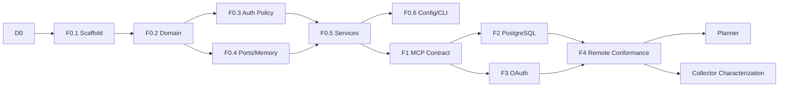

# Public Sector Research MCP — Implementation Plan

> 문서 상태: In Implementation · 기준일: 2026-07-16 · 현재 increment: F4 구현 완료, G5 Host 승인 대기

[DETAILED DESIGN](./DETAILED_DESIGN.md) · [VALIDATION CRITERIA](./VALIDATION_CRITERIA.md) · [ROADMAP](./ROADMAP.md) · [ADR](./adr/)

## 1. 목적

이 문서는 제품 Roadmap을 구현 가능한 change set으로 분해한다. 각 작업은 다음을 가져야 한다.

- 요구사항과 검증 ID
- 입력과 생성·수정 파일
- 선행조건
- 실패 시 중단 기준
- Definition of Done
- 다음 작업이 의존할 안정 interface

큰 기능 branch 하나에서 모든 Foundation 기능을 완성하지 않는다. 작은 vertical increment를 순서대로 통합한다.

## 2. 구현 원칙

1. 먼저 domain invariant와 authorization contract를 테스트로 고정한다.
2. in-memory adapter는 test/dev 용도이며 production readiness 증거가 아니다.
3. PostgreSQL과 OAuth adapter가 검증되기 전 production mode는 fail closed한다.
4. MCP decorator는 application service를 호출하는 얇은 adapter다.
5. 새 interface는 positive test보다 cross-tenant·invalid-state negative test를 먼저 포함한다.
6. migration, schema, runbook, test를 같은 change set에서 갱신한다.
7. 기존 crawler code는 Foundation exit gate 전 이식하지 않는다.
8. 문서의 `Must`를 낮추려면 Product·Architecture·Security decision을 기록한다.

## 3. Release 단위

| Increment | 이름 | 결과 | 구현상태 |
|---|---|---|---|
| D0 | Detailed Design | 상세설계·계획·검증·ADR | 완료 |
| F0 | Foundation Core | package, domain, policy, memory UoW | 완료 (`G0~G1`) |
| F1 | MCP Contract | Tools·Resources·Prompt와 in-memory protocol test | 완료 (`G2`, loopback) |
| F2 | PostgreSQL Durability | migration, RLS, transaction, lease | 완료: PostgreSQL 17.10 local G3 |
| F3 | OAuth Resource Server | TokenVerifier, AuthContext, Membership | 완료: local G4 |
| F4 | Remote Conformance | Streamable HTTP, Host 2종, recovery | 구현 완료 / G5 PARTIAL |
| P0 | Planner Skeleton | Plan create/review workflow | Foundation 후 |
| C0 | Collector Characterization | legacy behavior fixture와 adapter 판단 | Foundation 후 |

`F0~F4`가 모두 끝나야 Roadmap의 Foundation exit gate를 통과한다.

## 4. D0 — Detailed Design

### 산출물

- `docs/DETAILED_DESIGN.md`
- `docs/IMPLEMENTATION_PLAN.md`
- `docs/VALIDATION_CRITERIA.md`
- ADR-0001~0004
- README navigation

### 완료 기준

- runtime, SDK, protocol, auth, tenant, job queue 결정이 일치한다.
- Foundation 포함/제외 범위가 명시돼 있다.
- 모든 다음 작업 패키지가 검증 ID에 연결된다.
- production readiness와 development harness를 혼동하지 않는다.

## 5. F0 — Foundation Core

### 목표

MCP SDK나 DB 없이도 검증 가능한 domain/application core와 development/test adapter를 만든다.

### WP-F0.1 Project scaffold

**파일**

- `pyproject.toml`
- `uv.lock`
- `.python-version`
- `.gitignore`
- `src/psr_mcp/__init__.py`
- `src/psr_mcp/config.py`
- `tests/conftest.py`

**작업**

- Python 3.12 pin
- src layout
- runtime `mcp>=1.28,<2`, Pydantic v2
- dev pytest, anyio, ruff, mypy
- strict type/lint/test configuration
- console scripts `psr-mcp`, `psrctl`

**검증:** `VAL-BUILD-001~005`

**난이도:** 낮음

**DoD:** clean environment에서 sync, import, test discovery 성공

### WP-F0.2 Domain model and errors

**파일**

- `domain/errors.py`
- `domain/identity.py`
- `domain/projects.py`
- `domain/research.py`
- `domain/audit.py`

**작업**

- frozen dataclass/enum
- UTC와 blank/length validation
- ResearchRun state transition
- Job lease state
- stable domain error code

**검증:** `VAL-DOM-001~012`

**난이도:** 중간

**DoD:** invalid object 생성 거부, terminal transition 거부, framework import 없음

### WP-F0.3 Authorization policy

**파일**

- `auth/context.py`
- `auth/policy.py`
- `auth/providers.py`

**작업**

- `AuthorizationContext`
- scope/role/project restriction evaluator
- opaque not-found policy
- static development provider와 production guard interface

**검증:** `VAL-AUTH-001~010`

**난이도:** 높음

**DoD:** Organization A/B matrix와 project restriction test 전부 통과

### WP-F0.4 Ports and in-memory UnitOfWork

**파일**

- `application/ports.py`
- `storage/memory.py`

**작업**

- Organization-scoped repository interfaces
- UnitOfWork transaction contract
- in-memory snapshot/rollback
- idempotency unique semantics
- worker claim lock/lease semantics
- deterministic Clock/ID fixtures

**검증:** `VAL-PORT-001~009`, `VAL-JOB-001~008`

**난이도:** 높음

**DoD:** contract suite가 rollback, race, lease를 검증

### WP-F0.5 Application services

**파일**

- `application/projects.py`
- `application/research_runs.py`
- `application/workers.py`

**작업**

- Project list/get
- approved Plan gate
- start/status/cancel
- request fingerprint와 idempotency
- expected version
- worker claim/heartbeat/complete
- transaction-bound AuditEvent

**검증:** `VAL-APP-001~016`

**난이도:** 매우 높음

**DoD:** service test가 PRD FR-001~006, FR-020~025의 Foundation 부분을 추적

### WP-F0.6 Configuration and CLI guard

**파일**

- `config.py`
- `cli/main.py`
- `bootstrap.py`

**작업**

- settings parse와 redacted diagnostics
- production fail-closed
- `psrctl doctor --json`
- development seed composition

**검증:** `VAL-CFG-001~008`

**난이도:** 중간

**DoD:** insecure production setting이 process start 전에 실패

### F0 exit

- `ruff`, `mypy`, unit/contract test 통과
- line coverage 90% 이상, branch coverage 85% 이상
- cross-tenant negative cases 100% 통과
- in-memory라는 limitation을 README/doctor가 표시

**2026-07-16 결과:** 통과. 상세 증적은 [Foundation Core 검증 보고서](./validation/2026-07-16-foundation-core.md)에 기록한다.

## 6. F1 — MCP Contract

### 목표

F0 application service를 공식 SDK v1의 Tool·Resource·Prompt로 노출한다.

### WP-F1.1 Schema

**파일**

- `mcp/schemas.py`
- `tests/integration/test_mcp_contract.py`

**작업**

- Pydantic input/output model
- `schema_version`, `operation_id`, URI
- cursor, limit, ID, reason validation
- canonical Tool catalog SHA-256 snapshot

**검증:** `VAL-MCP-001~006`

### WP-F1.2 Handler and error mapper

**파일**

- `mcp/handlers.py`

**작업**

- AuthContext resolve
- DTO↔domain command mapping
- domain error→Tool execution error
- deny/internal error structured log context
- no stack/tenant leakage

**검증:** `VAL-MCP-007~013`, `VAL-SEC-001~004`

### WP-F1.3 Server registration

**파일**

- `mcp/server.py`
- `cli/main.py`

**작업**

- FastMCP v1 composition
- Tool 5개
- Resource template 2개
- Prompt 1개
- Streamable HTTP development entrypoint

**검증:** `VAL-MCP-014~020`

### WP-F1.4 In-memory protocol test

- SDK-supported in-memory client/server 또는 low-level test transport
- list tools/resources/prompts
- call/read happy path
- cross-tenant failure parity
- schema snapshot
- malformed JSON-RPC parse error
- Tasks 없는 flow
- 새 HTTP session에서 explicit Run ID 상태 재조회

**F1 exit:** `G0~G2` 통과

**2026-07-16 결과:** 공식 Python SDK의 in-memory session 및 loopback Streamable HTTP smoke test에서 통과. 두 Host 원격 호환성은 F4 범위다.

## 7. F2 — PostgreSQL Durability

### 목표

in-memory UoW를 production-shaped PostgreSQL adapter로 교체하고 durable Job을 증명한다.

### WP-F2.1 Persistence spike

- SQLAlchemy 2 async와 typed SQL 비교
- connection pool의 `SET LOCAL` safety 확인
- migration tool 결정
- ADR-0005 작성

**2026-07-16 결정:** [ADR-0005](./adr/0005-postgresql-persistence-stack.md)에 따라 Psycopg 3 typed SQL과 async pool을 runtime에 사용하고 Alembic은 migration에만 사용한다. PostgreSQL 17.10에서 RLS/pool 실증 후 이 작업을 완료 처리한다.

**중단 기준:** RLS context reset을 신뢰성 있게 증명하지 못하면 library를 교체한다.

### WP-F2.2 Schema and RLS

- organizations, users, memberships
- projects, research_plans, research_runs, jobs, audit_events
- tenant composite keys/foreign keys
- idempotency unique index
- RLS enable/force policy
- least-privilege runtime role

**검증:** `VAL-DB-001~012`

### WP-F2.3 PostgreSQL repositories

- Project/Plan/Run/Job/Audit adapter
- UnitOfWork
- error translation
- keyset pagination
- optimistic version

**검증:** memory와 PostgreSQL에 같은 port contract suite 실행

### WP-F2.4 Worker lease

- `SKIP LOCKED` claim
- heartbeat
- expiry/reclaim
- cancellation/completion race
- attempts/exhaustion

**검증:** `VAL-JOB-009~018`

### WP-F2.5 Recovery

- Gateway restart
- worker kill -9 equivalent
- DB connection loss before/after commit
- backup/restore manifest

**F2 exit:** `G3` 통과

**2026-07-16 결과:** PostgreSQL 17.10에서 migration upgrade/downgrade, runtime RLS, repository contract, worker concurrency, backend loss, backup/restore를 검증했다. 상세 증적은 [PostgreSQL G3 보고서](./validation/2026-07-16-postgresql-g3.md)에 기록한다. PR CI와 PostgreSQL 18 matrix는 release validation으로 남긴다.

## 8. F3 — OAuth Resource Server

### 목표

development static AuthContext를 실제 OAuth/OIDC 검증과 Membership resolution으로 교체한다.

### WP-F3.1 Token verifier

- SDK `TokenVerifier`
- issuer metadata/JWKS discovery
- algorithm allowlist
- issuer/audience/expiry/not-before/scope
- key rotation cache와 fail behavior
- no token passthrough

### WP-F3.2 Membership resolution

- external subject→internal user
- Organization selection policy
- role/scope intersection
- Project restriction
- revoked Membership behavior

### WP-F3.3 Protected Resource Metadata

- RFC 9728 metadata
- canonical HTTPS resource URL
- proxy/header trust policy
- authorization challenge

### WP-F3.4 Security tests

- wrong issuer/audience
- expired/not-yet-valid
- unsigned/algorithm confusion
- revoked membership
- cross-org claim manipulation
- token/log scan

**F3 exit:** `G4` 통과

**2026-07-16 결과:** 실제 RSA JWT, OIDC Discovery/JWKS, RFC 9728 metadata, PostgreSQL 17 RLS/Membership을 결합한 local G4를 통과했다. 전체 135개 test와 combined line+branch coverage 91.11%를 확인했다. 상세 증적은 [OAuth G4 보고서](./validation/2026-07-16-oauth-g4.md)에 기록한다. 실제 기관 IdP와 원격 Host 검증은 F4에 남긴다.

## 9. F4 — Remote Conformance

### 목표

실제 Streamable HTTP와 목표 Host에서 동일 계약을 검증한다.

### 작업

- TLS reverse proxy 환경
- MCP Inspector 또는 공식 client conformance
- Codex 계열 Host 1종 + 추가 Host 1종
- initialize/capability/tools/resources/prompts
- structuredContent/text fallback
- disconnect/reconnect 후 Run status
- request size, rate limit, timeout
- operation/audit trace

### 완료 기준

- PRD AC-080~083, AC-085. AC-084의 plan→run→evidence→report 전체 flow는 Evidence/Report가 구현되는 MVP end-to-end gate에서 판정한다.
- `VALIDATION CRITERIA`의 `G5`
- known compatibility matrix
- unresolved P0/P1 0건

**2026-07-16 결과:** commit `c7064cd`에서 real TCP, TLS terminating reverse proxy, request bound, operation/audit trace와 official client conformance를 구현했다. PostgreSQL 17을 포함한 158개 test, combined line+branch coverage 90.90%, OSV known vulnerability 0건을 확인했다. MCP Inspector 0.18.0은 Tool/Resource/Prompt와 새 process Run 재조회가 통과했고 Codex CLI 0.144.2는 실제 Tool call이 통과했다. Codex Resource/Prompt 호출은 로컬 내용을 외부 model service로 전송할 수 있어 명시적 보안 승인 전 `BLOCKED`다. 따라서 F4 code는 완료됐지만 strict G5는 `PARTIAL`이다. [Remote G5 보고서](./validation/2026-07-16-remote-g5.md)와 [Host matrix](./compatibility/host-matrix.md)를 따른다.

**2026-07-16 완료 감사:** combined coverage가 별도 branch 85% 기준을 증명하지 못하는 공백을 발견했다. commit `952e173`에서 security/config/OAuth/cursor/worker negative case와 CI의 독립 threshold gate를 추가했다. PostgreSQL 17.10을 포함한 185개 test가 통과했고 statement 95.02%, branch 87.10%, critical module 최소 95.00%를 확인했다. [Coverage Gate 감사 보고서](./validation/2026-07-16-foundation-coverage-audit.md)를 따른다.

## 10. P0 — Planner Skeleton

Foundation 이후 첫 product increment다.

- `ResearchPlan` 전체 schema
- question/decision context/jurisdiction/as-of
- Government Profile loading
- deterministic rule-based minimum plan
- optional LLM adapter port
- Review version/nonce
- `psr.research.plan.create/get/submit_review`

LLM이 없어도 schema, required tracks, stop condition을 만들 수 있는 baseline을 먼저 둔다.

## 11. C0 — Legacy Collector Characterization

Foundation과 Planner 기반이 검증된 다음 진행한다.

1. 기존 `crawlkit.py` command와 output fixture 생성
2. HTML/JSON/PDF/local file happy/failure corpus
3. header/cookie/redirect/empty-body risk characterization
4. reuse/refactor/replace matrix
5. `Collector` port 뒤 최소 adapter 추출
6. SSRF/redaction/rate/retry 적용

기존 code를 신규 repository로 먼저 복사하지 않는다.

## 12. 작업 순서와 병렬성



F2와 F3는 F1 후 병렬 가능하지만, 같은 integration branch에 동시에 큰 refactor를 넣지 않는다.

## 13. 권장 change set

| Change | 범위 | Review focus |
|---|---|---|
| CH-001 | docs/ADR/scaffold | dependency/protocol |
| CH-002 | domain/errors/state | invariants |
| CH-003 | auth context/policy | tenant negative cases |
| CH-004 | ports/memory UoW | transaction semantics |
| CH-005 | project/run/worker service | idempotency/concurrency |
| CH-006 | config/CLI/bootstrap | production fail closed |
| CH-007 | MCP schemas/handlers/server | schema/error/auth parity |
| CH-008 | PostgreSQL migration | RLS/constraints |
| CH-009 | PostgreSQL adapter/worker | atomicity/recovery |
| CH-010 | OAuth adapter | token validation |
| CH-011 | conformance/Host matrix | interoperability |

각 change는 이전 change의 test가 모두 통과한 상태에서 시작한다.

## 14. 요구사항 추적

| PRD | Foundation 작업 | Validation |
|---|---|---|
| FR-001~003 | F0.3, F2, F3 | AUTH/DB/SEC |
| FR-004 | F3, Collector later | SEC token passthrough |
| FR-006 | F0.5, F2 | AUDIT |
| FR-014~015 | P0; Foundation approved fixture gate | APP-approval |
| FR-020~025 | F0.4~F2, F1 | APP/JOB/MCP |
| NFR-002~003 | F1, F4 | MCP/ARCH |
| NFR-004 | F0.3, F2, F3 | AUTH/DB |
| NFR-007 | F0.5, F2 | APP/DB |
| NFR-011 | F0.5, F2 | AUDIT |
| NFR-015 | F1 | MCP pagination |
| NFR-018 | F2 | RECOVERY |

## 15. Definition of Ready

작업 패키지를 시작하려면 다음이 있어야 한다.

- owner와 reviewer
- 연결된 requirement/validation ID
- input/output/interface
- sample 또는 fixture
- security/tenant 영향
- migration 또는 compatibility 영향
- 명시적 비범위
- rollback 또는 disable 방법

## 16. Definition of Done

- 구현과 test가 같은 change에 있음
- `ruff`, `mypy`, 전체 test 통과
- branch coverage target 충족
- cross-tenant negative test 포함
- structured log/audit 영향 검토
- 문서와 schema snapshot 갱신
- migration은 새 환경과 upgrade 환경에서 검증
- production/development behavior가 구분됨
- known limitation과 다음 작업이 기록됨
- reviewer가 evidence link 또는 test output으로 확인 가능

## 17. 일정 추정

3~5명 팀 기준 상대 추정이며 보안심사 대기시간은 별도다.

| Increment | 예상 | 주요 불확실성 |
|---|---:|---|
| D0 | 2~3일 | 용어/결정 합의 |
| F0 | 1.5~2주 | state/idempotency contract |
| F1 | 1주 | SDK schema/error behavior |
| F2 | 2~3주 | RLS/pool/lease concurrency |
| F3 | 2주 | 기관 IdP claim/rotation |
| F4 | 1~2주 | Host interoperability |

한 명이 순차 구현하면 2~3배의 calendar time을 예상한다.

## 18. 진행 보고 형식

각 increment 종료 시 다음을 보고한다.

```text
Completed:
Validated:
Not validated:
Risks changed:
Artifacts:
Next gate:
```

“구현 완료”와 “운영 검증 완료”를 분리한다.

## 19. 현재 착수 범위

`D0~F4` 구현을 마쳤다. local TLS proxy, official SDK와 MCP Inspector는 통과했고 Codex Tool도 실제 호출됐다. 다만 Codex Resource/Prompt 검증의 보안 승인, 실제 기관 IdP/gateway, G6 owner 승인이 남아 strict G5는 `PARTIAL`이다. 이 조건을 닫기 전 production-ready로 선언하지 않는다.

### 2026-07-16 인계 상태

- 완료: D0, F0~F4 code, PostgreSQL CI workflow, DB/OAuth/Remote runbook
- 검증됨: PostgreSQL 17.10 durability, OIDC JWT·Membership·RFC 9728, TCP/TLS, SDK·Inspector, Codex Tool, 독립 coverage gate
- 미검증: Codex Resource/Prompt, 실제 기관 IdP/gateway, 독립 owner review
- 다음 change set: G5 Codex Host 승인 결과 반영 또는 지원기준 결정, 이후 G6 owner review

---

가장 먼저 안정화할 것은 crawler 기능이 아니라 **모든 후속 기능이 공유할 authorization·transaction·MCP 계약**이다.
