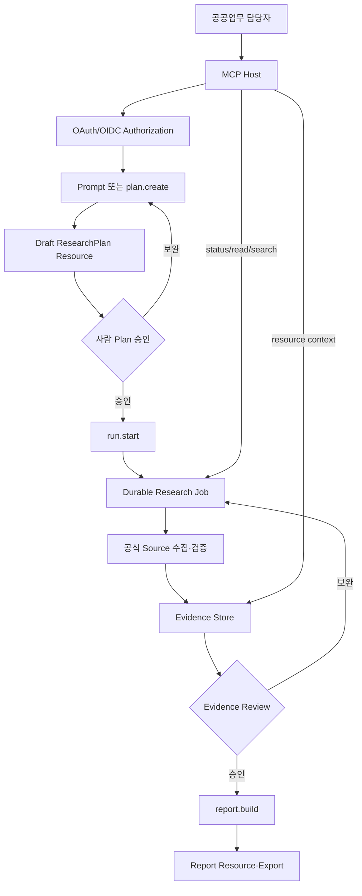
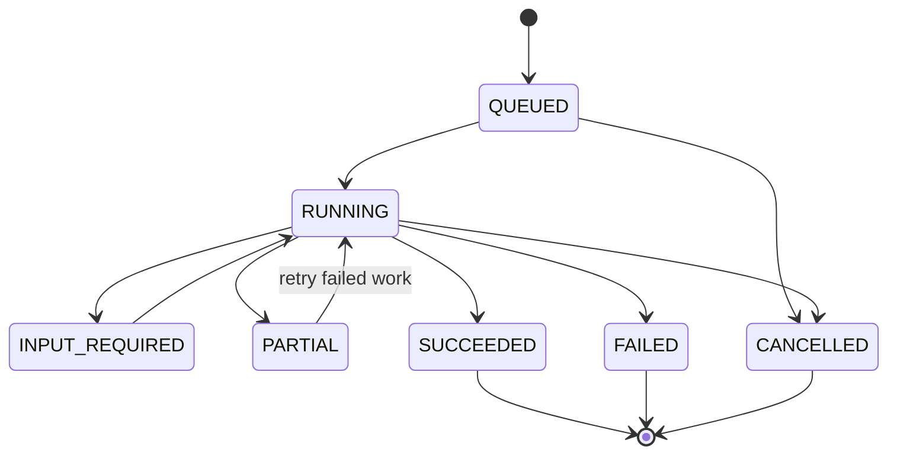

# Public Sector Research MCP — Product Requirements Document

> 문서 상태: Proposed · 기준일: 2026-07-16 · 대상: MVP Internal Alpha → Public-Sector Pilot

제품의 이유는 [VISION](./VISION.md), 구현 구조는 [ARCHITECTURE](./ARCHITECTURE.md), 단계별 계획은 [ROADMAP](./ROADMAP.md)을 따른다.

## 1. 문서 목적

이 문서는 공공분야 다중 사용자를 위한 Evidence-First Research MCP의 제품 요구사항을 정의한다. 구현자는 다음을 추측하지 않아야 한다.

- 누가 어떤 업무에서 쓰는가?
- MCP Tool·Resource·Prompt가 무엇을 제공하는가?
- 어떤 작업에 사람 승인이 필요한가?
- Tenant와 Project 데이터가 어떻게 분리되는가?
- 공신력, 현행성, 원문확보와 Evidence 품질을 어떻게 표현하는가?
- long-running research를 protocol 실험 기능 없이 어떻게 실행하는가?
- 어떤 상태가 MVP와 공공분야 Pilot의 완료를 의미하는가?

식별자:

- `FR-nnn`: 기능 요구사항
- `NFR-nnn`: 비기능 요구사항
- `AC-nnn`: Acceptance Criterion
- 우선순위: `Must`, `Should`, `Could`, `Won't`
- 단계: `MVP`, `v1.0 Pilot`, `v1.5`, `v2`, `v3`

## 2. 제품 정의

PSR MCP는 다음 세 부분으로 구성된다.

1. **Remote MCP Server:** AI Host가 조사·근거·보고서 기능을 사용하는 공식 interface
2. **Evidence Research Platform:** Planner, Collector, Evidence Store, Review, Report, Diff를 수행하는 application service
3. **Review Console:** Tool 호출만으로 보장할 수 없는 사람 승인, 사용자·Project 관리, audit 확인을 위한 최소 web UI

MCP가 primary integration surface지만 제품은 “MCP server process 하나”가 아니다. 다중 사용자의 job, object, 권한과 Review를 운영하는 service다.

## 3. 배경과 확인된 출발점

기존 `adaptive-web-research` Skill은 probe-first 조사, `urllib` cookie session, HTML·JSON·PDF 구조 분석, 원문·SHA-256 snapshot의 가치가 검증됐다. 그러나 단일 사용자 로컬 script이며 다음은 제공하지 않는다.

- Organization, User, Project Role, Tenant isolation
- 원격 MCP transport, OAuth, scope, resource URI
- concurrent research job과 durable status
- Source Registry와 기관 관리자 정책
- Claim·EvidenceLink·Review·Report DB
- audit·retention·quota·backup·운영 monitoring

따라서 신규 저장소는 기존 Skill을 그대로 package화하지 않는다. 저수준 수집 코드는 characterization과 보안 검토 후 adapter 단위로 선택 이식한다.

## 4. 목표 사용자

### 4.1 Primary Persona

| Persona | 대표 업무 | 성공 기준 |
|---|---|---|
| 정책·기획 담당자 | 정책동향, 업무보고, 기본계획, 신규사업 | 공식 근거가 연결된 초안을 업무시간 안에 생성 |
| 규정·법무 담당자 | 법령·지침 현행성, 적용대상, 의무/권고 | 조항·시행일·개정상태를 추적 |
| 조달·계약 담당자 | 구매원칙, RFP, 계약조건, 데이터 권리 | 공식 기준과 해외 공공사례를 요구사항에 연결 |
| 감사·평가 담당자 | 지표, 평가편람, 감사기준, 실적 근거 | 기준문서와 수치 정의를 재검증 |
| 디지털·AI 담당자 | AI 정책, 기술표준, 도입사례 | 공식 기술문서와 공공 적용조건을 비교 |
| 연구·용역 수행자 | 정책연구와 조사보고서 | 기관 Project에서 근거와 Review를 공유 |

### 4.2 Governance Persona

| Persona | 책임 |
|---|---|
| Organization Admin | 사용자, Role, quota, source policy, retention |
| Research Manager | Project 개설, Plan 승인, budget 관리 |
| Reviewer | Evidence·Claim·Report 검토와 승인 |
| Security/Audit Viewer | 접근·Tool·export·Review audit 확인 |
| Service Agent | 승인된 scope에서 자동 integration 수행 |

## 5. 주요 사용 시나리오

### 5.1 공공정책 조사

사용자가 MCP Host에서 “공공기관 생성형 AI 구매 원칙을 조사해줘”라고 요청한다. Prompt가 관할·기준일·산출물을 정리하고 `psr.research.plan.create`가 draft Plan을 만든다. 담당자가 승인한 뒤 `psr.research.run.start`가 job을 생성한다. Host는 status tool과 run Resource로 진행상태를 확인하고, 완료 후 Evidence와 report를 조회한다.

### 5.2 법령·지침 현행성 검토

기존 Project의 Claim이 참조하는 법령·지침 Snapshot을 조회한다. Document version, effective date, freshness와 ChangeEvent를 확인하고 오래된 Claim을 Reviewer queue에 넣는다.

### 5.3 공식사례 벤치마킹

정부·공공기관·국제기구·공식 기업자료를 source track으로 분리한다. 홍보성 성과수치의 분모와 적용조건을 Evidence Score rationale에 남기고, 재인용 기사 cluster는 독립 근거로 중복 계산하지 않는다.

### 5.4 Project 근거 재사용

유사 질문 전에 `psr.evidence.search`가 Project 또는 Organization에서 접근 가능한 기존 Evidence를 찾는다. `CURRENT`, `CHECK_DUE`, `STALE`, `RESTRICTED`를 구분하고 재사용 또는 refresh를 제안한다.

### 5.5 사람 검토

Plan 승인, Evidence override, report publish는 authenticated human action으로 기록한다. AI가 review tool을 호출해도 server는 user identity, scope, approval nonce 또는 Console confirmation을 검증한다.

### 5.6 부분 실패

일부 source가 timeout·403·empty body여도 성공 Snapshot과 Passage는 보존한다. Run은 `PARTIAL`이 되고 보고서에 질문 coverage, 실패 이유, 공식 원문 미확보가 표시된다.

## 6. User Stories

| ID | Story | 우선순위/단계 |
|---|---|---|
| US-001 | 담당자로서 익숙한 AI Host에서 기관의 Research MCP를 사용하고 싶다. | Must/MVP |
| US-002 | 담당자로서 공식 원문과 정확한 page·section을 확인하고 싶다. | Must/MVP |
| US-003 | Reviewer로서 조사 시작 전에 질문·source·budget을 승인하고 싶다. | Must/MVP |
| US-004 | 관리자로서 사용자가 자기 Organization·Project 자료만 보게 하고 싶다. | Must/MVP |
| US-005 | 담당자로서 연구가 오래 걸려도 Host 연결을 점유하지 않고 상태를 확인하고 싶다. | Must/MVP |
| US-006 | 담당자로서 일부 수집 실패가 전체 조사 손실로 이어지지 않기를 원한다. | Must/MVP |
| US-007 | 감사 담당자로서 누가 어떤 Tool로 무엇을 조회·생성·승인했는지 보고 싶다. | Must/v1.0 Pilot |
| US-008 | 담당자로서 이전 Project Evidence를 freshness와 함께 재사용하고 싶다. | Should/v1.5 |
| US-009 | Reviewer로서 기준문서 변경이 어떤 보고서에 영향을 주는지 알고 싶다. | Should/v1.5 |
| US-010 | 기관 관리자로서 공식 Source Registry와 profile을 관리하고 싶다. | Must/v1.0 Pilot |
| US-011 | Integration 담당자로서 두 MCP Host에서 같은 ID와 schema를 사용하고 싶다. | Must/v1.0 Pilot |
| US-012 | 운영자로서 protocol upgrade가 application data migration을 강제하지 않기를 원한다. | Must/MVP |

## 7. 제품 범위

### 7.1 MVP In Scope

- Remote Streamable HTTP MCP server
- 현재 안정 MCP `2025-11-25` 호환
- OAuth-protected resource server 구조와 개발용 IdP integration
- Organization, User, Membership, Project, RBAC
- PostgreSQL metadata store와 S3-compatible object store
- Project·Plan·Run·Question·Document·Snapshot·Passage·Claim·EvidenceLink·Review·Report
- Government Research Profile 1종과 curated source seed
- 비동기 application job과 status/cancel tool
- 공식 HTML·PDF·JSON 수집, validation, immutable snapshot
- Evidence Score v1과 Claim/Passage 연결
- Markdown·JSON report
- core MCP Tools·Resources·Prompts
- audit event와 basic quota/rate limit
- 최소 Review Console: Plan 승인, Evidence 검토, report 승인
- 기존 probe dataset import dry-run

### 7.2 v1.0 Pilot In Scope

- 기관 IdP/OIDC 실연동
- 운영 monitoring, backup/restore, admin console
- Source Registry 관리와 domain allow/deny policy
- 보안·개인정보·접근성 검토
- 2개 이상 MCP Host conformance
- HTML report와 citation bundle
- Organization audit export

### 7.3 Out of Scope

- 범용 검색엔진과 대규모 분산 crawler
- 접근제한 우회, 유료 DB 무단 접근
- 완전 자동 법률·감사·조달 결론
- AI Model hosting 자체 개발
- 공공기관 내부문서 DMS 전체 대체
- 모든 기관을 위한 no-code workflow builder
- graph DB를 primary store로 도입(MVP)
- protocol RC 기능을 release blocker로 채택
- MCP client 또는 범용 AI chat UI 자체 개발

## 8. Role과 Scope

### 8.1 Organization Role

| Role | 핵심 권한 |
|---|---|
| `org_admin` | Membership, Project, profile, source policy, retention, audit |
| `research_manager` | Project 관리, Plan 승인, budget, report publish |
| `researcher` | Plan draft, Run 요청, Evidence/Claim 작성 |
| `reviewer` | Evidence·Claim·Report Review |
| `viewer` | 승인된 Resource와 Report read |
| `service_agent` | 명시된 Project와 scope의 machine access |

### 8.2 OAuth Scope

| Scope | 기능 |
|---|---|
| `project:read` | 접근 가능한 Project 목록·metadata |
| `research:plan` | Plan draft와 수정 |
| `research:run` | 승인된 Plan 실행·상태·cancel |
| `evidence:read` | Evidence search/get |
| `evidence:review` | Evidence·Claim Review |
| `report:write` | report build·refresh |
| `report:publish` | 승인된 report publish/export |
| `admin:organization` | 사용자·정책·audit 관리 |

Role은 scope의 상한이며 access token scope가 실제 호출 권한을 더 좁힌다. Project membership restriction을 추가 적용한다.

## 9. 기능 요구사항

### 9.1 Organization·Project·Authorization

| ID | 요구사항 | 단계 | Acceptance Criteria |
|---|---|---|---|
| FR-001 | 모든 domain row와 object는 `organization_id` 경계를 가져야 한다. | MVP | 다른 Organization token으로 ID를 알아도 `NOT_FOUND_OR_FORBIDDEN`이다. |
| FR-002 | Membership은 Organization Role과 선택적 Project restriction을 가져야 한다. | MVP | Project 미가입 사용자는 resource URI를 읽을 수 없다. |
| FR-003 | MCP request마다 token audience, issuer, expiry, scope를 검증해야 한다. | MVP | 다른 resource용 token은 401/403으로 거부된다. |
| FR-004 | MCP client token을 downstream source/API로 전달하지 않아야 한다. | MVP | integration test에서 downstream request에 client bearer token이 없다. |
| FR-005 | Organization Admin은 Console/API에서 Project와 Membership을 관리해야 한다. | MVP | model-controlled MCP Tool로 Organization Admin action을 노출하지 않는다. |
| FR-006 | 모든 write는 actor, auth context, Project, operation ID를 audit해야 한다. | MVP | Review와 report에서 원 호출자를 찾을 수 있다. |

### 9.2 Research Planning

| ID | 요구사항 | 단계 | Acceptance Criteria |
|---|---|---|---|
| FR-010 | Plan은 질문, decision context, 관할, 기준일, 대상, 산출물, profile을 입력받는다. | MVP | 필수값이 모호하면 `NEEDS_INPUT`을 반환한다. |
| FR-011 | Plan은 의사결정 질문과 계층형 ResearchQuestion을 분리한다. | MVP | 각 Question에 evidence type과 source track이 있다. |
| FR-012 | Plan은 source/request/time/cost budget과 stop condition을 포함한다. | MVP | budget 초과 전 Job이 `STOPPED_BUDGET`을 기록한다. |
| FR-013 | Government Profile은 법령, 정책, 개인정보, 조달, 감사·평가, 공식사례 track을 제공한다. | MVP | 구매원칙 scenario에서 관련 track이 생성된다. |
| FR-014 | Plan은 draft와 approved version을 immutable 보존한다. | MVP | 승인 후 수정은 새 version과 Review를 요구한다. |
| FR-015 | Plan approval은 `research_manager` 이상의 authenticated human action이어야 한다. | MVP | AI service identity만으로 approval할 수 없다. |

### 9.3 비동기 Research Run

| ID | 요구사항 | 단계 | Acceptance Criteria |
|---|---|---|---|
| FR-020 | `run.start`는 승인된 Plan에서 durable Job을 생성하고 빠르게 `run_id`를 반환한다. | MVP | 2초 이내 accepted response, 실제 수집은 worker가 수행한다. |
| FR-021 | Job은 Organization·Project·initiator auth context에 묶인다. | MVP | 다른 context에서 status/result/cancel이 거부된다. |
| FR-022 | Host는 `run.status`와 Run Resource로 상태·진행·실패를 조회한다. | MVP | polling이 idempotent하고 cursor/limit이 있다. |
| FR-023 | Job state는 `QUEUED`, `RUNNING`, `INPUT_REQUIRED`, `PARTIAL`, `SUCCEEDED`, `FAILED`, `CANCELLED`다. | MVP | terminal state는 다시 변경되지 않는다. |
| FR-024 | 취소는 권한과 현재상태를 확인하고 cooperative cancellation을 수행한다. | MVP | terminal Job cancel은 execution error를 반환한다. |
| FR-025 | MCP Tasks가 없어도 전체 flow가 동작해야 한다. | MVP | `execution.taskSupport=forbidden`으로 core client test가 통과한다. |
| FR-026 | 향후 Tasks adapter는 application Job ID와 protocol Task ID를 분리한다. | v2 | protocol upgrade가 domain Job migration을 요구하지 않는다. |

### 9.4 Source Registry·수집

| ID | 요구사항 | 단계 | Acceptance Criteria |
|---|---|---|---|
| FR-030 | Source Registry는 기관, domain, source type, jurisdiction, official status, owner review를 저장한다. | MVP | 결과에서 curated/observed/unverified source가 구분된다. |
| FR-031 | SearchResult는 source tier와 원 출처 후보를 표시한다. | MVP | 비공식 자료가 공식 자료로 표시되지 않는다. |
| FR-032 | Collector는 policy, rate, allowed domain, timeout, retry를 적용한다. | MVP | 금지 domain은 network 요청 전에 차단된다. |
| FR-033 | HTTP 200 empty/login/error page를 유효 Evidence로 만들지 않는다. | MVP | invalid content는 typed failure다. |
| FR-034 | HTML·PDF·JSON·text를 판별하고 original bytes와 SHA-256을 저장한다. | MVP | octet-stream PDF도 magic으로 식별한다. |
| FR-035 | 일부 source 실패 시 성공 결과를 commit하고 Run을 `PARTIAL`로 둔다. | MVP | 실패 source만 retry할 수 있다. |
| FR-036 | Cookie, Authorization, Set-Cookie, signed query를 metadata와 log에서 redact한다. | MVP | seeded secret scan 0건이다. |

### 9.5 Evidence·Review

| ID | 요구사항 | 단계 | Acceptance Criteria |
|---|---|---|---|
| FR-040 | Snapshot은 immutable object이며 Document version과 capture method를 가진다. | MVP | 동일 bytes는 중복 object를 만들지 않는다. |
| FR-041 | Passage는 page, heading path, char range 또는 JSON Pointer locator를 가진다. | MVP | EvidenceLink 대상 Passage locator completeness 100%다. |
| FR-042 | Claim은 `FACT`, `INFERENCE`, `RECOMMENDATION`, `DECISION`, `QUESTION`을 구분한다. | MVP | report에서 inference가 fact처럼 표시되지 않는다. |
| FR-043 | EvidenceLink는 `SUPPORTS`, `CONTRADICTS`, `QUALIFIES`, `CONTEXT`를 지원한다. | MVP | 한 Claim에 상충 Evidence를 함께 연결한다. |
| FR-044 | Score는 권위성, 1차성, 직접성, 현행성, 원문확보, 독립성, 구체성, 적용범위를 차원별 설명과 저장한다. | MVP | 총점만 있는 score는 저장되지 않는다. |
| FR-045 | Review는 append-only이며 override가 이전 판단을 supersede한다. | MVP | 수정·삭제로 과거 Review를 숨길 수 없다. |
| FR-046 | 공식 원문 미확보, 단일 source, stale, unresolved conflict를 gap으로 표시한다. | MVP | report에 limitation이 자동 포함된다. |

### 9.6 Report와 Reuse

| ID | 요구사항 | 단계 | Acceptance Criteria |
|---|---|---|---|
| FR-050 | Report는 Claim ID와 Evidence dependency manifest를 가져야 한다. | MVP | ReportSection에서 사용 Passage까지 탐색 가능하다. |
| FR-051 | Markdown·JSON report는 scope, 기준일, coverage, conflicts, gaps, failures, citations를 포함한다. | MVP | 부분성공 report가 완전한 것처럼 표시되지 않는다. |
| FR-052 | report build는 unlinked FACT를 lint한다. | MVP | unlinked FACT는 publish gate를 통과하지 못한다. |
| FR-053 | Project Memory는 Question, Query, Source, exclusion, Claim, Review, Report를 검색한다. | v1.5 | 유사 질문에 reuse candidate와 freshness가 표시된다. |
| FR-054 | ChangeEvent가 영향받는 Claim과 ReportSection을 `REVIEW_REQUIRED`로 만든다. | v1.5 | layout-only 변경은 impact를 전파하지 않는다. |
| FR-055 | export는 raw original 제외가 기본이고 citation bundle을 제공한다. | v1.0 Pilot | bundle에 absolute path와 secret이 없다. |

## 10. MCP Tool 요구사항

### 10.1 Naming·Schema 정책

- 이름은 `psr.<domain>.<action>` 형식의 ASCII와 dot을 사용한다.
- 모든 Tool은 `inputSchema`, `outputSchema`, title, 한국어·영어 description, annotations를 갖는다.
- Tool output은 `structuredContent`와 짧은 text summary를 함께 제공한다.
- list 결과 순서는 deterministic하게 유지한다.
- Tool은 authorization을 annotations에 의존하지 않는다. annotation은 UI hint일 뿐이다.
- 모든 write input은 `idempotency_key` 또는 entity `expected_version`을 요구한다.

### 10.2 MVP Tool Catalog

| Tool | Scope | Annotation 요약 | 입력 | 출력 |
|---|---|---|---|---|
| `psr.project.list` | `project:read` | read-only, closed-world | cursor, limit | Project summaries |
| `psr.project.get` | `project:read` | read-only, closed-world | project_id | Project/profile/role |
| `psr.research.plan.create` | `research:plan` | additive, closed-world | project, question, context, profile | draft plan ID + resource link |
| `psr.research.plan.get` | `project:read` | read-only | plan_id/version | plan + Review status |
| `psr.research.plan.submit_review` | `research:plan` + human | write, non-destructive | plan, verdict, approval nonce | Review ID, approved version |
| `psr.research.run.start` | `research:run` | write, open-world, task forbidden | approved_plan_id, idempotency_key | run_id, status URI |
| `psr.research.run.status` | `project:read` | read-only | run_id | status, progress, failures |
| `psr.research.run.cancel` | `research:run` | destructive | run_id, reason, expected_version | cancelled state |
| `psr.evidence.search` | `evidence:read` | read-only, closed-world | project, query, filters, cursor | Evidence summaries |
| `psr.evidence.get` | `evidence:read` | read-only | evidence_id | Claim, Passage, Score, Citation |
| `psr.evidence.submit_review` | `evidence:review` + human | write, non-destructive | target, verdict, comment, nonce | Review ID |
| `psr.report.build` | `report:write` | additive, closed-world | run_id, template, format | report_id, status/resource |
| `psr.report.get` | `project:read` | read-only | report_id/version | report metadata/resource link |

`plan.submit_review`와 `evidence.submit_review`는 MCP Host의 confirmation만 믿지 않는다. Console 또는 기관 approval service가 발급한 짧은 수명의 nonce와 human subject를 검증한다.

### 10.3 Tool Error

- unknown tool·malformed JSON-RPC: protocol error
- schema는 맞지만 날짜·권한대상·상태가 잘못됨: Tool Execution Error, `isError=true`
- retryable failure는 `retryable`, `retry_after`, `operation_id`를 structured output에 포함
- 내부 stack trace, token, raw upstream body는 반환하지 않음

### 10.4 운영·개발 CLI

일반 사용자의 primary interface는 MCP와 Review Console이다. `psrctl`은 운영자·개발자용이며 MCP authorization을 우회하는 별도 business interface가 아니다.

| Command | 용도 | 주요 입력 | 출력/생성물 |
|---|---|---|---|
| `psrctl serve mcp` | MCP Gateway 기동 | config reference, bind | structured startup log |
| `psrctl serve worker` | Worker 기동 | queue, concurrency | worker health/log |
| `psrctl db migrate` | 승인된 DB migration | target revision | applied revision JSON |
| `psrctl profile validate <file>` | Profile schema·merge 검사 | YAML/JSON file | validation JSON |
| `psrctl source import <file>` | 검토용 source seed import | signed/owned manifest | dry-run diff; `--apply` 시 audit |
| `psrctl legacy inspect <path>` | legacy artifact dry-run 분석 | read-only directory | import manifest와 warning |
| `psrctl doctor` | dependency·DB·object·IdP 점검 | config reference | redacted diagnostic JSON |
| `psrctl conformance` | protocol/schema smoke | endpoint, protocol version | compatibility report |

정책:

- 기본 output은 사람이 읽는 text, `--json`은 versioned machine output이다.
- `--dry-run`이 mutation command의 기본이며 `--apply`는 명시해야 한다.
- exit code는 `0` 성공, `2` input/config, `3` authorization/policy, `4` dependency unavailable, `5` partial, `10` internal이다.
- token·secret·raw protected content는 argument나 output에 직접 쓰지 않고 secret reference를 사용한다.
- production mutation은 operator identity와 operation ID를 AuditEvent에 남긴다.
- end-user research command는 `psrctl`에 중복 구현하지 않는다. 같은 기능을 MCP와 CLI가 서로 다른 정책으로 실행하는 것을 막기 위함이다.

## 11. MCP Resource 요구사항

### 11.1 URI

```text
psr://projects/{project_id}
psr://projects/{project_id}/plans/{plan_id}
psr://projects/{project_id}/runs/{run_id}
psr://projects/{project_id}/documents/{document_id}
psr://projects/{project_id}/snapshots/{snapshot_id}/metadata
psr://projects/{project_id}/passages/{passage_id}
psr://projects/{project_id}/evidence/{evidence_link_id}
psr://projects/{project_id}/reports/{report_id}/versions/{version}
psr://projects/{project_id}/changes/{change_event_id}
```

URI에 Organization ID를 노출하지 않는다. Server가 authorization context와 Project ownership을 결합해 resolve한다.

### 11.2 정책

- `resources/list`는 접근 가능한 Project 범위만 반환한다.
- list/read는 cursor, size limit, content classification을 적용한다.
- Passage와 Report는 text Resource가 기본이다.
- raw Snapshot은 list 기본 제외이며 별도 권한과 정책에 따라 expiring handle만 제공한다.
- Resource annotations에는 audience, priority, lastModified를 제공한다.
- `resources/subscribe`와 change notification은 v1.5에서 도입한다.
- Resource link가 Tool result에 포함돼도 별도 authorization check를 생략하지 않는다.

## 12. MCP Prompt 요구사항

Prompts는 사용자가 선택하는 workflow template이며 business rule이나 authorization을 대체하지 않는다.

| Prompt name | 목적 | 주요 argument |
|---|---|---|
| `public_policy_research` | 공공정책 조사 시작 | project, question, jurisdiction, as_of_date, output |
| `regulation_currentness_check` | 법령·지침 현행성 확인 | document/claim, jurisdiction, as_of_date |
| `official_case_benchmark` | 공식사례 비교 | theme, organizations, metrics, period |
| `evidence_review` | Claim·Evidence 검토 | target ID, review criteria |
| `change_impact_review` | 변경 영향 검토 | ChangeEvent ID, report scope |

Prompt argument는 autocomplete가 가능하되 권한 없는 Project ID를 제안하지 않는다.

## 13. 사용자 흐름



## 14. 상태 모델

### 14.1 ResearchPlan

`DRAFT → REVIEW_REQUIRED → APPROVED | CHANGES_REQUESTED | REJECTED → SUPERSEDED`

### 14.2 ResearchRun



`PARTIAL`은 terminal report 생성이 가능하지만 retry를 통해 다시 `RUNNING`이 될 수 있는 application 상태다. protocol Task 상태와 동일하다고 가정하지 않는다.

## 15. 비기능 요구사항

| ID | 요구사항 | 단계 | Acceptance Criteria |
|---|---|---|---|
| NFR-001 | Python 3.12를 production 기준으로 검토하고 최소 지원버전을 ADR로 고정한다. | MVP | CI matrix와 dependency support가 일치한다. |
| NFR-002 | 현재 안정 MCP `2025-11-25` conformance를 통과해야 한다. | MVP | 2개 Host smoke와 protocol test suite를 통과한다. |
| NFR-003 | transport adapter가 domain/application layer를 침범하지 않아야 한다. | MVP | protocol upgrade가 DB entity를 변경하지 않는다. |
| NFR-004 | 모든 tenant query는 Organization filter와 Project authorization을 적용한다. | MVP | cross-tenant test 100% 차단이다. |
| NFR-005 | metadata DB는 PostgreSQL, original은 S3-compatible object store를 사용한다. | MVP | Project move 없이 service instance를 교체할 수 있다. |
| NFR-006 | raw object는 immutable하고 checksum 검증을 제공한다. | MVP | integrity job이 tamper를 탐지한다. |
| NFR-007 | write API는 idempotency와 optimistic concurrency를 지원한다. | MVP | duplicate start가 Job을 중복 생성하지 않는다. |
| NFR-008 | Tool p95 응답은 비동기 수락·조회 2초, evidence search 1초를 목표로 한다. | v1.0 Pilot | 부하 test 결과를 기록한다. |
| NFR-009 | 수집 Job은 tenant quota와 source별 rate limit을 지킨다. | MVP | noisy tenant가 다른 tenant queue를 고갈시키지 않는다. |
| NFR-010 | 저장·전송 중 암호화와 secret manager를 사용한다. | v1.0 Pilot | token/secret이 DB·log·object에 없다. |
| NFR-011 | audit event는 append-only이며 최소 사용자·도구·대상·결과를 포함한다. | MVP | operation ID로 end-to-end 추적 가능하다. |
| NFR-012 | 한국어 UI·report를 기본 제공하고 원문 언어와 번역을 구분한다. | MVP | 번역문만으로 citation을 대체하지 않는다. |
| NFR-013 | Review Console은 keyboard navigation과 명확한 상태 text를 제공한다. | v1.0 Pilot | 접근성 checklist를 통과한다. |
| NFR-014 | backup·restore·retention·purge 절차를 제공한다. | v1.0 Pilot | restore drill과 deletion manifest가 있다. |
| NFR-015 | Resource와 Tool list는 deterministic ordering과 pagination을 제공한다. | MVP | 동일 권한에서 반복 결과가 안정적이다. |
| NFR-016 | source content의 prompt injection을 instruction으로 실행하지 않는다. | MVP | malicious fixture가 Tool/approval policy를 변경하지 못한다. |
| NFR-017 | 원문 미확보와 수집 실패를 결과에서 숨기지 않는다. | MVP | report limitation completeness 100%다. |
| NFR-018 | 서비스 장애가 성공 Snapshot과 Review를 손실시키지 않아야 한다. | MVP | worker crash recovery test가 통과한다. |

## 16. 오류·부분실패·재시도

| Error | 자동 재시도 | 사용자 동작 |
|---|---|---|
| `AUTH_REQUIRED` | 없음 | 재인증 |
| `SCOPE_INSUFFICIENT` | 없음 | step-up authorization 또는 관리자 요청 |
| `PROJECT_FORBIDDEN` | 없음 | Membership 확인 |
| `PLAN_NOT_APPROVED` | 없음 | Plan Review |
| `POLICY_BLOCKED` | 없음 | Source 정책 검토 |
| `NETWORK_TRANSIENT` | 최대 2회 | 실패 지속 시 partial 수용/재시도 |
| `RATE_LIMITED` | Retry-After | 대기 |
| `CONTENT_INVALID` | 없음 | 대체 공식 source |
| `PARSE_FAILED` | parser fallback 1회 | manual extraction 검토 |
| `ORIGINAL_UNAVAILABLE` | 없음 | limitation 수용 또는 source 보완 |
| `CONFLICT_REVIEW_REQUIRED` | 없음 | Reviewer 판단 |
| `QUOTA_EXCEEDED` | 없음 | budget 조정 |

Tool Execution Error는 `code`, `message`, `retryable`, `operation_id`, `details`, `suggested_action`을 structured output으로 제공한다.

## 17. 보존·삭제·Export

- Organization별 기본 retention을 설정한다.
- Snapshot, Review, Audit은 policy가 허용하는 기간 동안 immutable 보존한다.
- Project 삭제는 soft delete와 grace period 후 purge다.
- purge는 DB row, object reference, cache, search index를 포함하고 deletion manifest를 남긴다.
- Git 또는 외부 export로 나간 자료는 별도 lifecycle임을 경고한다.
- raw 원문 export는 기본 비활성화다.
- report/citation export는 Project classification과 사용자 scope를 확인한다.
- 민감 Project는 Organization 간 공유와 global reuse를 금지한다.

## 18. 관찰가능성

필수 event:

- OAuth subject·client·scope validation 결과(토큰 값 제외)
- MCP method/tool/resource, duration, result, operation ID
- Plan version·approval·nonce consumption
- Job queue/start/progress/retry/cancel/complete
- source request policy·status·content validation
- object hash·parser version·dedup decision
- score/review/report/export
- cross-tenant 또는 권한거부 시도
- admin policy·membership·retention 변경

OpenTelemetry 도입은 v1.0 Pilot release gate로 한다. 원문 text와 token은 telemetry에 포함하지 않는다.

## 19. 성공지표

| Metric | 정의 | Pilot 목표 |
|---|---|---:|
| Official primary source ratio | 채택 Evidence 중 공식 1차자료 비율 | ≥ 70% |
| Claim evidence coverage | FACT Claim의 valid EvidenceLink 비율 | ≥ 95% |
| Locator completeness | Evidence Passage locator 비율 | 100% |
| Evidence reuse rate | 후속 조사에서 기존 Evidence 재사용 비율 | ≥ 30% |
| Unsupported fact rate | Review에서 근거부족으로 반려된 FACT 비율 | < 5% |
| Review turnaround | Plan/Evidence Review median | 1영업일 이내 pilot 목표 |
| Cross-tenant incidents | unauthorized data exposure | 0 |
| Secret leakage | artifact/log token·secret | 0 |
| Partial preservation | 혼합 실패에서 성공 artifact 보존 | 100% |
| Host interoperability | 지원 Host conformance | 2개 이상 |

## 20. Acceptance Criteria

### 시나리오 A — 공공정책 조사(MVP)

- `AC-001`: authenticated Researcher가 접근 가능한 Project에서 Plan draft를 만든다.
- `AC-002`: Plan은 법령·정책·개인정보·조달·데이터권리·업체종속 질문을 포함한다.
- `AC-003`: human approval 전 `run.start`가 거부된다.
- `AC-004`: 승인 후 `run.start`가 2초 내 run ID와 Resource link를 반환한다.
- `AC-005`: 공식 HTML·PDF가 Snapshot·Passage로 저장된다.
- `AC-006`: Claim이 Passage locator와 Score breakdown에 연결된다.
- `AC-007`: Markdown report가 gaps, conflicts, failures, provenance를 포함한다.

### 시나리오 B — Tenant 격리(MVP)

- `AC-020`: Organization A token은 Organization B Project 목록을 보지 못한다.
- `AC-021`: B의 run/evidence/report ID를 알아도 read·status·cancel이 거부된다.
- `AC-022`: service log와 error message가 B entity 존재 여부를 노출하지 않는다.
- `AC-023`: worker와 object key에도 tenant context가 적용된다.

### 시나리오 C — 사람 Review(MVP)

- `AC-040`: service-agent token만으로 Plan/Evidence approval이 불가능하다.
- `AC-041`: 만료·재사용된 approval nonce는 거부된다.
- `AC-042`: Review supersession이 이전 판단과 actor를 보존한다.
- `AC-043`: unreviewed material conflict가 report publish를 막는다.

### 시나리오 D — 부분 실패(MVP)

- `AC-060`: 4개 source 중 timeout과 403이 있어도 성공 Snapshot은 commit된다.
- `AC-061`: Job은 `PARTIAL`, failure는 retryable/final로 분류된다.
- `AC-062`: failed-only retry가 성공 source를 다시 수집하지 않는다.
- `AC-063`: report가 incomplete coverage를 명시한다.

### 시나리오 E — MCP 호환(MVP/Pilot)

- `AC-080`: current stable protocol에서 tools/resources/prompts capability를 선언한다.
- `AC-081`: Tool input/output이 schema validation을 통과한다.
- `AC-082`: structuredContent와 text compatibility output을 제공한다.
- `AC-083`: Resource list/read가 pagination과 authorization을 적용한다.
- `AC-084`: 두 지원 Host에서 plan→run→evidence→report flow가 동작한다.
- `AC-085`: protocol RC 지원 여부와 무관하게 application Job이 동작한다.

### 시나리오 F — 변경 영향(v1.5)

- `AC-100`: 개정 원문이 새 Snapshot과 ChangeEvent를 만든다.
- `AC-101`: layout-only와 content change를 구분한다.
- `AC-102`: 영향받는 Claim·Report만 Review queue에 들어간다.
- `AC-103`: subscribed Resource client가 지원되는 경우 update notification을 받는다.

## 21. Open Questions

| ID | 질문 | 선택지 | 추천안 | 시점 |
|---|---|---|---|---|
| OQ-001 | 운영 형태 | 중앙 SaaS, 기관별 배포, hybrid | **기관별 배포 가능한 shared code + 중앙 managed option** | Pilot 전 |
| OQ-002 | Identity Provider | 자체 계정, OIDC only, 복수 방식 | **OIDC 우선, local dev identity 별도** | MVP |
| OQ-003 | Python MCP SDK/version | stable SDK, RC beta, 직접 protocol | **stable SDK + transport abstraction, RC spike 별도** | 첫 spike |
| OQ-004 | approval nonce 발급 | Console, Host callback, 기관 결재 API | **Console MVP, 기관 결재 adapter 확장** | MVP |
| OQ-005 | Job queue | PostgreSQL, Redis, managed queue | **PostgreSQL-backed MVP, scale trigger 후 분리** | storage ADR |
| OQ-006 | Source Registry 소유 | 중앙, 기관, hybrid | **공통 seed + 기관 override와 Review** | MVP |
| OQ-007 | cross-Organization Evidence reuse | 금지, 공개자료만, 전체 | **기본 금지, 검증된 public source metadata만 shared cache** | v1.5 |
| OQ-008 | raw Snapshot 제공 | 항상, 별도 scope, 금지 | **별도 scope+policy+expiring handle** | Pilot |
| OQ-009 | MCP Tasks | 즉시, optional, 미사용 | **core 미의존; 안정화·Host 지원 후 adapter** | v2 |
| OQ-010 | 2026-07-28 protocol | RC 선적용, final 대기 | **final 및 Tier SDK 지원 확인 후 opt-in** | release 후 ADR |

## 22. 제품 결정사항

다음은 이 PRD에서 확정한다.

1. 신규 저장소는 공공분야 Research MCP 제품이며 기존 crawler Skill과 독립한다.
2. Remote MCP가 primary integration이고 Review Console은 책임 있는 승인 보조수단이다.
3. 다중 사용자·Tenant isolation·OAuth·PostgreSQL은 MVP architecture에서 제외하지 않는다.
4. MCP Tasks는 core dependency가 아니다.
5. Project 생성·Membership·retention 같은 admin action은 MVP MCP Tool로 노출하지 않는다.
6. 사람 승인은 Host confirmation만으로 충족하지 않는다.
7. 공식자료 우선은 source type과 Evidence rationale로 드러내며 무비판적 신뢰를 뜻하지 않는다.
