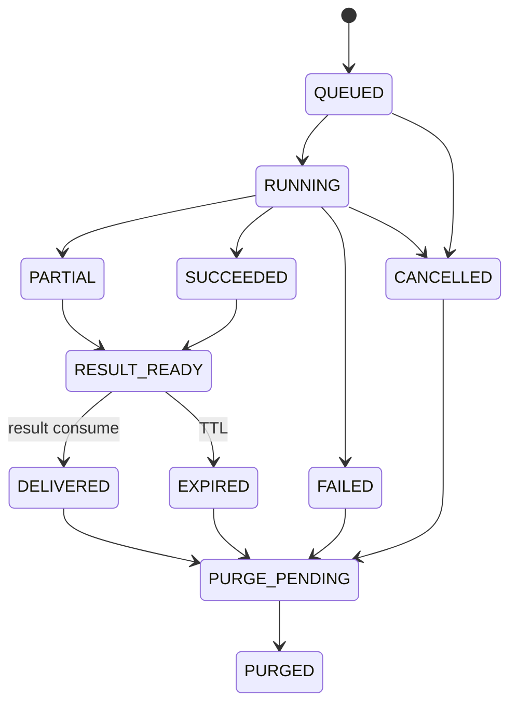

# Public Sector Research MCP — Product Requirements Document

> 문서 상태: Accepted · 기준일: 2026-07-16 · 현재 Release Target: **Public Preview**

[VISION](./VISION.md) · [ARCHITECTURE](./ARCHITECTURE.md) · [ROADMAP](./ROADMAP.md) · [ADR-0009](./adr/0009-public-zero-retention-first.md) · [ADR-0010](./adr/0010-progressive-identity-and-opt-in-persistence.md)

## 1. 문서 목적

이 문서는 누구나 가입 없이 사용하고 사용자 content를 보관하지 않는 Public Preview의 요구사항을 정의한다. 구현자는 다음을 추측하지 않아야 한다.

- 사용자가 로그인하지 않고 어떻게 조사하는가?
- 어떤 content가 임시 처리되고 언제 삭제되는가?
- 긴 조사 결과를 연결 종료 뒤 어떻게 전달하는가?
- 공개 endpoint의 남용·비용·SSRF를 어떻게 막는가?
- 결과의 유용성과 근거 품질을 어떻게 검증하는가?
- 어떤 사용자 증거가 생겨야 계정·History·유료 저장을 시작하는가?

식별자:

- `FR-PUB-nnn`: Public Preview 기능 요구사항
- `FR-ACC-nnn`: 선택 가입 단계 요구사항
- `FR-PAID-nnn`: 유료 영구저장 단계 요구사항
- `NFR-PUB-nnn`: Public Preview 비기능 요구사항
- `AC-PUB-nnn`: Public Preview Acceptance Criterion
- 우선순위: `Must`, `Should`, `Could`, `Won't`

## 2. 제품 정의

Public Preview는 다음 세 부분으로 구성된다.

1. **Public MCP Gateway:** 로그인 없이 제한된 Research Tool을 제공한다.
2. **Ephemeral Research Runtime:** Planner, Search, Collector, Parser, Evidence Composer, Writer를 임시 작업공간에서 실행한다.
3. **Purge and Safety Control:** quota, SSRF, 비용 상한, TTL과 삭제 증거를 관리한다.

현재 구현된 OAuth Resource Server, Organization/RLS, PostgreSQL durable Job은 폐기하지 않는다. Public Preview의 요청 경로에서는 content 저장을 위해 사용하지 않으며, Account Beta와 Enterprise mode에서 활성화한다.

## 3. 목표 사용자

| Persona | 대표 요구 | Public Preview 성공 |
|---|---|---|
| 공공업무 담당자 | 정책·제도·조달·평가 근거 조사 | 공식 원문이 연결된 초안을 바로 받음 |
| 정책·규제 담당자 | 현행 법령·가이드 확인 | 기준일·관할·적용대상과 한계를 확인 |
| 연구자·학생 | 공식자료 중심 비교조사 | 재인용을 줄인 출처와 비교표를 받음 |
| 개발자·기획자 | 공공 AI·데이터 기준 조사 | 공식 정책·표준·기술문서를 함께 비교 |
| 일반 사용자 | 공공정책을 근거와 함께 이해 | 쉬운 설명과 원문 링크를 받음 |
| 반복 사용자(미래) | 과거 조사 저장·재사용 | Account Beta 대기수요로 기록 |

사용자의 소속, 이메일, 기관 인증은 Public Preview 이용조건이 아니다.

## 4. 주요 사용 시나리오

### 4.1 빠른 조사

사용자가 “공공기관 생성형 AI 구매 시 데이터 권리 원칙을 알려줘”라고 요청한다. `psr.research.quick`은 범위와 기준일을 확인하고 제한된 공식 source를 조사한 뒤 Markdown과 구조화 citation을 같은 응답에 반환한다. 작업 content는 응답 완료 후 삭제한다.

### 4.2 긴 조사

여러 PDF와 source가 필요한 요청은 `psr.research.start`가 opaque `run_handle`과 만료시각을 반환한다. 사용자는 `run.status`, `run.result`로 결과를 받는다. 성공적으로 전달한 content는 60초 이내 purge 대상으로 전환하며, 미수령 결과도 TTL 뒤 삭제한다.

### 4.3 부분 실패

일부 공식 source가 timeout·403·invalid document여도 성공한 근거로 결과를 만들고 실패 source와 조사 공백을 표시한다. 실패 content도 TTL 정책에 따라 삭제한다.

### 4.4 사용자가 결과를 저장

Public Preview 서버는 저장하지 않는다. Tool 결과는 Markdown/JSON으로 반환해 AI Host, 로컬 파일, Git 또는 사용자가 선택한 저장소에 보관할 수 있게 한다.

### 4.5 저장 기능 요청

사용자가 History·과거 조사 재사용을 원하면 기능 대기 의사를 content 없이 제출할 수 있다. 실제 수요 trigger를 충족한 뒤 Account Beta를 연다. Public Preview 사용자를 자동 가입시키거나 과거 content를 소급 저장하지 않는다.

## 5. User Stories

| ID | Story | 우선순위 |
|---|---|---|
| US-PUB-001 | 사용자로서 가입 없이 MCP를 연결해 첫 조사를 하고 싶다. | Must |
| US-PUB-002 | 공식자료와 원문 구간이 연결된 결과를 받고 싶다. | Must |
| US-PUB-003 | 내 질문과 조사결과가 서버에 장기 보관되지 않기를 원한다. | Must |
| US-PUB-004 | 긴 조사도 연결을 계속 유지하지 않고 결과를 받고 싶다. | Must |
| US-PUB-005 | 일부 source 실패와 미확인 항목을 숨기지 않기를 원한다. | Must |
| US-PUB-006 | 받은 결과를 Markdown/JSON으로 내 저장소에 보관하고 싶다. | Must |
| US-PUB-007 | 운영자로서 한 사용자가 과도한 비용을 발생시키지 않게 하고 싶다. | Must |
| US-PUB-008 | 반복 사용자로서 나중에 선택 가입해 저장과 재사용을 켜고 싶다. | Should/Future |
| US-PUB-009 | 가입 후에도 저장하지 않는 조사 mode를 선택하고 싶다. | Should/Future |

## 6. 제품 단계와 범위

### 6.1 Public Preview — In Scope

- 가입·로그인 없는 MCP Tool
- Government/Public Research Profile v0
- 공개 HTTPS source의 공식자료 우선 검색
- 안전한 HTML·PDF·JSON 수집
- 짧은 동기 조사와 긴 ephemeral Run
- Markdown + JSON 결과
- citation, 원문 구간, 기준일, conflict, gap, failure
- IP·run·source별 quota와 concurrency 제한
- SSRF·redirect·size·timeout·parser 제한
- TTL purge와 삭제 검증
- content 없는 aggregate metric과 선택 피드백

### 6.2 Public Preview — Out of Scope

- 회원가입, 로그인, 비밀번호, 소셜 계정
- 개인 History, Project Memory, Living Report
- 사용자 간 공유와 팀 Workspace
- 원문·보고서 영구저장
- 사용자 private file upload
- 사용자 cookie·credential이 필요한 source
- browser 자동화, captcha·paywall·로그인 우회
- 결제, 저장공간 판매, SLA
- 기관 관리자 Console과 human Review workflow
- 의미 기반 Diff와 자동 report refresh

### 6.3 Account Beta

- OIDC 선택 가입
- Personal Workspace 자동 생성
- 조사별 `save=true` 명시적 저장
- 저장한 조사 History·검색·Evidence reuse
- 사용자 export/delete
- 가입 상태에서도 기본 ephemeral mode 유지

### 6.4 Paid and Enterprise

- 저장 quota, 장기 retention, 높은 concurrency, 고급 Profile
- billing, backup/restore, encryption key 운영
- 팀·기관 Workspace, SSO, Membership, RLS
- Review, audit export, legal hold, 관리 Console

## 7. Public Tool 계약

### 7.1 Tool Catalog

| Tool | 입력 | 출력 | content retention |
|---|---|---|---|
| `psr.research.quick` | question, as_of_date?, profile?, output_format? | answer, citations, gaps, failures | 응답 완료 후 purge |
| `psr.research.start` | question, as_of_date?, profile?, budget? | run_handle, status, expires_at | TTL 작업공간 |
| `psr.research.run.status` | run_handle | status, progress bucket, expires_at | content 없음 |
| `psr.research.run.result` | run_handle, consume=true | answer, citations, gaps, failures | 전달 뒤 purge |
| `psr.research.run.cancel` | run_handle | cancelled, purge_pending | 즉시 purge |
| `psr.service.policy` | 없음 | limits, retention summary, supported profiles | 없음 |
| `psr.feedback.submit` | feedback_token, helpful, save_feature_interest? | accepted | 질문·결과 미포함 |

기존 Foundation의 Project/Run Tool은 Account/Enterprise adapter용으로 유지하되 Public Preview catalog에서는 노출하지 않는다.

### 7.2 Result Schema

모든 조사 결과는 최소 다음을 포함한다.

```json
{
  "schema_version": "1.0",
  "summary": "한국어 요약",
  "scope": {
    "source_discovery": "curated_seed",
    "source_tracks": ["law-regulation", "privacy"]
  },
  "findings": [
    {
      "claim": "검토 가능한 주장",
      "kind": "FACT",
      "citation_ids": ["cit-1"],
      "confidence": "HIGH"
    }
  ],
  "citations": [
    {
      "id": "cit-1",
      "track_id": "privacy",
      "title": "원문 제목",
      "publisher": "발행기관",
      "url": "https://...",
      "retrieved_at": "RFC3339",
      "locator": "제3조 또는 p.12",
      "excerpt": "저작권 한도 안의 짧은 근거 구간",
      "source_tier": "OFFICIAL_PRIMARY",
      "document_sha256": "64자리 SHA-256",
      "score": {"overall": 0.85}
    }
  ],
  "gaps": [],
  "conflicts": [],
  "failures": [],
  "retention": {
    "server_saved": false,
    "purge_state": "PURGED"
  }
}
```

### 7.3 Run Handle

- 최소 192-bit 이상의 cryptographic random opaque value다.
- 사용자·질문·URL을 encode하지 않는다.
- status/result/cancel capability로만 사용한다.
- log에는 전체 handle을 남기지 않고 앞 8자도 보안 log에 저장하지 않는다.
- 만료 후 `RUN_EXPIRED_OR_NOT_FOUND`를 반환하며 존재 여부를 더 노출하지 않는다.
- Public Preview handle은 갱신·공유·복구할 수 없다.

## 8. 기능 요구사항

### 8.1 Public Access

| ID | 요구사항 | 우선순위 | Acceptance Criteria |
|---|---|---|---|
| FR-PUB-001 | 공개 Tool은 계정 없이 호출 가능해야 한다. | Must | OAuth token 없이 quick/policy 호출 성공 |
| FR-PUB-002 | 공개 mode와 account/enterprise mode를 구성으로 분리해야 한다. | Must | public mode가 Membership DB를 조회하지 않음 |
| FR-PUB-003 | 관리·영구저장 Tool은 public catalog에 없어야 한다. | Must | list 결과에 Project/Admin Tool 0개 |
| FR-PUB-004 | 서비스 정책·한도·무보관 약속을 Tool로 조회할 수 있어야 한다. | Must | `service.policy`가 TTL과 제한을 반환 |

### 8.2 Planning and Research

| ID | 요구사항 | 우선순위 | Acceptance Criteria |
|---|---|---|---|
| FR-PUB-010 | question은 10~4000자로 제한한다. | Must | 범위 밖 입력은 network 전에 거부 |
| FR-PUB-011 | 기준일, 관할, 필요한 근거 유형을 최소 계획으로 만든다. | Must | 결과에 실제 적용된 scope가 표시됨 |
| FR-PUB-012 | Government Profile은 법령·정부정책·공공기관·국제표준 track을 제공한다. | Must | 공식 track이 비공식 track보다 우선 |
| FR-PUB-013 | source·시간·byte·document budget과 stop condition을 적용한다. | Must | budget 초과가 partial로 종료 |
| FR-PUB-014 | source content를 instruction으로 실행하지 않는다. | Must | prompt-injection fixture가 정책을 변경하지 못함 |
| FR-PUB-015 | 실제 source 발견방식이 disabled·fixture·curated·live search 중 무엇인지 결과와 정책에 표시한다. | Must | `source_discovery`가 실제 composition과 일치 |
| FR-PUB-016 | curated mode는 검토된 주제 범위 밖 질문에 관련 없는 seed를 반환하지 않는다. | Must | 범위 밖 질문이 `CURATED_SCOPE_UNSUPPORTED`와 gap을 반환 |

### 8.3 Collection Safety

| ID | 요구사항 | 우선순위 | Acceptance Criteria |
|---|---|---|---|
| FR-PUB-020 | 공개 HTTPS URL만 수집한다. | Must | HTTP·file·ftp·data scheme 차단 |
| FR-PUB-021 | DNS resolve와 모든 redirect에서 private/link-local/loopback/metadata IP를 차단한다. | Must | SSRF corpus 100% 차단 |
| FR-PUB-022 | user cookie, Authorization, client token을 upstream에 전달하지 않는다. | Must | seeded credential leakage 0 |
| FR-PUB-023 | robots.txt·약관·저작권·접근제한 상태를 typed policy result로 남긴다. | Must | 우회수집 없이 limitation 표시 |
| FR-PUB-024 | response·압축해제·PDF page·parser time에 상한을 둔다. | Must | bomb fixture가 process를 고갈시키지 않음 |
| FR-PUB-025 | 공식 원문 미확보를 결과에서 명시한다. | Must | 대체 기사만 있을 때 gap 생성 |
| FR-PUB-026 | 외부 Search provider로 전달되는 데이터와 provider-side retention을 공개해야 한다. | Must | `service.policy`와 연결문서가 실제 adapter와 일치 |
| FR-PUB-027 | 동적 shell·뷰어만 수집되고 본문이 빠진 문서를 Evidence로 사용하지 않는다. | Must | 국가법령정보센터 shell fixture가 `DYNAMIC_CONTENT_MISSING` |

### 8.4 Evidence and Output

| ID | 요구사항 | 우선순위 | Acceptance Criteria |
|---|---|---|---|
| FR-PUB-030 | FACT finding은 citation과 연결한다. | Must | citation 없는 FACT 0개 또는 gap 처리 |
| FR-PUB-031 | 공식·비공식, 1차·재인용을 구분한다. | Must | 재인용 cluster가 독립 근거로 중복 계산되지 않음 |
| FR-PUB-032 | 원문 locator와 짧은 excerpt를 제공한다. | Must | 채택 citation locator completeness 95% 이상 |
| FR-PUB-033 | FACT·INFERENCE·RECOMMENDATION을 구분한다. | Must | 추론이 FACT로 출력되지 않음 |
| FR-PUB-034 | conflicts, gaps, failures, as-of date를 항상 출력한다. | Must | 빈 경우도 명시적 배열 |
| FR-PUB-035 | Markdown과 JSON을 지원하고 Markdown은 요약·검토안·사실·근거·확인 필요사항을 구분한다. | Must | 두 형식의 핵심 claim/citation ID 일치, 필수 한국어 heading 존재 |
| FR-PUB-036 | 하나의 원문이 여러 조사 track을 지지하면 중복 원문 판정과 별개로 track 연결을 보존한다. | Must | citation에 `track_id`, 동일 PDF의 cross-track recall 유지 |
| FR-PUB-037 | 같은 URL이 여러 track을 지지하더라도 원문 network fetch는 Run당 한 번만 수행한다. | Must | 두 track·한 URL fixture의 fetch count가 1 |
| FR-PUB-038 | 업무용 권고안은 사전 검토된 anchor group이 모두 근거 excerpt에 있을 때만 생성하고, 부족한 anchor 이름을 gap으로 표시한다. | Must | anchor 하나가 빠진 fixture에서 recommendation 0, missing anchor가 gap에 존재 |
| FR-PUB-039 | 자동 권고안은 FACT가 아니라 `RECOMMENDATION`이며 사용한 citation ID를 모두 노출한다. | Must | citation 없는 recommendation 0 |

### 8.5 Ephemeral Lifecycle

| ID | 요구사항 | 우선순위 | Acceptance Criteria |
|---|---|---|---|
| FR-PUB-040 | 질문·검색어·원문·보고서를 영구 DB와 일반 log에 저장하지 않는다. | Must | seeded canary scan 0건 |
| FR-PUB-041 | raw source는 결과 조립 후 우선 삭제한다. | Must | 완료 Run의 raw file 0개 |
| FR-PUB-042 | 성공적으로 수령한 결과는 60초 이내 purge 대상으로 표시한다. | Must | consume test 통과 |
| FR-PUB-043 | 미수령 결과는 60분, 작업공간은 절대 2시간 내 삭제한다. | Must | fake clock TTL test 통과 |
| FR-PUB-044 | startup 시 만료 orphan 작업공간을 삭제한다. | Must | crash/restart purge test 통과 |
| FR-PUB-045 | 삭제 실패는 재시도하고 content 없는 deletion failure metric을 남긴다. | Must | transient failure 후 eventual purge |
| FR-PUB-046 | 사용자에게 정확한 purge 상태와 만료시각을 알린다. | Must | 결과 schema에 retention block |

### 8.6 Abuse and Cost

| ID | 요구사항 | 우선순위 | Acceptance Criteria |
|---|---|---|---|
| FR-PUB-050 | IP, anonymous client bucket, run 기준 rate/concurrency limit을 동시에 적용한다. trusted proxy의 단일 client IP header만 허용하고 직접 요청의 위조 header는 제거한다. | Must | token/handle/header 변경으로 IP quota 우회 불가 |
| FR-PUB-051 | source host별 rate와 전체 outbound concurrency를 제한한다. | Must | 한 source가 worker를 독점하지 않음 |
| FR-PUB-052 | 1회 조사 비용·시간 상한을 초과하면 partial 종료한다. | Must | 무제한 retry 없음 |
| FR-PUB-053 | 운영자가 public start/collection을 즉시 중지하는 kill switch를 가진다. | Must | 기존 결과 조회·purge는 계속 가능 |
| FR-PUB-054 | abuse counter는 회전 HMAC key와 TTL을 사용한다. | Must | raw IP·question이 app DB에 없음 |
| FR-PUB-055 | 동시에 실행할 수 있는 quick 조사를 프로세스별 설정값으로 제한한다. | Must | 상한 초과 요청은 workspace·외부 network 생성 전에 `PUBLIC_LIMIT_REACHED`, 완료·실패·취소 뒤 slot 반환 |
| FR-PUB-056 | production 공개 mode는 UTC 일자별 quick 진입 budget을 명시하고 소진 시 새 조사를 중단한다. | Must | 잘못된 입력·active 초과는 미차감, 시작된 성공·실패는 차감, workspace·network 전 `PUBLIC_DAILY_BUDGET_EXHAUSTED` |
| FR-PUB-057 | 운영자는 서버 재시작이나 관리 MCP Tool 없이 새 quick을 즉시 pause/resume할 수 있어야 한다. | Must | operator file 생성 시 새 quick 거부·policy 반영, 기존 실행 purge 유지, 제거 시 resume |
| FR-PUB-058 | operator doctor는 local smoke 가능 여부와 production 공개 설정 준비 여부를 분리해 판정해야 한다. | Must | backend·ephemeral root·secret·proxy·daily budget·runtime pause check, CI gate exit 0/5 |

### 8.7 Feedback

| ID | 요구사항 | 우선순위 | Acceptance Criteria |
|---|---|---|---|
| FR-PUB-060 | 결과마다 content와 분리된 일회성 feedback token을 제공한다. | Should | token에서 run/question 복원 불가 |
| FR-PUB-061 | helpful 여부와 저장기능 관심만 기본 수집한다. | Should | free-text는 기본 비활성 |
| FR-PUB-062 | 피드백을 조사 content와 join하지 않는다. | Must | DB 관계와 log correlation 없음 |

### 8.8 Future Account and Persistence

| ID | 요구사항 | 단계 |
|---|---|---|
| FR-ACC-001 | OIDC 가입은 저장기능을 원하는 사용자의 선택이어야 한다. | Account Beta |
| FR-ACC-002 | 가입 후에도 ephemeral mode가 기본이어야 한다. | Account Beta |
| FR-ACC-003 | `save=true`인 조사만 Personal Workspace에 저장한다. | Account Beta |
| FR-ACC-004 | 사용자는 저장된 조사 export/delete를 수행할 수 있어야 한다. | Account Beta |
| FR-ACC-005 | History·Evidence reuse는 저장된 조사에만 적용한다. | Account Beta |
| FR-ACC-006 | 저장 요청은 실행 전에 인증·consent·quota·storage 가용성을 검증한다. | Account Beta |
| FR-ACC-007 | 저장을 보장할 수 없으면 시작 전에 실패하고 ephemeral로 조용히 강등하지 않는다. | Account Beta |
| FR-ACC-008 | 익명 완료 조사는 소급 귀속하지 않고 사용자 주도 import만 허용한다. | Account Beta |
| FR-PAID-001 | quota·retention·가격·삭제정책을 구매 전에 명시한다. | Paid |
| FR-PAID-002 | 저장공간과 장기 Job에 billing meter를 적용한다. | Paid |
| FR-PAID-003 | Organization/SSO/RLS/Review는 팀·기관 mode에서 제공한다. | Enterprise |

## 9. 상태 모델



`PURGED`가 content lifecycle의 최종 상태다. Operational metadata는 별도 TTL로 남을 수 있지만 question, source body, extracted text, result body를 포함하지 않는다.

## 10. 오류·부분실패

| Error | 사용자 의미 | 처리 |
|---|---|---|
| `INPUT_INVALID` | 질문·날짜·budget이 잘못됨 | network 전 거부 |
| `PUBLIC_LIMIT_REACHED` | 익명 사용 한도 초과 | Retry-After |
| `PUBLIC_DAILY_BUDGET_EXHAUSTED` | UTC 일일 quick 진입 budget 소진 | 다음 UTC 일자 또는 운영자 조정 뒤 retry |
| `RUN_EXPIRED_OR_NOT_FOUND` | handle 없음 또는 만료 | 존재 여부 통합 |
| `SOURCE_POLICY_BLOCKED` | 안전·약관 정책상 수집 불가 | limitation에 표시 |
| `NETWORK_TRANSIENT` | source 일시 장애 | 제한된 retry |
| `CONTENT_INVALID` | 로그인 페이지·빈 문서·형식 위장·본문 없는 동적 shell | Evidence 제외 |
| `BUDGET_EXHAUSTED` | 시간·byte·source 한도 도달 | partial 결과 |
| `RESULT_TOO_LARGE` | MCP 응답 상한 초과 | 요약·citation 중심 축소 |
| `PURGE_PENDING` | 삭제 재시도 중 | content 접근 차단 |

내부 stack trace, raw upstream response, token, IP와 filesystem path는 반환하지 않는다.

## 11. 비기능 요구사항

| ID | 요구사항 | Acceptance Criteria |
|---|---|---|
| NFR-PUB-001 | Python 3.12와 MCP current stable을 사용한다. | CI·conformance 통과 |
| NFR-PUB-002 | quick 요청은 30초 내 결과 또는 async 전환을 반환한다. | p95 측정 |
| NFR-PUB-003 | public Tool catalog는 deterministic하고 10개 이하로 유지한다. | snapshot test |
| NFR-PUB-004 | worker crash가 TTL purge를 무력화하지 않는다. | restart test |
| NFR-PUB-005 | log·trace·metric에 User Content가 없어야 한다. | canary scan 0건 |
| NFR-PUB-006 | 결과 전달 전까지 content는 process/ephemeral store 경계 밖으로 복제되지 않는다. | storage inventory test |
| NFR-PUB-007 | 모든 outbound request는 policy adapter를 통과한다. | direct network import/call test |
| NFR-PUB-008 | 알려진 dependency critical/high 취약점은 공개 전 0건 또는 승인된 waiver다. | audit artifact |
| NFR-PUB-009 | 서비스 정책과 실제 TTL config가 자동 비교된다. | startup fail on mismatch |
| NFR-PUB-010 | 한국어 결과를 기본으로 하고 원문 의미를 과도하게 의역하지 않는다. | golden QA |
| NFR-PUB-011 | PSR server 무보관과 외부 provider ZDR 여부를 구분해 표현한다. | 정책·문서 표현 검토 |
| NFR-PUB-012 | doctor와 service policy는 secret 값을 출력하지 않고 현재 구성과 제한을 일관되게 표시한다. | secret canary 0, config contract test |

### 11.1 Operator CLI

| Command | 출력/종료코드 | 의미 |
|---|---|---|
| `psrctl doctor --json` | valid config면 0 | redacted settings, limitations, public readiness checks |
| `psrctl doctor --json --require-public-ready` | production 공개 설정 준비 시 0, 미달 시 5 | CI/pre-deploy configuration gate |

`public_deployment_config_ready=true`는 source mode, ephemeral root, secret 존재, trusted proxy,
daily quick budget과 runtime pause control이 준비됐다는 뜻이다. 실제 gateway spoof rehearsal,
provider 비용 hard cap, staging purge game day와 사용자 효용 검증을 승인한다는 뜻은 아니다.

## 12. 관찰가능성과 개인정보

허용 metadata:

- tool name
- coarse status/failure code
- duration bucket
- request/result/download byte bucket
- source count와 source tier count
- cost bucket
- purge latency와 deletion outcome
- 회전 HMAC abuse bucket

금지 metadata:

- 질문과 검색어
- URL query 전체와 원문 URL의 credential component
- 원문·Passage·보고서 본문
- raw IP와 bearer/cookie
- full run handle
- 모델 prompt/response

Aggregate metric은 개별 조사 content와 join할 수 없어야 한다.

## 13. 성공지표

| Metric | Public Preview 목표 |
|---|---:|
| 완료 조사 결과 수령률 | ≥ 60% |
| 자발적 helpful 긍정률 | ≥ 60% |
| 공식 1차 source 비율 | ≥ 70% |
| FACT citation coverage | ≥ 95% |
| Citation locator completeness | ≥ 95% |
| TTL 이후 content 잔존 | 0 |
| seeded secret leakage | 0 |
| 공개 endpoint 비용 상한 초과 | 0 |
| History/save 관심 사용자 | Stage B trigger로 측정 |

가입자 수, 저장량과 Tool 호출 수는 Public Preview의 핵심 성공지표가 아니다.

## 14. Acceptance Scenarios

### 시나리오 A — 가입 없는 빠른 조사

- `AC-PUB-001`: token 없이 `service.policy`와 `research.quick`을 호출한다.
- `AC-PUB-002`: 결과에 요약, FACT, citation, locator, as-of, gap이 있다.
- `AC-PUB-003`: 응답 뒤 질문·원문·보고서 canary가 DB·log·tmp에 남지 않는다.

### 시나리오 B — 긴 조사와 수령

- `AC-PUB-010`: `research.start`가 2초 내 opaque handle과 expires_at을 반환한다.
- `AC-PUB-011`: 새 MCP 연결에서 handle로 status와 result를 조회한다.
- `AC-PUB-012`: `consume=true` 결과 수령 뒤 60초 내 content가 접근 불가·삭제된다.
- `AC-PUB-013`: 만료 handle은 `RUN_EXPIRED_OR_NOT_FOUND`만 반환한다.

### 시나리오 C — Crash와 TTL

- `AC-PUB-020`: worker crash 뒤 orphan workspace가 startup/sweeper에 의해 삭제된다.
- `AC-PUB-021`: 미수령 결과가 60분 뒤 삭제된다.
- `AC-PUB-022`: 삭제 일시 실패는 접근 차단 상태에서 재시도된다.

### 시나리오 D — 공개 endpoint 방어

- `AC-PUB-030`: private IP, localhost, link-local, cloud metadata와 redirect escape가 차단된다.
- `AC-PUB-031`: bearer/handle을 바꿔도 동일 IP quota를 우회하지 못한다.
- `AC-PUB-032`: oversized·decompression·PDF/parser bomb이 budget 안에서 중단된다.
- `AC-PUB-033`: kill switch 뒤 새 Run은 거부되고 기존 purge는 계속된다.

### 시나리오 E — 조사 품질

- `AC-PUB-040`: 공공기관 AI 구매 원칙 질문에서 법령·조달·개인정보·데이터권리 track을 다룬다.
- `AC-PUB-041`: 공식 원문과 재인용 기사를 구분한다.
- `AC-PUB-042`: 공식 원문을 확보하지 못한 항목은 gap으로 표시한다.
- `AC-PUB-043`: 일부 source 실패에도 usable partial 결과를 반환한다.
- `AC-PUB-044`: API key 없는 curated mode가 지원 질문에서 7개 track citation을 반환하고
  `source_discovery=curated_seed`를 표시한다.
- `AC-PUB-045`: 같은 PIPC·WEF 문서를 여러 track에 재사용해도 각 원문은 한 번만 수집한다.
- `AC-PUB-046`: curated GR-001에서 근거가 충분한 track만 조달 원칙 후보를 만들고, 부족한
  track은 원문 FACT만 반환한다.

## 15. Stage B 진입 기준

다음 조건을 모두 검토한 뒤 선택 가입 구현을 시작한다.

1. 4주 연속 주간 완료 조사 100건 이상
2. 결과 수령률 60% 이상
3. helpful 응답 50건 이상, 긍정률 60% 이상
4. 저장·History·재사용 요청 20명 이상
5. Public Preview의 abuse·비용·purge 지표가 안정적
6. 계정 데이터와 opt-in 저장에 대한 개인정보·보안 설계 승인

조건이 미달하면 가입 기능 대신 조사 품질, 연결 편의, source coverage를 개선한다.

## 16. Open Questions

| ID | 질문 | 추천안 | 결정 시점 |
|---|---|---|---|
| OQ-PUB-001 | 실제 Search provider 운영승인 | 초기 효용검증은 no-key curated mode로 진행하고, Brave는 recall 확대 실험 전에 credential·약관·비용 승인 | PG1/R4 |
| OQ-PUB-002 | quick 최대시간 | 20초 목표, 30초 hard limit | load test |
| OQ-PUB-003 | 임시 content backend | 단일 node encrypted tmpdir부터 시작 | Public Preview |
| OQ-PUB-004 | 결과 최대크기 | Markdown 256KB, JSON 512KB 초기값 | Host test |
| OQ-PUB-005 | feedback 수집 | boolean + save interest, free-text 없음 | Preview |
| OQ-PUB-006 | 공개 비용상한 | process daily quick budget은 안전 하한으로 적용; 실제 provider 비용·multi-replica 합계는 shared budget과 provider hard cap으로 보완 | PG3 |
| OQ-PUB-007 | Account IdP | Google/Microsoft 지원 OIDC broker | Stage B |
| OQ-PUB-008 | 유료화 기준 | 저장·장기실행 비용과 지불의사 확인 후 | Stage C |

## 17. 제품 결정사항

1. Public Preview는 가입 없이 사용한다.
2. 사용자 content는 기본 영구저장하지 않는다.
3. 긴 작업에만 짧은 TTL의 임시 저장을 허용한다.
4. 결과는 사용자에게 즉시 전달하며 저장 책임과 소유권은 사용자에게 있다.
5. OAuth·Tenant·PostgreSQL foundation은 후속 선택 가입·팀 기능에 재사용한다.
6. History·Project Memory·Living Report는 실제 저장 수요가 확인되기 전 구현하지 않는다.
7. 공개 전 최소조건은 로그인 기능이 아니라 SSRF·quota·비용·purge 안전성이다.
8. 유료화는 저장공간과 반복사용 가치가 증명된 뒤 시작한다.
9. no-key curated mode는 한국 공공부문 AI 조달의 검토 seed만 제공하고 실시간 검색으로
   표현하지 않는다.
10. PSR 서버가 content를 저장하지 않는 것과 외부 Search provider의 query 보존정책을
    분리해 고지한다.
11. Brave live search는 선택형이며 Search 결과 자체를 Evidence로 간주하지 않는다.
