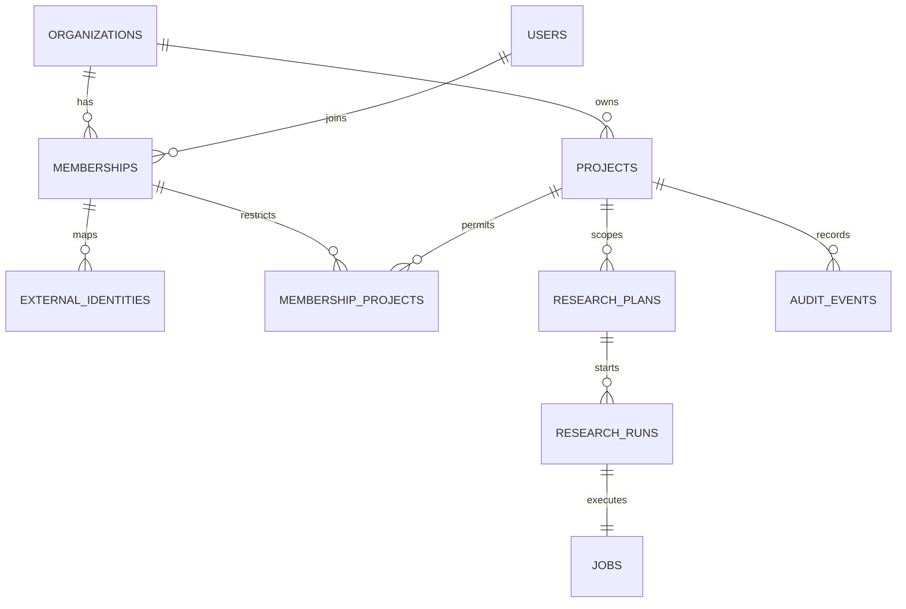

# Foundation Persistent Data Dictionary

> 기준일: 2026-07-16 · Schema revision: `0002_external_identity_membership` · 구현 기준: `c7064cd`
>
> 이 schema는 현재 구현된 Foundation과 미래 `ACCOUNT_OPT_IN`/`ENTERPRISE` mode의 persistent metadata용이다. `PUBLIC_EPHEMERAL` Public Preview의 질문·검색어·원문·Passage·보고서 본문은 이 schema에 저장하지 않는다. 공개 mode의 content lifecycle은 [ARCHITECTURE](../ARCHITECTURE.md)와 [ADR-0009](../adr/0009-public-zero-retention-first.md)을 따른다.

[Architecture Data Model](../ARCHITECTURE.md) · [PostgreSQL Runbook](../runbooks/postgresql.md) · [Threat Model](../security/THREAT_MODEL.md)

## 1. 사용 규칙

이 문서는 **현재 migration으로 실제 저장되는 데이터**를 정의한다. PRD/Architecture에 계획된 Source, Document, Snapshot, Passage, Claim, EvidenceLink, Review, Report 등은 아직 table이 없으며 10절에 `PLANNED`로 구분한다.

공통 규칙:

- application이 UUID를 발급하며 PostgreSQL default UUID 생성에 의존하지 않는다.
- tenant row는 `organization_id`를 composite key/FK에 포함한다.
- 시간은 UTC-aware application datetime과 PostgreSQL `timestamptz`로 저장한다.
- API/Resource datetime은 RFC 3339 UTC string으로 반환한다.
- optimistic concurrency version은 1부터 시작한다.
- `operation_id`는 한 application operation과 audit를 연결한다.
- `X-Request-ID`는 HTTP 추적 ID이며 domain table에는 저장하지 않는다.
- runtime transaction은 query보다 먼저 `set_config('app.organization_id', <uuid>, true)`를 설정한다.
- `users`를 제외한 현재 tenant table은 FORCE RLS다. runtime role은 `users`를 직접 SELECT할 수 없다.

## 2. 관계



## 3. Identity와 Tenant

### 3.1 `organizations`

Organization은 최상위 tenant 경계다.

| Column | Type | Null | 규칙/의미 | 분류 |
|---|---|---:|---|---|
| `id` | `uuid` | N | tenant primary key | Internal ID |
| `name` | `text` | N | 1~200자 기관명 | 기관정보 |
| `status` | `text` | N | `ACTIVE`, `SUSPENDED` | 권한정보 |
| `created_at` | `timestamptz` | N | 생성시각 | 운영 metadata |

RLS는 `id = app.organization_id`다. suspended Organization은 Membership resolution에서 제외한다.

### 3.2 `users`

User는 여러 Organization Membership이 참조하는 내부 주체다.

| Column | Type | Null | 규칙/의미 | 분류 |
|---|---|---:|---|---|
| `id` | `uuid` | N | internal subject ID | 개인정보/식별자 |
| `external_subject` | `text` | Y | legacy field; 신규 OAuth mapping에 사용 금지 | 개인정보/Deprecated |
| `created_at` | `timestamptz` | N | 생성시각 | 운영 metadata |

`0002`부터 external subject uniqueness는 tenant-aware `external_identities`가 담당한다. runtime role에는 `users` SELECT grant가 없다.

### 3.3 `memberships`

| Column | Type | Null | 규칙/의미 | 분류 |
|---|---|---:|---|---|
| `organization_id` | `uuid` | N | tenant, PK/FK | 권한정보 |
| `user_id` | `uuid` | N | User, PK/FK | 개인정보/식별자 |
| `roles` | `text[]` | N | 최소 1개 Organization role | 권한정보 |
| `status` | `text` | N | `ACTIVE`, `REVOKED` | 권한정보 |
| `project_scope` | `text` | N | `ALL`, `RESTRICTED` | 권한정보 |
| `created_at` | `timestamptz` | N | 생성시각 | 운영 metadata |
| `updated_at` | `timestamptz` | N | 변경시각 | 운영 metadata |

현재 domain role은 `org_admin`, `research_manager`, `researcher`, `reviewer`, `viewer`, `service_agent`다. Foundation fixture는 주로 `researcher`를 사용한다. Role은 token scope의 상한이며 둘 다 만족해야 한다.

### 3.4 `external_identities`

검증된 access token identity를 tenant Membership으로 연결한다.

| Column | Type | Null | 규칙/의미 | 분류 |
|---|---|---:|---|---|
| `organization_id` | `uuid` | N | 요청 claim으로 선택하되 RLS 안에서 재검증 | 권한정보 |
| `user_id` | `uuid` | N | Membership의 내부 subject | 개인정보/식별자 |
| `issuer` | `text` | N | exact OIDC issuer, 8~2048자 | 권한정보 |
| `external_subject` | `text` | N | exact JWT `sub`, 1~512자 | 개인정보/외부식별자 |
| `actor_type` | `text` | N | `human`, `service` | 권한정보 |
| `created_at` | `timestamptz` | N | mapping 생성시각 | 운영 metadata |

Primary key는 `(organization_id, issuer, external_subject)`다. `(organization_id, user_id, issuer)`도 unique다. issuer/sub만 또는 organization claim만으로 authorization하지 않는다.

### 3.5 `membership_projects`

`memberships.project_scope='RESTRICTED'`일 때 허용 Project 집합이다.

| Column | Type | Null | 규칙/의미 |
|---|---|---:|---|
| `organization_id` | `uuid` | N | tenant composite PK/FK |
| `user_id` | `uuid` | N | Membership composite PK/FK |
| `project_id` | `uuid` | N | Project composite PK/FK |

빈 집합과 `RESTRICTED` 조합은 접근 가능한 Project가 없음을 뜻한다. `ALL`일 때 row 유무를 권한 근거로 사용하지 않는다.

## 4. Project와 Plan

### 4.1 `projects`

| Column | Type | Null | 규칙/의미 |
|---|---|---:|---|
| `id` | `uuid` | N | Organization 안의 Project ID |
| `organization_id` | `uuid` | N | tenant |
| `name` | `text` | N | 1~200자 업무명 |
| `profile` | `text` | N | 1~64자 Research Profile key |
| `status` | `text` | N | `ACTIVE`, `ARCHIVED` |
| `version` | `integer` | N | optimistic concurrency, `>=1` |
| `created_at` | `timestamptz` | N | 생성시각 |
| `updated_at` | `timestamptz` | N | 변경시각 |

Primary key는 `(organization_id, id)`다. archived Project는 read 가능 범위를 별도 policy가 결정하지만 새 Run 시작은 거부한다.

### 4.2 `research_plans`

Foundation은 승인된 Plan fixture를 저장하고 Run start guard를 검증한다. 실제 Plan create/review workflow는 P0에서 구현한다.

| Column | Type | Null | 규칙/의미 |
|---|---|---:|---|
| `id` | `uuid` | N | logical Plan ID |
| `organization_id` | `uuid` | N | tenant |
| `project_id` | `uuid` | N | 소속 Project |
| `version` | `integer` | N | immutable version, `>=1` |
| `question` | `text` | N | 1~4000자 조사 질문 |
| `status` | `text` | N | `DRAFT`, `IN_REVIEW`, `APPROVED`, `REJECTED` |
| `approved_by` | `uuid` | Y | approved 상태에서만 필수 User ID |
| `approved_at` | `timestamptz` | Y | approved 상태에서만 필수 |
| `created_at` | `timestamptz` | N | 생성시각 |
| `updated_at` | `timestamptz` | N | 변경시각 |

Primary key는 `(organization_id, id, version)`다. `APPROVED`이면 approver/time이 모두 있고, 그 외 상태이면 둘 다 없어야 한다.

## 5. Run과 Job

### 5.1 `research_runs`

| Column | Type | Null | 규칙/의미 |
|---|---|---:|---|
| `id` | `uuid` | N | Host reconnect에서 사용하는 durable ID |
| `organization_id` | `uuid` | N | tenant |
| `project_id` | `uuid` | N | 소속 Project |
| `plan_id` | `uuid` | N | 승인 Plan logical ID |
| `plan_version` | `integer` | N | 실행 시 고정된 Plan version |
| `initiated_by` | `uuid` | N | 내부 User ID |
| `status` | `text` | N | 5.3 상태 참조 |
| `version` | `integer` | N | optimistic concurrency |
| `idempotency_key` | `text` | N | ASCII safe 8~128자 |
| `request_fingerprint` | `text` | N | Plan ID/version canonical SHA-256 hex |
| `failure_code` | `text` | Y | 공개 가능한 안정 error code |
| `cancel_reason` | `text` | Y | 10~500자, 개인정보 입력 금지 운영정책 필요 |
| `cancellation_requested_at` | `timestamptz` | Y | cooperative cancel 요청시각 |
| `created_at` | `timestamptz` | N | 생성시각 |
| `updated_at` | `timestamptz` | N | 변경시각 |
| `started_at` | `timestamptz` | Y | 최초 RUNNING 시각 |
| `finished_at` | `timestamptz` | Y | terminal 상태에서 필수 |

Primary key는 `(organization_id, id)`다. `(organization_id, project_id, initiated_by, idempotency_key)`가 unique다. 같은 key와 다른 fingerprint는 `IDEMPOTENCY_CONFLICT`다.

### 5.2 `jobs`

| Column | Type | Null | 규칙/의미 |
|---|---|---:|---|
| `id` | `uuid` | N | worker Job ID |
| `organization_id` | `uuid` | N | tenant |
| `project_id` | `uuid` | N | Project |
| `run_id` | `uuid` | N | 1:1 ResearchRun |
| `state` | `text` | N | Run과 같은 execution state 집합 |
| `available_at` | `timestamptz` | N | claim 가능시각 |
| `attempts` | `integer` | N | claim 횟수, 기본 0 |
| `max_attempts` | `integer` | N | 기본 3, `>=1` |
| `lease_owner` | `text` | Y | RUNNING에서만 필수 worker ID |
| `lease_expires_at` | `timestamptz` | Y | RUNNING에서만 필수 |
| `cancel_requested_at` | `timestamptz` | Y | worker cooperative cancel signal |
| `created_at` | `timestamptz` | N | 생성시각 |
| `updated_at` | `timestamptz` | N | 변경시각 |

`SELECT ... FOR UPDATE SKIP LOCKED`로 claim한다. expired RUNNING lease는 reclaim 가능하다. attempt가 max에 도달하면 Job과 Run을 원자적으로 FAILED 처리한다.

### 5.3 상태 전이

```text
QUEUED -> RUNNING -> PARTIAL | SUCCEEDED | FAILED | CANCELLED
QUEUED -> CANCELLED
RUNNING --lease expired/retryable--> QUEUED
```

`PARTIAL`, `SUCCEEDED`, `FAILED`, `CANCELLED`은 terminal이다. terminal row는 다시 non-terminal로 전이하지 않는다. running cancel은 즉시 terminal로 바꾸지 않고 request flag를 설정한다.

## 6. `audit_events`

| Column | Type | Null | 규칙/의미 |
|---|---|---:|---|
| `id` | `uuid` | N | tenant 안 audit event ID |
| `organization_id` | `uuid` | N | tenant |
| `project_id` | `uuid` | Y | 관련 Project |
| `occurred_at` | `timestamptz` | N | event 시각 |
| `actor_subject_id` | `text` | N | Membership에서 해결된 내부 subject 또는 service ID |
| `actor_type` | `text` | N | `human`, `service` |
| `operation` | `text` | N | 예: `research.run.start` |
| `target_type` | `text` | N | 예: `ResearchRun` |
| `target_id` | `text` | Y | target identifier |
| `outcome` | `text` | N | `SUCCEEDED`, `DENIED`, `FAILED`, `IDEMPOTENT_REPLAY` |
| `operation_id` | `text` | N | 응답과 상관관계 |
| `reason_code` | `text` | Y | 안정된 거부/실패 code |
| `metadata_json` | `jsonb` | N | secret/원문 금지, 기본 `{}` |

RLS와 함께 UPDATE/DELETE trigger가 항상 예외를 내므로 append-only다. DB superuser/owner의 out-of-band 조작은 application trigger만으로 완전히 방지할 수 없으므로 DB audit/backup 접근통제가 필요하다.

## 7. MCP 공개 데이터

### 7.1 공통 output

| Field | 의미 |
|---|---|
| `schema_version` | application response schema, 현재 `1.0` |
| `operation_id` | application service operation 상관 ID |
| `resource_uri` | Host가 재조회할 canonical `psr://` URI |

### 7.2 Resource URI

```text
psr://projects/{project_id}
psr://projects/{project_id}/runs/{run_id}
```

URI 자체가 권한을 부여하지 않는다. 모든 read에서 current auth context의 Organization, scope, role, Project restriction을 다시 적용한다.

### 7.3 Cursor

Project list cursor는 HMAC-signed opaque string이다. cursor에는 pagination boundary와 context fingerprint만 넣고 secret이나 bearer를 넣지 않는다. 다른 filter/tenant context에서 재사용하면 거부한다.

## 8. 보존과 삭제의 현재 상태

Foundation에는 자동 retention/purge Job이 없다. 운영 전 임시 정책:

- AuditEvent: append-only, 기관 기록관리 정책 결정 전 자동 삭제 금지
- Membership/ExternalIdentity: 폐기 시 status를 우선 변경하고 hard delete는 승인된 개인정보 삭제 절차에서만 수행
- Plan/Run/Job: Foundation 검증 데이터 외 자동 삭제 없음
- backup: PostgreSQL Runbook의 보존·암호화·복원 정책을 따른다

기관별 보존기간, 법적 보존, litigation hold, 개인정보 삭제권 충돌은 Product/Legal 결정이 필요하며 MVP retention module에 반영한다.

## 9. 민감정보 금지 필드

다음에는 token, password, cookie, DB URL, source credential, 원문 개인정보를 넣지 않는다.

- `idempotency_key`
- `cancel_reason`
- `failure_code`, `reason_code`
- `audit_events.metadata_json`
- `operation_id`, request ID
- CLI stdout와 conformance JSON

## 10. 계획됐지만 미구현인 Entity

| Entity | 단계 | Foundation DB 상태 |
|---|---|---|
| `ResearchQuestion`, `SearchQuery`, `ResearchProfile` | P0/MVP | table 없음 |
| `Source`, `Document`, `Snapshot`, `Passage` | Collector/MVP | table 없음 |
| `Claim`, `EvidenceLink`, `Citation` | Evidence/MVP | table 없음 |
| `Review`, `Decision` | Review/MVP | table 없음 |
| `Report`, `ReportSection` | Report/MVP | table 없음 |
| `Entity`, `Relation` | v1.5+ | table 없음 |
| `ChangeEvent`, freshness state | v1.5 | table 없음 |
| `Account`, `AccountIdentity`, `PersonalWorkspace` | Free Account Beta A0.1 | table 없음 |
| `RetentionConsent`, `SavedResearch`, `SavedEvidence` | Free Account Beta A0.2 | table 없음 |
| `FreshnessCheck`, `ReuseDecision`, `ImportReceipt`, `DeletionManifest` | Free Account Beta A0.3 | table 없음 |

이 Entity 이름이 response나 문서에 존재하더라도 구현된 persistence로 간주하지 않는다.

## 11. Schema 변경 규칙

1. SQL migration, domain model, mapper, repository, 본 data dictionary를 같은 change set에서 갱신한다.
2. tenant table은 `organization_id`, composite FK, FORCE RLS, cross-tenant negative test를 요구한다.
3. 새 상태는 DB CHECK, domain enum, transition table, MCP schema, recovery test를 함께 수정한다.
4. 개인정보 column은 분류, 목적, retention, export/redaction 정책을 먼저 기록한다.
5. audit metadata schema가 바뀌면 downstream audit export compatibility를 검토한다.
6. destructive migration은 backup/restore rehearsal과 explicit operator confirmation을 요구한다.
