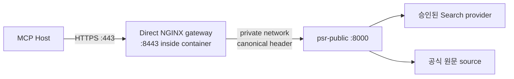

# Direct-Ingress NGINX Gateway Runbook

> 상태: 기준 구성·정적계약·TLS 통합시험 구현 · 실제 NGINX OCI CI와 staging rehearsal 대기

[Architecture](../ARCHITECTURE.md) · [Validation Criteria](../VALIDATION_CRITERIA.md) ·
[Container Runbook](./container-public-preview.md) ·
[Threat Model](../security/THREAT_MODEL.md)

## 1. 목적

이 구성은 가입 없는 `PUBLIC_EPHEMERAL` MCP 앞에서 다음 경계를 제공한다.

- TLS 1.2/1.3 종료
- 정확한 public Host만 허용하고 unknown SNI 거부
- 사용자 입력의 IP·인증·쿠키 forwarding header 폐기
- gateway가 직접 본 TCP peer IP를 `X-PSR-Client-IP` 하나로 재생성
- IP별·전체 request/connection quota
- 1 MiB body, 연결·송수신 timeout
- request/response buffering·cache·재시도 금지
- URI·IP·Host·header·body가 없는 content-free access log

NGINX의 request rate limit은 shared-memory key와 leaky-bucket 방식으로 동작하고,
connection limit은 같은 key의 동시 처리 요청을 제한한다. 기준 구성은 공식
[`limit_req`](https://nginx.org/en/docs/http/ngx_http_limit_req_module.html),
[`limit_conn`](https://nginx.org/en/docs/http/ngx_http_limit_conn_module.html),
[`proxy`](https://nginx.org/en/docs/http/ngx_http_proxy_module.html) directive만 사용한다.

## 2. 지원 topology



이 기준 구성은 **NGINX가 인터넷 요청을 직접 받는 단일 ingress**에 한정한다.

CDN, cloud load balancer, ingress controller가 NGINX 앞에 있으면 `$remote_addr`는 최종
사용자가 아니라 상위 proxy 주소다. 이 상태로 배포하면 spoof는 신뢰하지 않지만 모든 사용자가
한 quota bucket에 들어갈 수 있다. 상위 proxy를 사용할 때는 다음을 별도 설계·검증하기 전까지
이 구성을 그대로 사용하지 않는다.

1. 운영자가 소유한 정확한 proxy CIDR allowlist
2. `real_ip_header`와 recursive 처리정책
3. 외부 직접접속 차단
4. multi-hop spoof corpus
5. CDN/LB log·body-retention 설정

`set_real_ip_from 0.0.0.0/0`, 임의 `X-Forwarded-For` 신뢰, comma chain의 첫 값 선택은
허용하지 않는다.

## 3. 기준 파일

```text
deploy/nginx/
├─ entrypoint/
│  └─ 15-psr-validate-env.sh
├─ nginx.conf
└─ templates/
   └─ psr-public.conf.template
```

- `nginx.conf`: content-free log, tmp 경로, request/connection zone
- `psr-public.conf.template`: TLS server, exact `/mcp`, header overwrite, proxy 제한
- `15-psr-validate-env.sh`: Host·upstream·port·TLS mount를 render 전에 fail closed
- `scripts/verify_gateway_contract.py`: fail-closed 정적 검증
- `tests/integration/test_tls_reverse_proxy.py`: TLS·spoof·credential stripping 통합시험

공식 NGINX image의 template 기능을 사용하되 `NGINX_ENVSUBST_FILTER='^(PSR_)'`로
`PSR_*` 변수만 치환한다. `$remote_addr`, `$request_id` 같은 NGINX 변수는 그대로 남아야 한다.
render 결과는 read-only image layer가 아니라 tmpfs `/tmp/conf.d`에 생성한다.

## 4. 필수 설정

| 변수 | 예 | 규칙 |
|---|---|---|
| `PSR_PUBLIC_HOST` | `research.example.org` | DNS hostname만, scheme/path/port 금지 |
| `PSR_UPSTREAM_HOST` | `psr-public` | private container/service DNS name |
| `PSR_UPSTREAM_PORT` | `8000` | application listener |
| `NGINX_ENVSUBST_FILTER` | `^(PSR_)` | 반드시 이 값 |
| `NGINX_ENVSUBST_OUTPUT_DIR` | `/tmp/conf.d` | tmpfs 내부 |

Application 설정은 최소한 다음과 일치해야 한다.

```text
PSR_PUBLIC_URL=https://<PSR_PUBLIC_HOST>
PSR_RESOURCE_SERVER_URL=https://<PSR_PUBLIC_HOST>/mcp
PSR_MAX_REQUEST_BYTES=1048576
PSR_REQUEST_TIMEOUT_SECONDS=30
PSR_TRUSTED_PROXY_CIDRS=<gateway가 접속하는 private CIDR만>
```

`PSR_TRUSTED_PROXY_CIDRS`에 인터넷 전체, Docker 전체 기본대역 또는 운영자가 통제하지 않는
공유 network를 넣지 않는다. Application port 8000은 public interface에 publish하지 않는다.

## 5. Image와 실행 경계

기준 검증 image:

```text
nginx:1.30.4-alpine@
sha256:59d10bca5c674965ef4ff884715000dd60ef5567c36663523f108eec8e4105d4
```

운영자는 image digest 갱신을 dependency update로 취급해 `nginx -t`, TLS, spoof, quota
rehearsal을 다시 실행한다.

아래 명령은 gateway container 경계 예시다. application과 private network가 먼저 준비돼
있어야 하며 certificate는 repository 밖의 secret mount에서 제공한다.

```bash
docker run --detach --name psr-public-edge \
  --network psr-backend \
  --publish 443:8443 \
  --user 101:101 \
  --read-only \
  --cap-drop=ALL \
  --security-opt=no-new-privileges \
  --pids-limit=128 \
  --memory=256m \
  --cpus=1 \
  --tmpfs /tmp:rw,noexec,nosuid,nodev,size=32m,mode=1777 \
  --volume "$PWD/deploy/nginx/nginx.conf:/etc/nginx/nginx.conf:ro" \
  --volume "$PWD/deploy/nginx/templates:/etc/nginx/templates:ro" \
  --volume "$PWD/deploy/nginx/entrypoint/15-psr-validate-env.sh:/docker-entrypoint.d/15-psr-validate-env.sh:ro" \
  --volume "/approved/psr-tls:/etc/nginx/tls:ro" \
  --env NGINX_ENVSUBST_FILTER='^(PSR_)' \
  --env NGINX_ENVSUBST_OUTPUT_DIR=/tmp/conf.d \
  --env NGINX_ENTRYPOINT_QUIET_LOGS=1 \
  --env PSR_PUBLIC_HOST=research.example.org \
  --env PSR_UPSTREAM_HOST=psr-public \
  --env PSR_UPSTREAM_PORT=8000 \
  nginx:1.30.4-alpine@sha256:59d10bca5c674965ef4ff884715000dd60ef5567c36663523f108eec8e4105d4
```

TLS private key는 UID 101이 읽을 수 있되 다른 host user가 읽지 못하도록 소유권·mode를
배포환경에 맞춰 설정한다. CI synthetic key의 완화된 mode를 운영에 복사하지 않는다.

## 6. Header 계약

외부 요청에 다음 값이 있어도 upstream에는 전달하지 않는다.

```text
Authorization
Cookie
Forwarded
X-Forwarded-For
X-Forwarded-Host
X-Forwarded-Proto
X-Real-IP
X-PSR-Client-IP
```

Gateway는 제거 뒤 다음을 새로 만든다.

```text
Host: <PSR_PUBLIC_HOST>
X-PSR-Client-IP: <gateway direct TCP peer>
X-Request-ID: <gateway-generated random ID>
```

Application은 trusted gateway CIDR에서 온 단일 `X-PSR-Client-IP`만 소비하고 downstream
MCP application에서 해당 header를 다시 제거한다. 누락, 비정상 IP, comma-separated IP는
400으로 fail closed한다.

## 7. Quota 의미

기준값:

| 경계 | 값 | 의미 |
|---|---:|---|
| IP request rate | 평균 60/min, burst 20 | MCP transport request flood 제한 |
| global request rate | 평균 20/sec, burst 40 | 전체 process 보호 |
| IP concurrent request | 4 | 한 사용자의 연결 점유 제한 |
| global concurrent request | 100 | gateway 전체 상한 |
| body | 1 MiB | application 기본값과 동일 |
| connect timeout | 5초 | 죽은 upstream 차단 |
| send/read timeout | 35초 | application 30초 timeout보다 약간 큼 |

IP request rate는 “quick 조사 60회”가 아니다. MCP initialize, Tool list와 Tool call도 HTTP
request를 사용한다. 실제 조사 횟수·동시실행·일일 비용은 application과 provider hard cap이
별도로 제한한다.

`proxy_next_upstream off`는 POST 재전송으로 같은 Tool이 중복 실행되는 것을 막는다.

## 8. 무보관·로그 계약

Gateway는 request/response cache와 proxy temp response file을 사용하지 않는다. 최대 1 MiB
request body는 streaming하며 불가피한 request temp 경로는 tmpfs `/tmp`다.

Access log 허용 field:

```text
timestamp
HTTP method
status
request duration
response byte count
request/connection limit 상태
```

금지 field:

```text
client IP
Host
URI/query
request line
request/response header
request/response body
MCP session ID
operation ID
feedback token
```

Platform가 stdout log를 수집하는 경우에도 짧은 metadata retention과 접근통제를 적용한다.
`error_log`는 `crit`로 제한한다. 운영 가시성을 늘리기 위해 log level을 내리려면 canary
leakage test와 개인정보 검토를 다시 통과해야 한다.

## 9. 검증 순서

### 9.1 Local static와 Python TLS

```bash
python3 scripts/verify_gateway_contract.py
pytest -q tests/unit/test_gateway_contract.py
pytest -q tests/integration/test_tls_reverse_proxy.py
```

TLS 통합시험은 malicious `X-PSR-Client-IP`, forwarding chain, bearer와 cookie를 보내고
upstream이 canonical IP 하나만 보며 민감 header를 0개 보는지 확인한다.

### 9.2 OCI syntax

GitHub Actions `Public Preview OCI gate`는 다음을 수행한다.

1. pinned NGINX image 사용
2. synthetic certificate 생성
3. non-root UID 101, read-only root, capability 0
4. `/tmp`만 writable
5. restricted envsubst render
6. `nginx -t -c /etc/nginx/nginx.conf`

이 CI가 실제 통과하기 전에는 NGINX syntax gate를 PASS로 기록하지 않는다.

### 9.3 Staging release rehearsal

실제 staging에서 다음을 모두 기록한다.

- unknown SNI handshake 거부
- HTTP plaintext listener 없음
- canonical Host만 성공
- spoofed forwarding/credential header가 upstream에 없음
- 같은 IP의 header rotation이 quota를 우회하지 못함
- 서로 다른 실제 IP는 별도 bucket
- 1 MiB 초과 request 413
- edge saturation 429
- application 429와 `Retry-After`
- access/error/platform log canary 0
- certificate chain, hostname, expiry와 TLS protocol
- gateway 중지·rollback 뒤 purge process 계속 동작

Staging probe용 echo backend는 일시적으로만 사용하고 public DNS에 노출하지 않는다. 검증 직후
삭제하고 실제 MCP container로 교체한다.

## 10. Rollback과 Kill Switch

Gateway 오류 시 먼저 `PSR_PUBLIC_PAUSE_FILE`을 생성해 새 조사만 중지한다. 기존 결과 전달과
purge를 확인한 뒤 gateway image/config를 이전 digest로 rollback한다.

다음 경우 public route를 열지 않는다.

- `nginx -t` 실패
- public Host/certificate 불일치
- Application port가 인터넷에 직접 노출
- trusted proxy CIDR가 실제 gateway network보다 넓음
- body log 또는 raw IP log 발견
- provider hard cap·application daily budget 미설정
- staging spoof rehearsal 실패
