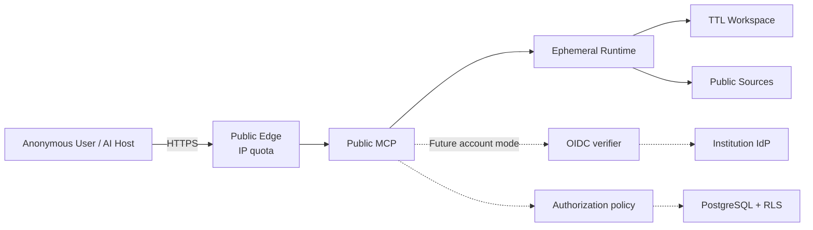

# Public Sector Research MCP — Threat Model

> 상태: Public Preview local vertical slice 갱신 · 기준일: 2026-07-16

[Architecture](../ARCHITECTURE.md) · [ADR-0009](../adr/0009-public-zero-retention-first.md) · [OAuth Runbook](../runbooks/oauth-resource-server.md) · [Remote Runbook](../runbooks/remote-mcp.md) · [Validation Criteria](../VALIDATION_CRITERIA.md)

## 1. 범위

이 문서는 두 범위를 분리한다.

1. 이미 구현된 OAuth·Tenant·PostgreSQL Foundation
2. 구현 중인 가입 없는 `PUBLIC_EPHEMERAL` Public Preview

Foundation 범위:

- Remote MCP Streamable HTTP
- OIDC access token verification과 RFC 9728 protected resource metadata
- Organization/User/Membership/Project authorization
- PostgreSQL RLS와 durable ResearchRun/Job
- operation/audit trace
- TLS terminating reverse proxy deployment pattern

Public Preview 설계 범위:

- 익명 MCP Tool
- IP·anonymous bucket quota
- 공개 HTTPS source Search/Collector
- HTML·PDF·JSON Parser
- 임시 workspace와 opaque run handle
- Planner, Evidence Composer, Markdown/JSON result
- TTL purge와 content-free observability

Public Preview의 local safety core와 quick research 수직 슬라이스는 구현됐다. 아래 표의
`PASS/local`은 통제된 fixture와 localhost 환경의 구현 증거이며 staging·edge·실제 공공 웹
검증을 뜻하지 않는다. `PG0~PG3` 검증 전 공개 endpoint를 열지 않는다.

Review Console, private document, user credential, browser automation, 영구 Evidence Store, Account signup은 Public Preview 범위 밖이다.

## 1.1 Mode별 자산

| Mode | 주요 보호자산 | 기본 보존 |
|---|---|---|
| `PUBLIC_EPHEMERAL` | 질문, 검색어, source body, result, handle | 결과 전달 또는 강제 TTL까지 |
| `ACCOUNT_OPT_IN` | 사용자 identity, 저장 consent, 저장한 조사 | 사용자 선택·정책에 따름 |
| `ENTERPRISE` | 기관 Project, Evidence, Review, Audit | 기관 보존정책 |

Public Preview에서는 “저장하지 않는 것” 자체가 핵심 보안속성이다.

## 2. 보안 목표

1. Public Preview의 질문·원문·결과가 영구 DB·일반 log·TTL 이후 tmp에 남지 않는다.
2. 익명 사용자가 bearer·handle을 회전해 IP·비용 quota를 우회하지 못한다.
3. Collector가 localhost, private/link-local network, cloud metadata에 접근하지 못한다.
4. 악성 HTML·PDF·JSON이 parser resource를 무제한 점유하거나 source instruction을 실행시키지 못한다.
5. opaque handle을 추측하거나 log에서 획득해 결과를 읽지 못한다.
6. kill switch가 새 고비용 조사를 막아도 기존 content purge는 계속된다.
7. Account/Enterprise에서는 다른 User·Organization 데이터를 ID를 알아도 읽거나 참조하지 못한다.
8. access token의 외부 identity와 active Membership을 분리 검증한다.
9. token, DB credential, cursor key, 내부 예외가 response/log/export에 노출되지 않는다.
10. 자동 검증하지 않은 보안 속성을 운영 완료로 주장하지 않는다.

## 3. 보호 자산과 분류

| 자산 | 분류 | 손상 영향 |
|---|---|---|
| OAuth access token/JWKS trust | Secret / Security Metadata | 사용자 위조, 전체 권한 경계 붕괴 |
| DB runtime/owner credential | Secret | tenant data 유출·변조, migration 탈취 |
| Membership/ExternalIdentity | 개인정보·권한정보 | 사용자 식별, 권한 상승 |
| Project/Plan/Run | 기관 업무정보 | 조사과제 노출, 잘못된 실행 |
| AuditEvent | 보안·감사기록 | 책임 추적 상실 |
| cursor signing key | Secret | pagination tampering |
| request/operation/run IDs | Internal Identifier | 단독 secret은 아니나 상관분석 가능 |
| public question/search query | User Content | 조사 관심사 노출, 무보관 약속 위반 |
| source body/extracted passage | Third-party/User Content | 저작권·개인정보·악성 content 잔존 |
| public research result | User Content | 업무정보 노출, 무보관 약속 위반 |
| opaque run handle | Bearer Capability | 임시 결과 무단 조회 |
| abuse HMAC key | Secret | IP bucket 역추적·quota 무력화 |
| ephemeral root | Restricted Temporary Storage | content 유출·TTL 위반 |

## 4. 행위자와 신뢰 경계

### 정상 행위자

- 가입하지 않은 Public Preview 사용자
- MCP Host와 공개 edge operator
- 공공업무 담당자와 Reviewer
- Organization Admin/Security Auditor
- 기관 IdP와 gateway operator
- PSR web process와 worker identity
- PostgreSQL owner/migration operator

### 위협 행위자

- 인증되지 않은 internet client
- quota 우회를 시도하는 자동화 client
- SSRF target으로 내부망 접근을 유도하는 사용자
- 악성 HTML·PDF·JSON을 제공하는 source operator
- 유출된 opaque handle 보유자
- 다른 Organization의 정상 사용자
- 탈취·폐기·과다 scope token 사용자
- prompt에 의해 잘못된 Tool을 선택한 AI Host
- 악성 또는 오구성 gateway/header sender
- 과도한 DB 권한을 가진 내부 운영자
- 손상된 dependency 또는 build pipeline

### 경계



## 5. 보안 불변조건

- public mode는 OAuth token 유무와 관계없이 IP quota를 먼저 적용한다.
- public mode의 질문·검색어·source body·result는 persistent DB와 일반 telemetry에 기록하지 않는다.
- ephemeral directory와 file은 각각 `0700`, `0600`이며 user input을 path에 사용하지 않는다.
- result를 전달하면 content access를 즉시 차단하고 60초 내 purge 대상으로 전환한다.
- 미수령 result와 orphan workspace는 ADR-0009의 강제 TTL을 넘지 않는다.
- outbound URL은 최초 요청과 모든 redirect에서 scheme, host, DNS/IP, port 정책을 다시 통과한다.
- client bearer, cookie, certificate를 upstream source에 전달하지 않는다.
- source text는 untrusted data이며 system/tool instruction으로 해석하지 않는다.
- kill switch는 새 quick/start를 막아도 status/result/cancel/purge를 막지 않는다.
- `organization_id` token claim만으로 사용자를 인증하지 않는다.
- exact `(issuer, external_subject, requested_organization_id)`가 active external identity와 Membership에 매핑돼야 한다.
- runtime role은 table owner 또는 `BYPASSRLS`가 아니며 transaction마다 `SET LOCAL app.organization_id`를 먼저 수행한다.
- `NOT_FOUND_OR_FORBIDDEN`은 존재와 권한 실패를 구분해 노출하지 않는다.
- `run.start`는 승인 Plan, `research:run` scope, 허용 role, active Project, safe idempotency key를 모두 요구한다.
- JWT는 `typ=at+jwt`, allowlisted asymmetric `alg`, exact issuer/audience, `kid`, 시간 claim을 검증한다.
- OIDC discovery/JWKS는 bounded JSON, redirect 없음, same-origin 또는 explicit allowlist, key rotation refresh를 적용한다.
- client bearer를 downstream dependency로 전달하지 않는다.
- audit row는 append-only이며 application write transaction과 함께 commit한다.
- production은 static auth, memory storage, HTTP public URL, development cursor key로 기동하지 않는다.

## 6. Public Preview 위협·통제·검증

| ID | 위협 | 필수 통제 | 검증 | 상태 |
|---|---|---|---|---|
| TM-PUB-001 | bearer·client ID 회전으로 익명 quota 우회 | edge raw IP + application HMAC IP bucket | `VAL-PUB-ABUSE-001~006` | application PASS, edge 대기 |
| TM-PUB-002 | 대량 Run·source로 비용 고갈 | active/global/source quota, per-run budget, kill switch | `VAL-PUB-ABUSE-007~015` | process active quick·run budget PASS; edge·async·shared quota 대기 |
| TM-PUB-003 | 질문·원문·결과가 log/DB에 잔존 | telemetry allowlist, persistent sink 분리, canary scan | `VAL-PUB-RET-010~014` | quick canary PASS/local; staging scan 대기 |
| TM-PUB-004 | crash·삭제 실패로 tmp 잔존 | startup/periodic sweep, hard TTL, access block, retry | `VAL-PUB-RET-001~009` | local lifecycle PASS; async 대기 |
| TM-PUB-005 | path traversal·symlink로 임의 file 접근 | random path, no user filename, no-follow, restrictive mode | `VAL-PUB-TMP-*` | PASS/S0 |
| TM-PUB-006 | handle 추측·유출로 결과 탈취 | 192-bit CSPRNG, keyed digest, no log, uniform error | `VAL-PUB-HANDLE-*` | 미구현/PG2 |
| TM-PUB-007 | localhost/private/metadata SSRF | HTTPS/port policy, DNS/IP check, redirect revalidation | `VAL-PUB-NET-001~009` | PASS/local; staging egress 대기 |
| TM-PUB-008 | client credential upstream 유출 | credential input 미지원, header allowlist | `VAL-PUB-NET-010` | PASS/local |
| TM-PUB-009 | decompression/PDF/parser bomb | byte, ratio, page, depth, time, memory budget | `VAL-PUB-COL/PARSE` | PASS/local; hostile corpus 확대 필요 |
| TM-PUB-010 | source prompt injection이 조사정책 변경 | source를 untrusted data로 tag, deterministic policy | `VAL-PUB-PLAN-008`, `PARSE-007` | PASS/local |
| TM-PUB-011 | 악성·제한 source 우회수집 | robots/terms/access policy, no captcha/paywall bypass | `VAL-PUB-NET-012` | robots PASS; site Terms 운영검토 대기 |
| TM-PUB-012 | 인용 없는 허위사실 출력 | FACT citation lint, gaps/inference 분리 | `VAL-PUB-EVD-*` | citation lint PASS; domain synthesis QA 대기 |
| TM-PUB-013 | edge forwarded IP spoof | trusted proxy CIDR, canonical single-IP parse, untrusted header strip | `VAL-PUB-ABUSE-011~012`, `VAL-PUB-EDGE-002` | application PASS; gateway rehearsal 대기 |
| TM-PUB-014 | feedback로 content 재식별 | one-time opaque token, no content join/free text | `VAL-PUB-FBK-*` | 미구현/PG3 |
| TM-PUB-015 | Search query가 외부 provider에 보존 | 기본 disabled, service disclosure, provider 계약 분리 | `FR-PUB-026`, Live QA | 고지 구현; provider ZDR 미검증 |

## 7. Foundation 위협·통제·검증

| ID | 위협 | 주요 통제 | 검증 증적 | 잔여위험/상태 |
|---|---|---|---|---|
| TM-001 | 서명 없는/대칭 JWT 수용 | `typ`, asymmetric alg allowlist, signature verification | `test_oauth_tokens.py` | 낮음/PASS |
| TM-002 | 다른 issuer/audience token 재사용 | exact `iss`, `aud`, RFC 9728 resource URL | OAuth G4 + PG E2E | 낮음/PASS |
| TM-003 | stale/미래 token | `exp`, `iat`, `nbf`, bounded leeway | unit tests | 낮음/PASS |
| TM-004 | unknown `kid`와 key rotation | forced JWKS refresh와 fail closed | unit tests | 반복 unknown `kid` refresh 증폭; A0 전 negative cache 필요 |
| TM-005 | malicious discovery/JWKS redirect·oversize | redirect 금지, origin policy, size/content-type/depth bounds | unit tests | parser zero-day/낮음 |
| TM-006 | 조작한 Organization claim | tenant RLS 안에서 issuer/sub exact Membership 재검증 | `test_oauth_end_to_end.py` | 낮음/PASS |
| TM-007 | revoked Membership 계속 사용 | request마다 DB resolve, active 상태 조건 | G4 tests | DB outage 시 fail closed/PASS |
| TM-008 | cross-tenant IDOR | application policy + tenant key + FORCE RLS | PostgreSQL contract tests | `research_runs.initiated_by` composite FK 보강이 A0 전 필요 |
| TM-009 | runtime role RLS bypass | non-owner/no BYPASSRLS assertions, restricted grants | G3 report | DBA는 별도 privileged actor |
| TM-010 | Project restriction 우회 | `project_scope`, membership_projects, role+scope intersection | membership tests | admin misconfiguration |
| TM-011 | Tool replay로 중복 Run | safe idempotency key + fingerprint + unique constraint | service/PG/conformance tests | key 관리 책임은 client |
| TM-012 | worker crash/중복 claim | row lock, lease, heartbeat, reclaim, max attempts | G3 crash tests | external side effect는 C0에서 보강 |
| TM-013 | audit와 write 불일치 | 같은 UoW transaction, append-only trigger | rollback tests + OAuth trace test | privileged owner 삭제는 DB audit 필요 |
| TM-014 | secret/internal exception 노출 | generalized MCP/CLI errors, diagnostics redaction | handler/CLI/log tests | restricted operator log ACL 필요 |
| TM-015 | bearer token log 노출 | token hash rate key, raw token assertion | HTTP policy + OAuth E2E | gateway log 별도 review 필요 |
| TM-016 | DNS rebinding/Host spoof | SDK transport security, canonical host/origin allowlist | remote transport tests | gateway canonical Host 필수 |
| TM-017 | forged forwarded header | `proxy_headers=False`, config-derived public URL | spoof integration test | gateway 자체 로그/route 설정 |
| TM-018 | oversized/chunked request DoS | declared+observed byte limit | HTTP policy tests | proxy에도 동일/더 작은 limit 필요 |
| TM-019 | slow request/resource exhaustion | application timeout, bounded JSON response | timeout tests | slowloris는 gateway 책임 |
| TM-020 | brute force/traffic flood | Foundation token+IP limiter, Public IP-first limiter, gateway quota contract | rate tests | Public application 우회는 닫힘; edge quota 대기 |
| TM-021 | TLS MITM | production HTTPS fail closed, CA-verifying proxy test | TLS integration test | 실기관 cert 미검증 |
| TM-022 | Host disconnect 상태 상실 | stateless HTTP, durable explicit Run ID | TCP/TLS/Inspector reconnect | Host retry behavior 차이 |
| TM-023 | vulnerable dependency | locked dependencies, `uv audit`, SBOM | CI + 2026-07-16 audit | advisory feed 한계 |
| TM-024 | incompatible dependency license | versioned cross-platform manifest | manifest check | project 자체 license 미결정 |
| TM-025 | MCP source content 외부 전송 | 수동 Host test approval boundary, capability-aware gate | Codex Resource/Prompt 실행 중단·미필수화 | 향후 opt-in 검증 시 별도 승인 |

## 8. 보안 검토 결과

### 닫힌 P1

| 항목 | 조치 |
|---|---|
| JWT/Membership trust 혼합 가능성 | 외부 identity와 tenant Membership resolver를 분리하고 claim 단독 신뢰 금지 |
| process lifecycle에서 pool/verifier 중복 구성 | composition root 한 곳에서 open/close, 이중 verifier 거부 |
| request resource exhaustion | size, timeout, rate, request ID boundary 구현 |
| 취약한 `pytest 8.4.2` | `pytest 9.1.1`로 lock 갱신; OSV audit 0건 |

### 현재 열린 P1

| 항목 | 영향 | 처리 |
|---|---|---|
| `research_runs.initiated_by` global FK | 다른 tenant user ID 참조가 DB constraint로 차단되지 않음 | A0에서 composite tenant FK |
| unknown JWT `kid` 반복 refresh | 인증 endpoint와 IdP에 요청 증폭 가능 | A0에서 negative cache/cooldown |

공개 rate key 문제는 IP-first limiter로 닫혔다. 남은 두 항목은 Public mode가 OAuth/Tenant 경로를
사용하지 않으므로 Public Preview blocker는 아니지만 Account Beta 전에 반드시 수정한다.

## 9. 미검증과 의사결정 대기

| 항목 | 분류 | 다음 조치 |
|---|---|---|
| Public Tool과 ephemeral lifecycle | quick 구현 | policy/quick/purge 완료; async와 staging canary 남음 |
| Search·SafeCollector·parser·Evidence | 로컬 구현 | 실제 official-source QA와 hostile corpus 확대 |
| async handle·consume·purge | 미구현 | P2/PG2 |
| external Search provider | adapter 구현/운영 미검증 | credential·비용·query retention 승인 후 Live QA |
| 실제 기관 IdP/JWKS/폐기 전파 | 환경 미검증 | Pilot IdP owner와 integration test |
| 실제 gateway/WAF/TLS cipher | 환경 미검증 | 운영 topology review + penetration test |
| project distribution license | Product/Legal decision | 배포 전에 LICENSE와 NOTICE 결정 |
| global rate limit | 아키텍처 후속 | multi-replica 전에 gateway/Redis 정책 결정 |
| security owner sign-off | G6 approval | 본 문서와 validation report 서명 |

## 10. Collector 이후 남은 Threat Model 확장

다음은 기본 통제가 구현됐지만 실제 공개 전 추가 검증이 필요하다.

- edge/network namespace에서 private route가 실제로 없는지 검증
- robots.txt 외 site Terms·저작권·개인정보의 source registry 운영절차
- 실제 malformed/대형 정부 PDF와 parser zero-day 대응
- PDF worker의 Linux container seccomp/no-network/read-only filesystem
- response URL query와 upstream error의 telemetry redaction
- Search provider query retention·비용·credential rotation
- source-host rate와 upstream circuit breaker
- 향후 persistent object key가 public ephemeral path와 섞이지 않는 mode test

## 11. Review 절차

Security owner는 다음을 확인하고 문서 하단에 결정 기록을 추가한다.

1. 위협 범위와 제외범위가 배포 topology와 일치하는가?
2. 미검증 항목이 운영 문서와 release note에 동일하게 표시되는가?
3. P0/P1 분류와 수용 가능한 잔여위험이 맞는가?
4. Public Preview에서는 PG0~PG3, Account/Enterprise에서는 기관 IdP/gateway/DB 책임이 분리됐는가?
5. Public release 또는 후속 G6를 승인할지, 조건부 승인할지, 거부할지 결정한다.

### Owner decision

```text
Security owner: PENDING
Decision: PENDING
Date: PENDING
Conditions: Public PG0~PG3, project license, 후속 Account 시 IdP/Tenant P1 수정
```

Codex Host의 Foundation 지원 범위는 [ADR-0008](../adr/0008-capability-aware-host-conformance.md)에 따라 Tool-first로 확정했다. Resource/Prompt model-mediated 검증은 release gate가 아니며, 향후 제품 필요가 생기면 비민감 fixture와 외부 전송 범위를 별도로 승인한다.
