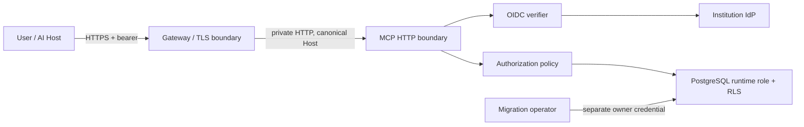

# Foundation Threat Model

> 상태: Security owner review 대기 · 기준일: 2026-07-16 · 구현 기준: `c7064cd`

[Architecture](../ARCHITECTURE.md) · [OAuth Runbook](../runbooks/oauth-resource-server.md) · [Remote Runbook](../runbooks/remote-mcp.md) · [Validation Criteria](../VALIDATION_CRITERIA.md)

## 1. 범위

현재 모델은 Foundation vertical slice만 다룬다.

- Remote MCP Streamable HTTP
- OIDC access token verification과 RFC 9728 protected resource metadata
- Organization/User/Membership/Project authorization
- PostgreSQL RLS와 durable ResearchRun/Job
- operation/audit trace
- TLS terminating reverse proxy deployment pattern

Collector, 외부 web source, object storage, Evidence/Report, Review Console은 아직 구현되지 않았으므로 현재 통제가 있다고 간주하지 않는다. 해당 module을 시작할 때 SSRF, prompt injection, 개인정보·저작권, object key isolation을 별도 threat-model increment로 추가한다.

## 2. 보안 목표

1. 다른 Organization의 존재나 데이터를 ID를 알아도 읽거나 변경하지 못한다.
2. access token의 외부 identity와 active Membership을 분리 검증한다.
3. model-controlled Tool이 scope·role·Project·state guard를 우회하지 못한다.
4. write 결과를 actor, operation, target, outcome까지 추적한다.
5. crash, reconnect, replay가 중복 Run 또는 잘못된 terminal state를 만들지 않는다.
6. token, DB credential, cursor key, 내부 예외가 response/log/export에 노출되지 않는다.
7. 비정상 request가 process memory·connection·CPU를 무제한 점유하지 못한다.
8. 자동 검증하지 않은 보안 속성을 운영 완료로 주장하지 않는다.

## 3. 보호 자산과 분류

| 자산 | 분류 | 손상 영향 |
|---|---|---|
| OAuth access token/JWKS trust | Secret / Security Metadata | 사용자 위조, 전체 권한 경계 붕괴 |
| DB runtime/owner credential | Secret | tenant data 유출·변조, migration 탈취 |
| Membership/ExternalIdentity | 개인정보·권한정보 | 사용자 식별, 권한 상승 |
| Project/Plan/Run | 기관 업무정보 | 조사과제 노출, 잘못된 실행 |
| AuditEvent | 보안·감사기록 | 책임 추적 상실 |
| cursor signing key | Secret | pagination tampering |
| request/operation/run IDs | Internal Identifier | 단독 secret은 아니나 상관분석 가능 |
| source/evidence/report | 미래 업무정보 | 현재 미구현; 별도 분류 필요 |

## 4. 행위자와 신뢰 경계

### 정상 행위자

- 공공업무 담당자와 Reviewer
- Organization Admin/Security Auditor
- 기관 IdP와 gateway operator
- PSR web process와 worker identity
- PostgreSQL owner/migration operator

### 위협 행위자

- 인증되지 않은 internet client
- 다른 Organization의 정상 사용자
- 탈취·폐기·과다 scope token 사용자
- prompt에 의해 잘못된 Tool을 선택한 AI Host
- 악성 또는 오구성 gateway/header sender
- 과도한 DB 권한을 가진 내부 운영자
- 손상된 dependency 또는 build pipeline

### 경계



## 5. 보안 불변조건

- `organization_id` token claim만으로 사용자를 인증하지 않는다.
- exact `(issuer, external_subject, requested_organization_id)`가 active external identity와 Membership에 매핑돼야 한다.
- runtime role은 table owner 또는 `BYPASSRLS`가 아니며 transaction마다 `SET LOCAL app.organization_id`를 먼저 수행한다.
- `NOT_FOUND_OR_FORBIDDEN`은 존재와 권한 실패를 구분해 노출하지 않는다.
- `run.start`는 승인 Plan, `research:run` scope, 허용 role, active Project, safe idempotency key를 모두 요구한다.
- JWT는 `typ=at+jwt`, allowlisted asymmetric `alg`, exact issuer/audience, `kid`, 시간 claim을 검증한다.
- OIDC discovery/JWKS는 bounded JSON, redirect 없음, same-origin 또는 explicit allowlist, key rotation refresh를 적용한다.
- client bearer를 downstream dependency로 전달하지 않는다.
- audit row는 append-only이며 application write transaction과 함께 commit한다.
- production은 static auth, memory storage, HTTP public URL, development cursor key로 기동하지 않는다.

## 6. 위협·통제·검증

| ID | 위협 | 주요 통제 | 검증 증적 | 잔여위험/상태 |
|---|---|---|---|---|
| TM-001 | 서명 없는/대칭 JWT 수용 | `typ`, asymmetric alg allowlist, signature verification | `test_oauth_tokens.py` | 낮음/PASS |
| TM-002 | 다른 issuer/audience token 재사용 | exact `iss`, `aud`, RFC 9728 resource URL | OAuth G4 + PG E2E | 낮음/PASS |
| TM-003 | stale/미래 token | `exp`, `iat`, `nbf`, bounded leeway | unit tests | 낮음/PASS |
| TM-004 | unknown `kid`와 key rotation | 한 번 forced JWKS refresh 후 fail closed | unit tests | IdP outage 영향/통제됨 |
| TM-005 | malicious discovery/JWKS redirect·oversize | redirect 금지, origin policy, size/content-type/depth bounds | unit tests | parser zero-day/낮음 |
| TM-006 | 조작한 Organization claim | tenant RLS 안에서 issuer/sub exact Membership 재검증 | `test_oauth_end_to_end.py` | 낮음/PASS |
| TM-007 | revoked Membership 계속 사용 | request마다 DB resolve, active 상태 조건 | G4 tests | DB outage 시 fail closed/PASS |
| TM-008 | cross-tenant IDOR | application policy + composite tenant key + FORCE RLS | PostgreSQL contract tests | owner credential 오용/운영통제 |
| TM-009 | runtime role RLS bypass | non-owner/no BYPASSRLS assertions, restricted grants | G3 report | DBA는 별도 privileged actor |
| TM-010 | Project restriction 우회 | `project_scope`, membership_projects, role+scope intersection | membership tests | admin misconfiguration |
| TM-011 | Tool replay로 중복 Run | safe idempotency key + fingerprint + unique constraint | service/PG/conformance tests | key 관리 책임은 client |
| TM-012 | worker crash/중복 claim | row lock, lease, heartbeat, reclaim, max attempts | G3 crash tests | external side effect는 C0에서 보강 |
| TM-013 | audit와 write 불일치 | 같은 UoW transaction, append-only trigger | rollback tests + OAuth trace test | privileged owner 삭제는 DB audit 필요 |
| TM-014 | secret/internal exception 노출 | generalized MCP/CLI errors, diagnostics redaction | handler/CLI/log tests | restricted operator log ACL 필요 |
| TM-015 | bearer token log 노출 | token hash rate key, raw token assertion | HTTP policy + OAuth E2E | gateway log 별도 review 필요 |
| TM-016 | DNS rebinding/Host spoof | SDK transport security, canonical host/origin allowlist | remote transport tests | gateway canonical Host 필수 |
| TM-017 | forged forwarded header | `proxy_headers=False`, config-derived public URL | spoof integration test | gateway 자체 로그/route 설정 |
| TM-018 | oversized/chunked request DoS | declared+observed byte limit | HTTP policy tests | proxy에도 동일/더 작은 limit 필요 |
| TM-019 | slow request/resource exhaustion | application timeout, bounded JSON response | timeout tests | slowloris는 gateway 책임 |
| TM-020 | brute force/traffic flood | token+IP process limiter, gateway quota contract | rate tests | multi-replica global rate 미구현 |
| TM-021 | TLS MITM | production HTTPS fail closed, CA-verifying proxy test | TLS integration test | 실기관 cert 미검증 |
| TM-022 | Host disconnect 상태 상실 | stateless HTTP, durable explicit Run ID | TCP/TLS/Inspector reconnect | Host retry behavior 차이 |
| TM-023 | vulnerable dependency | locked dependencies, `uv audit`, SBOM | CI + 2026-07-16 audit | advisory feed 한계 |
| TM-024 | incompatible dependency license | versioned cross-platform manifest | manifest check | project 자체 license 미결정 |
| TM-025 | MCP source content 외부 전송 | 수동 Host test approval boundary, capability-aware gate | Codex Resource/Prompt 실행 중단·미필수화 | 향후 opt-in 검증 시 별도 승인 |

## 7. 보안 검토 결과

### 닫힌 P1

| 항목 | 조치 |
|---|---|
| JWT/Membership trust 혼합 가능성 | 외부 identity와 tenant Membership resolver를 분리하고 claim 단독 신뢰 금지 |
| process lifecycle에서 pool/verifier 중복 구성 | composition root 한 곳에서 open/close, 이중 verifier 거부 |
| request resource exhaustion | size, timeout, rate, request ID boundary 구현 |
| 취약한 `pytest 8.4.2` | `pytest 9.1.1`로 lock 갱신; OSV audit 0건 |

현재 구현 범위에서 미해결 P0/P1 defect는 0건이다. 아래 “미검증/의사결정”은 결함을 닫았다는 의미가 아니며 release gate를 계속 연 상태로 둔다.

## 8. 미검증과 의사결정 대기

| 항목 | 분류 | 다음 조치 |
|---|---|---|
| 실제 기관 IdP/JWKS/폐기 전파 | 환경 미검증 | Pilot IdP owner와 integration test |
| 실제 gateway/WAF/TLS cipher | 환경 미검증 | 운영 topology review + penetration test |
| project distribution license | Product/Legal decision | 배포 전에 LICENSE와 NOTICE 결정 |
| global rate limit | 아키텍처 후속 | multi-replica 전에 gateway/Redis 정책 결정 |
| security owner sign-off | G6 approval | 본 문서와 validation report 서명 |

## 9. Collector 이전 필수 Threat Model 확장

다음은 아직 통제가 구현되지 않았으므로 C0/Collector merge 전에 새 threat ID와 test가 필요하다.

- SSRF: scheme, hostname, DNS resolve, private/link-local/metadata IP, redirect revalidation
- robots.txt/약관/저작권/개인정보/source credential
- malicious HTML/PDF/JSON parser와 decompression bomb
- prompt injection을 instruction과 evidence data로 분리
- response header/cookie/URL query secret redaction
- immutable object key와 cross-tenant bucket/prefix policy
- sandboxed parser, file type sniffing, antivirus/content disarm 정책
- upstream rate/retry/circuit breaker와 client token passthrough 음성 test

## 10. Review 절차

Security owner는 다음을 확인하고 문서 하단에 결정 기록을 추가한다.

1. 위협 범위와 제외범위가 배포 topology와 일치하는가?
2. 미검증 항목이 운영 문서와 release note에 동일하게 표시되는가?
3. P0/P1 분류와 수용 가능한 잔여위험이 맞는가?
4. 기관 IdP/gateway/DB owner가 각 통제의 실제 책임을 수락했는가?
5. G6를 승인할지, 조건부 승인할지, 거부할지 결정한다.

### Owner decision

```text
Security owner: PENDING
Decision: PENDING
Date: PENDING
Conditions: 실제 기관 IdP/gateway 검증, project license 결정
```

Codex Host의 Foundation 지원 범위는 [ADR-0008](../adr/0008-capability-aware-host-conformance.md)에 따라 Tool-first로 확정했다. Resource/Prompt model-mediated 검증은 release gate가 아니며, 향후 제품 필요가 생기면 비민감 fixture와 외부 전송 범위를 별도로 승인한다.
